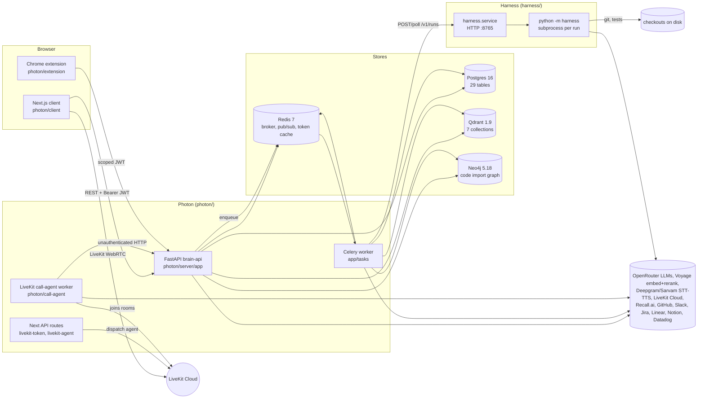
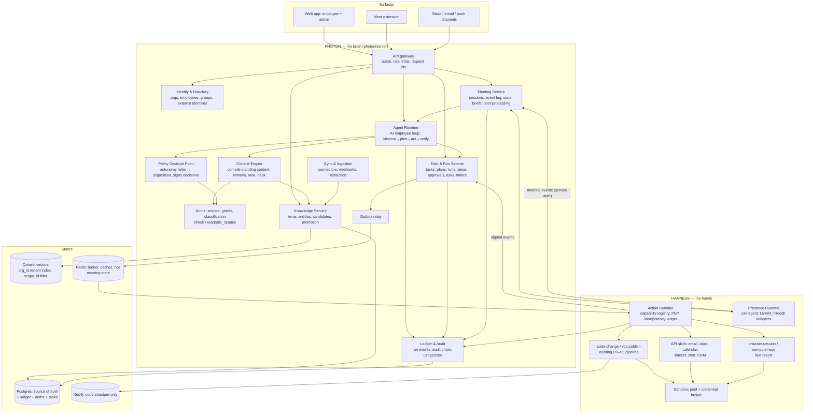
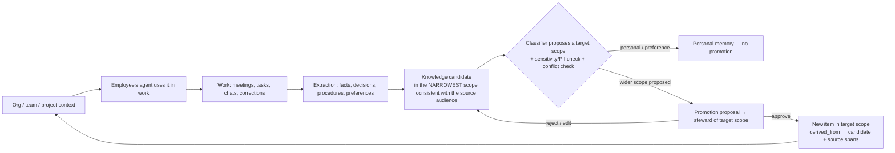
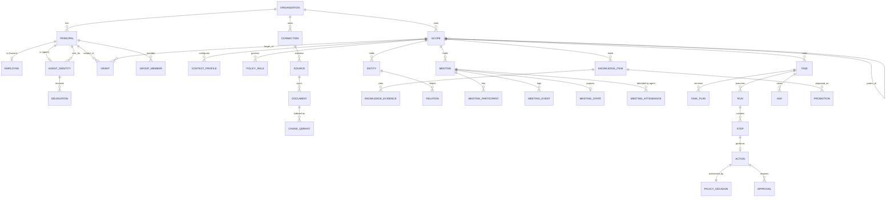

# Photon + Harness: System Audit and Enterprise Autonomy Architecture

**Status:** proposal, not an implementation. No code in `photon/` or `harness/` was changed to produce this report.
**Audited revision:** `b7ab291`, "feat: Photon, the company brain the harness now works for"
**Date:** 2026-09-28

## How to read this document

- **Part I (§1–§7A)** describes what the code actually does today. It was produced by tracing call paths, not by reading documentation. Where the docs and the code disagree, the code wins, and the disagreement is noted.
- **Part II (§8–§28)** is the target architecture: what to keep, what to modify, what to replace, and what is genuinely new. It also gives the order in which to build it.
- **Appendix A** is the consolidated defect register. It gives every finding a stable ID (`D-xx`) with a file:line reference, so the roadmap can refer to findings by ID.

**Method.** The audit ran as six parallel code traces over roughly 70k lines:

1. The answer engine.
2. Ingestion and storage.
3. Identity, tenancy, meetings and whisper.
4. The real-time call runtime, client and extension.
5. The Harness.
6. The Photon↔Harness bridge.

Each trace produced findings with file:line evidence. The lead reviewer then re-checked every Critical finding, and the High findings that the design depends on, directly against the source. Those carry a ✔ in Appendix A. Paths are relative to the repository root unless they start with `app/`, which means `photon/server/app/`.

---

# PART I: THE CURRENT SYSTEM

## 1. Executive Summary

### What the system is today

**Photon is a grounded question-answering engine with a voice.**

- **Ingestion.** It indexes a workspace's GitHub repos, Slack, Jira, Linear, Notion, Datadog and uploaded docs:
  - vectors go into Qdrant (Voyage `voyage-code-3`, 1024 dimensions);
  - a file-level import graph goes into Neo4j;
  - state goes into Postgres (29 tables).
- **Answering.** It answers through a fixed pipeline, plan → parallel read-only tools → compose → verify, in which every claim must carry an `[ev_xxxxxxxx]` citation or the engine abstains.
- **Meetings.** It attends its own LiveKit meetings as a voice agent that answers out loud. It can also "whisper" private suggestions to a member during Photon calls, Google Meet (by scraping captions in a Chrome extension) and Zoom/Teams (through a Recall.ai notetaker bot).
- **Escalation.** It hands a question to the member it represents when a rule fires.
- **Tasks from calls.** It turns spoken commitments ("I'll fix that") into draft code-fix jobs, using a regex.

**Harness is an evidence-gated bug-fixing pipeline for one git repository.** It runs a deterministic state machine: triage → read-only investigation → a binding scope → edit → verify against a baseline → six confidence gates → optional pull request behind a consent policy.

- The model proposes, and never executes. The harness runs every check itself.
- An HTTP service wraps the CLI, one subprocess per run, and exposes plan / fix / publish.

**The bridge between them is one path.**

1. A ticket (manual, a GitHub label, a Linear label, or a draft from a call) becomes an `AgentJob`.
2. A Celery task asks Harness for a plan and polls it for up to an hour.
3. A human approves or narrows the plan.
4. A second Celery task asks for a fix and polls it.
5. Photon asks Harness to publish a PR.

The loop ends at `pr_open`. Photon never observes what happens next, and it contributes none of its knowledge to the plan.

### Verdict

The two systems contain almost exactly the right foundational ideas, applied at the wrong scope and missing their load-bearing infrastructure.

| Keep (foundational ideas already present) | Missing or broken (what blocks the target) |
|---|---|
| **Evidence contract.** Every retrieved fact is a uniform, citable item, and a deterministic verifier strips unsupported claims (`app/tools/evidence.py`, `app/agent/verifier.py`). | **The security floor.** The data plane is open. `/api/agent/ask`, `/api/tools/*`, `/api/query`, transcript writes and escalation routes are unauthenticated and trust a client-supplied `workspace_id`. The JWT secret has a public default. `/dev/ask` impersonates any user and is mounted unless `APP_ENV=production`. See D-01 to D-07. |
| **Abstention as a first-class outcome.** | **A model finer than one level.** The only boundary is `Workspace` (+ viewer/member/owner). There is no organization, no per-document ownership, visibility, author, time or ACL, and the "private" connection scope is stored but never enforced. |
| **Server-forced tenancy.** The model never chooses a `workspace_id`. | **Durable execution.** Photon↔Harness state lives in two places (Postgres and `state.json` files), reconciled only by a Celery task blocked in a poll loop. There is no outbox, lease, reconciler, idempotency key or cancel, and the publish step fails on every successful run (D-19). |
| **A transport-free agent loop with an event sink.** | **An action abstraction.** Photon cannot act at all (no write tools). Harness can act only on code. No capability exists for documents, email, calendar, trackers, browsers or meeting chat. |
| **Harness's control-plane ideas.** Evidence-gated completion, a consent taxonomy for outward actions, scope binding checked against the actual diff, a plan → approve → execute split, and a typed event log. | **Meeting understanding.** Meetings are processed as a stream of questions. Nothing extracts decisions, action items or owners. Speak mode hears one participant. All meeting state is in worker memory. |
| **Human-in-the-loop primitives.** Escalation with a server-owned clock; `DRAFT` jobs that need confirmation; per-member `AgentProfile`; a company-agent flag. | **Isolation in Harness.** Commands run on the host with `shell=True`. The deny list is never applied. The supposedly read-only investigation phase can run arbitrary shell (D-07). |

### What it needs to become

It needs five architectural moves. None of them requires a new database, queue or agent framework.

1. **Scopes and grants as the single authorization primitive.**
   - An `Organization` is the root of a tree of scopes: units, projects, customers, personal spaces and meetings, plus "mirror" scopes that reflect source-system ACLs.
   - Every resource lives in exactly one scope. Principals get grants on scopes, and grants inherit down the tree.
   - Sensitivity labels decide where content may flow.
   - Agents act with the intersection of their employee's rights and their own delegation, never the union.
   - It is implemented in Postgres with a closure table. Retrieval enforces it in-query through `scope_id` payload filters in Qdrant.
2. **A context engine over provenance-rich knowledge.**
   - Generalize the evidence contract into knowledge items that carry source, author, version, validity time, confidence, scope and classification.
   - Compile standing context (policies, instructions, glossary) per scope chain, with inheritance and locks.
   - Route all retrieval through one permission-aware choke point.
3. **A durable task / run / step / action model in Postgres.**
   - The database is the source of truth; Celery only rings the doorbell.
   - Add a transactional outbox, leases with heartbeats, conditional state transitions, idempotency keys on every external effect, and a reconciler.
   - `AgentJob` becomes the first task type on it.
4. **Harness as an Action Runtime.**
   - One action contract: capability, parameters, effect class, a signed policy decision, expected postconditions, observations returned as evidence.
   - The existing P0–P5 pipeline becomes the `code.change` capability.
   - New capabilities are API-first (email, docs, calendar, trackers, chat). Browser and computer-use are last resorts.
   - Everything runs in real sandboxes with brokered, narrowly scoped credentials.
5. **Meetings as durable, event-sourced sessions.**
   - One meeting event log for every platform (LiveKit, Recall, the extension, uploads).
   - Per-participant hearing, with identity confidence.
   - A before / during / after pipeline that produces a brief, live meeting state, and after the meeting cited decisions, action items and tasks.
   - Those tasks flow into the same task and autonomy machinery, and into a knowledge-candidate and promotion loop.

**Order of work.** The security floor comes first and is non-negotiable. Then identity, organization and scopes. Then durable tasks and the Harness v2 contract. Then the context engine, then policy and autonomy, then new capabilities, then meetings, then post-meeting autonomy, then the knowledge loop.

The meeting agent is deliberately late. Everything it needs to be safe, including instruction authority, audience-bound disclosure, durable follow-through and approvals, is built by earlier phases.

---

## 2. Current Architecture

### 2.1 Deployables and stores



| Deployable | Tech | Role | State it owns |
|---|---|---|---|
| `photon/server` (brain-api) | FastAPI, SQLModel (async), structlog | All APIs, the agent loop, tools, webhooks, whisper engine, escalation rules | Postgres (29 tables); Qdrant (`code_chunks`, `slack_messages`, `jira_issues`, `connector_items` + seed `kb_docs`, `kb_tickets`, `kb_slack`); Neo4j (`Module`, `Symbol`); Redis |
| Celery worker | Celery, Redis broker; one queue; `acks_late`, prefetch 1; no beat | Ingestion (repo, Slack, Jira, connectors) and agent-job plan/fix tasks | Job rows; blocks up to 3600 s per agent-job task |
| `photon/call-agent` | LiveKit Agents 1.7, Deepgram/Sarvam, Silero VAD | Voice agent (speak mode), room listener (whisper mode) | **In-memory only** (turn history, escalations, frames) |
| `photon/client` | Next.js; JWT in `localStorage` | Console, call UI, admin, "my agent", whisper, tickets | Browser |
| Next API routes | `app/api/livekit-token`, `livekit-agent` | Mint LiveKit JWTs (checks the waiting room); dispatch the agent | none |
| `photon/extension` | Chrome MV3 | Scrapes Meet captions and sends them to whisper; side panel | `chrome.storage` (30-day scoped token) |
| `harness.service` | stdlib `ThreadingHTTPServer`, 2 worker slots | Plan / fix / publish runs | `HARNESS_SERVICE_HOME/runs/<id>/state.json`, checkouts |
| `python -m harness` | stdlib-only Python | P0→P5 pipeline | `.harness/run/*` artifacts, `trajectory.jsonl`, `.harness/cache` |

### 2.2 How the parts talk

| Edge | Protocol | AuthN | Notes |
|---|---|---|---|
| client → brain-api | REST, `Authorization: Bearer`, `X-Workspace-Id` | HS256 JWT, 7 days, non-revocable (`app/core/auth.py:37-40`) | Membership is checked by `get_current_workspace`, but only on routes that declare it |
| call-agent → brain-api | REST and SSE (`/api/agent/ask/stream`, `/meetings/{slug}/transcript`, `/escalations/*`, `/call-config`, heartbeat) | **none** | The server trusts `speaker_identity` and `workspace_id` in request bodies |
| client → LiveKit | Token minted by the Next route | LiveKit JWT | Guests get `canPublishData`; the admitted name is not bound |
| call-agent → room | LiveKit data channel, topic `photon.trace` | none | Broadcast to **every** participant, including evidence snippets |
| brain-api → Harness | Celery task → HTTP JSON; 5 s poll, ≤3600 s | Optional shared bearer | No callbacks, no idempotency, no retries |
| GitHub / Linear → brain-api | Webhooks | HMAC (one global Linear secret) | No delivery-id dedupe |
| Recall → brain-api | Webhook with a per-session secret in the path | Path secret | No signature, no dedupe |

### 2.3 What the architecture gets right

- **A clean transport seam.** `app/agent/` and `app/tools/` have zero transport imports. The call-agent talks to the brain only over HTTP, and `TransportAdapter` (`photon/call-agent/adapters/base.py`) is the only platform seam.
- **One tenant choke point, even though too few routes use it.** `get_current_workspace` + `require_role` (`app/core/workspace.py:65-119`) returns 404 for non-members. The agent loop overwrites `workspace_id` on every tenant-scoped tool call (`app/agent/loop.py:122-165`).
- **One evidence mint point.** `make_evidence` (`app/tools/evidence.py:47-78`) is the only place evidence is minted, and every tool returns the same `{tool, status, evidence[], note}` envelope.
- **Harness as a deterministic control plane.** The model never gets tools, and the harness executes and measures every check (`harness/phases/p1_investigate.py:317`, "The HARNESS decides what is true").
- **Credentials per call.** The Harness service takes caller-supplied, per-call credentials through git's env config, never argv or URL (`harness/service.py:142-155`).

### 2.4 What the architecture gets wrong

- **The boundary is documented but not enforced.** Several router comments say "unauthenticated for the demo". The demo shortcut became the data plane: every path the voice agent uses is unauthenticated.
- **Two execution models that don't know about each other.** Photon's is async FastAPI + Celery with state in Postgres. Harness's is threads + subprocesses with state in JSON files. They are bridged by blocking polls.
- **Demo data is wired into production paths.** The fictional "Meridian" corpus is read by `explain_why`, the `search_slack` fallback, `search_docs`, `search_tickets` and the planner prompt, regardless of the `enable_demo_corpus` gate (D-15).
- **Schema by `create_all` plus ~35 startup `ALTER`s** (`app/database.py:33-202`). Alembic is a dependency but unused.
- **No audit log, no cost accounting, no rate limiting, no request correlation ids.**

---

## 3. Photon Audit

### 3.1 What Photon actually does

| Capability | Real or demo | Where |
|---|---|---|
| Grounded Q&A over code, Slack, Jira, Linear, Notion, Datadog, custom docs and past calls | Real | `app/agent/loop.py:407` `answer_question` |
| Citations with a deterministic verifier and abstention | Real, but the verifier is shallow (D-16) | `app/tools/evidence.py`, `app/agent/verifier.py` |
| Multi-repo disambiguation inside a workspace | Real | `loop.py:473-482`, `app/services/workspace_repos.py` |
| "Why is this like this?" provenance chain (code → commit → PR → Slack) | **Demo only.** Always reads Meridian fixture JSONL (D-15) | `app/tools/provenance.py:87-148` |
| Docs-vs-code conflict check | **Demo only**, and the verdict never reaches the answer | `app/tools/conflict.py` |
| Customer account, log and incident lookups | **Demo only** (seed JSON) | `app/tools/tenant.py` |
| Live voice agent in Photon meetings (speak) | Real; hears one participant (D-30) | `photon/call-agent/*` |
| Whisper (private suggestions) on Photon calls / Meet extension / Recall bot | Real / real / real, with Recall never run with a live key | `app/services/whisper/*`, `photon/extension`, `app/routers/whisper.py` |
| Screen-share vision as evidence | Real | `app/core/llm/vision.py`, `loop.py:502-518` |
| Multilingual voice (te/ta/hi/en) | Real | `photon/call-agent/language.py`, Sarvam stack |
| Escalation to the represented member mid-call | Real, but reaches the member only through the web inbox (the Slack path lacks scopes) | `app/routers/escalations.py`, `app/services/escalation.py` |
| Commitment capture to DRAFT job | Real (regex, Photon-native calls only) | `app/services/commitments.py`, `app/routers/meetings.py:269-313` |
| Ticket → Harness plan → approve → PR | Real, but the publish step fails on successful runs (D-19) | `app/tasks/agent_jobs.py`, `app/services/harness_client.py` |
| Per-member agent profile | Stored; only `display_name` and `always_escalate` are used | `AgentProfile` (`app/models.py:977`) |
| Company ("org") agent | A flag, plus a source list that is bypassable (D-27) | `Workspace.org_agent_*` (`app/models.py:96-99`) |

### 3.2 Agent lifecycle as implemented

The prompt asks for starts → receives task → reasons → uses tools → observes results → continues → completes → stores state. Here is what the code does for one turn, `POST /api/agent/ask/stream`.

1. **Starts.** There is no agent process or identity. Each HTTP request calls `answer_question()` (`app/agent/loop.py:407`). The router mounts with no auth (`app/main.py:159`).
2. **Receives task.** The "task" is a question string plus client-supplied `history` (last 6 turns, sanitized, `app/agent/history.py:78-100`), optional `meeting_slug`, `workspace_id`, `repo_id` and a screen frame.
   - `_call_config` (`app/routers/agent.py:24-56`) resolves the meeting to a workspace, allowed tools and persona.
   - **Without a slug it returns `{}`**, so the client's `workspace_id` is used and all 19 tools are allowed (D-01).
3. **Reasons (plan).** It uses one of two paths:
   - A regex fast path for code-only workspaces (`loop.py:359-404`).
   - One planner LLM call with a JSON schema (`loop.py:255-313`; `generate(max_tokens=400, temperature=0)`). It picks ≤4 tools, with ≤6 tool calls in total.
4. **Uses tools.**
   - All planned tools run in parallel with `asyncio.gather`, with no per-tool timeout (`loop.py:556-575`).
   - `_run_one_call` forces `repo_id` and `workspace_id` and blocks tools that are not allowed (`loop.py:104-193`).
   - Every tool is read-only. There are no write tools anywhere.
5. **Observes.** Each tool returns evidence items: `ev_` + sha1(source_type:locator)[:8], with snippet, score and `retrieved_at`.
6. **Continues.** It runs a second planning round only if round 1 found **zero** evidence, and that round sees only a text log, never the evidence (`loop.py:578-605`). There is no iterative reasoning, no reflection, and no multi-step plan.
7. **Completes.**
   - Evidence is capped at 6 items, chosen round-robin (`loop.py:629-631`).
   - One compose LLM call produces JSON with inline markers and `claims[]` (`loop.py:636-663`).
   - The deterministic verifier checks only that claimed ids exist in this turn's set (`app/agent/verifier.py:23-91`). If there is no evidence at all, it returns a canned, LLM-free abstention.
8. **Stores state.** **Nothing is stored by the loop.**
   - The voice worker writes only the spoken prose to `TranscriptEntry` (`photon/call-agent/orchestrator.py:443`).
   - Whisper stores suggestions in `WhisperMessage`.
   - Claims, evidence and confidence are not persisted anywhere, so no record exists of which evidence an answer used.

So the "agent" is a **stateless, single-shot retrieval function** with no identity, no goals, no memory of its own actions, and no ability to act. Its strength is the contract around the answer: citations, abstention, forced tenancy, and a trace-event stream.

### 3.3 Other traced flows (summaries; full traces in the audit notes)

- **Voice turn (speak mode).**
  1. LiveKit links **one** participant. Their audio goes to Deepgram/Sarvam STT.
  2. `_InterceptAgent.on_user_turn_completed` (`call-agent/adapters/livekit_adapter.py:128-149`) passes the text to `Orchestrator.on_speech`, which **awaits** an unauthenticated transcript POST, and the server runs whisper and commitment capture inline (`app/routers/meetings.py:216-266`).
  3. A regex small-talk gate runs, then a 1.5 s filler, then an SSE ask.
  4. `turn.done` is republished to every participant.
  5. `/api/escalations/assess` runs, then TTS, then the agent's line is written to the transcript.
  6. Turns are serialized by LiveKit, so a slow turn blocks the next one. A server-side `turn.error` makes the agent go silent (D-44).
- **Whisper.** Lines arrive from the transcript POST, the extension or the Recall webhook.
  1. `should_suggest` (a permissive regex) schedules an in-process asyncio task (lost on restart).
  2. `answer_question` runs with the default-on source groups (**ignoring the meeting's selected sources**).
  3. The same suggestion is written into **every** workspace member's thread (`app/services/whisper/engine.py:79-98`), contradicting the bot's own "for {name} only" announcement (D-14).
- **Escalation.**
  1. After each answer, the worker calls unauthenticated `POST /api/escalations/assess`.
  2. Pure rules (`app/services/escalation.py:52-83`) decide whether to escalate. An `Escalation` row is created with a 60 s expiry, and the holding line is spoken instead of the answer.
  3. The worker polls status every 2 s. The member answers in the web inbox. The relay or apology line is spoken.
  4. A late answer, and the "I'll follow up in writing" promise, create nothing (D-46).
- **Commitment → draft job.**
  1. On each transcript line from "our side" (the agent, or any line with a `speaker_user_id`, which the unauthenticated endpoint trusts), a regex looks for subject + fix verb (`app/services/commitments.py:35-42`).
  2. It creates `AgentJob(status=draft, repo_id=None)` with the last four client lines as the problem statement.
  3. Nothing runs until the owner confirms and picks a repo.

### 3.4 Identity, tenancy and authorization as built

- **Principals.**
  - Users: email/password or GitHub OAuth.
  - Extension devices: 30-day scoped JWT, with the jti as the device row.
  - Guests: LiveKit identity `guest:<rand>`.
  - The call-agent worker: **no identity**.
  - Harness: one optional shared bearer token.
- **Tenant.** `Workspace` (kind `INDIVIDUAL` or `TEAM`, `is_personal`), with `WorkspaceMember.role` ∈ {viewer, member, owner}.
  - There is no Organization, superuser or staff flag, and no delete/leave/offboarding endpoints.
  - There is no unique constraint on (workspace, user) membership.
- **Enforcement where it exists.**
  - `get_current_workspace` → 404 for non-members; `require_role(min)` → 403.
  - Row ownership for whisper threads, escalations and agent jobs.
- **Enforcement gaps (see Appendix A).**
  - Unauthenticated data-plane routes: D-01, D-02, D-03, D-08, D-09.
  - Weak authentication: D-04, D-05, D-06.
  - Token scope escape: D-11.
  - Stored but unenforced private scope: D-13.
  - Inconsistent role checks: D-27.
  - No revocation on removal: D-28.
- **Seeds of the target model already present.**
  - `Meeting.attends_as` (`member` | `company`) and `Meeting.represents_user_id`: an agent acting on behalf of someone.
  - `AgentProfile.always_escalate` / `may_commit_to`: per-employee policy (only half used).
  - `ConnectionScope.USER`: personal context (unenforced).
  - `Workspace.org_agent_sources`: a scoped company agent.
  - `ExtensionDevice` with per-device jti revocation: the right pattern for delegated tokens.

### 3.5 Cross-cutting behaviour

| Concern | As built |
|---|---|
| LLM access | OpenRouter only (`app/core/llm/openrouter.py`). Sync httpx in a thread pool; 60 s timeout × 2 attempts plus tenacity backoff, up to ~124 s per call and up to 5 calls per turn. **`usage` is ignored**, so there is no cost data. No fallback model. |
| Embeddings / rerank | Voyage `voyage-code-3` (1024-d) and `rerank-2.5-lite`, which fails open |
| Background jobs | Celery: one queue, `acks_late=True`, prefetch 1, no beat, no time limits, no retries (`app/tasks/celery_app.py:12-22`). Whisper suggestions and Slack notifications run as in-process asyncio tasks or FastAPI BackgroundTasks, and are lost on restart. |
| State management | Postgres for durable rows; Redis for progress pub/sub and GitHub installation tokens (plaintext, 55 min). Call and meeting state live in worker memory. |
| Streaming | SSE from brain-api; LiveKit data channel to browsers. `?stream=true` on `/ask` is simulated (word-split). |
| Error handling | A middleware turns exceptions into JSON 500s and leaks the exception class name. `generate()` failures propagate out of the turn instead of degrading to abstention. |
| Observability | structlog with no request ids. The live trace panel is per turn, in browser memory. No persistence of turns, no metrics, no audit log. |
| External integrations | GitHub App (OAuth sign-in and install; repo import; issue webhooks), Slack (read-only OAuth), Jira (API token), Linear/Notion/Datadog (generic connector), Recall.ai, LiveKit Cloud, Deepgram, Sarvam |

### 3.6 Existing autonomy, honestly stated

Photon can do these things without a human:
- answer grounded questions (read-only);
- speak in its own meetings;
- decide to escalate;
- create DRAFT jobs from commitments;
- plan a code fix, via Harness.

Photon cannot:
- take any action with side effects of its own;
- execute anything without an explicit human confirmation (DRAFT → confirm, and plan → approve);
- remember what it did;
- follow up on anything;
- understand a meeting beyond answering questions in it;
- pursue a goal over time.

That conservatism is a feature to preserve. The gap is not that the safeguards exist; it is that there is no machinery, such as durable tasks, policy-scoped delegation, verification or follow-through, that would let safeguards be relaxed deliberately.

---

## 4. Harness Audit

### 4.1 What Harness actually is

Harness is a stdlib-only Python pipeline that repairs one bug in one git repository.

- `orchestrator.py:_run` (lines 109–506) is a hard-coded P0→P5 state machine:
  1. P0: regex triage.
  2. Baseline and localization: coverage-based SBFL, oracle test, import graph, lexical search.
  3. P1: investigation, where the model proposes hypotheses and the harness executes their checks.
  4. P2: a binding change plan, `harden()`-ed onto real files.
  5. P3: edit, then scope/syntax/size validation.
  6. P4: verification (lint delta → oracle → scoped tests → full suite → judges).
  7. P5: six confidence conditions, with a remedy table routing failures back to P1, P2 or P3.
- **The model never receives tools.** Each phase is one prompt with a structured reply.
- **Outputs:** a diff, JSON artifacts, `trajectory.jsonl`, and optionally a commit, push, PR or comment.
- **It has no browser, GUI, email, document, calendar, meeting or generic-API capability anywhere** (grep-verified). Its only network use is the model provider, the GitHub REST API or `gh`, `git clone`/`push`, and package installs.

### 4.2 Execution lifecycle: request → execution → observation → result → recovery

1. **Request.**
   - The CLI takes the issue from argv, `ISSUE`, `ISSUE_FILE` or stdin (`harness/__main__.py:166`).
   - The service takes `POST /v1/runs` and starts a thread, a semaphore slot, `git clone` (token through env), then a subprocess `python -m harness` with `HARNESS_NONINTERACTIVE=1 HARNESS_AUTO=install HARNESS_POST=off` (plus `HARNESS_DRY_RUN=1` for plans) (`harness/service.py:254-368`).
2. **Execution.**
   - Bring-up: provider detection, ranking and gateway (`orchestrator.py:74-95`). P0 → dependency install (gated) → baseline → localization → P1 → P2.
   - A plan stops here with `NO_FIX` (exit 3); that is the service's "plan".
   - Otherwise it loops ≤ `max_cycles` (5): P3 → P4 → P5 (`orchestrator.py:262-437`).
3. **Observation.** Every check runs through `harness/verify/runner.py:run` (`subprocess.run(shell=True)` on the host, or `docker exec`). Results are parsed (junit, lint), classified against the baseline (new, pre-existing, fixed, flaky) and written as events.
4. **Result.**
   - The best attempt is restored, `confidence.json`, `verification.json`, `diff.patch` and `run_report.md` are written, and the process exits 0 / 2 / 3 / 4 / 5.
   - The service copies 9 artifacts (**not the trajectory**) and applies `check_scope`.
   - `/publish` commits, pushes (`--force-with-lease`) and opens the PR.
5. **Recovery.**
   - *Within* a run, recovery is real: a failure taxonomy → first move → phase; stuck and no-progress detection; alternative hypotheses; anti-thrash; a remedy table.
   - *Across* a crash there is none. On restart the service marks in-flight runs `failed` (`service.py:228-239`) while orphaned children keep running, and nothing resumes from the phase artifacts.

### 4.3 Capability audit: the ten questions

| Capability | 1. What it does | 2. How Photon invokes it | 3. State | 4. Permissions | 5–6. Failure / recovery | 7. Async / resume | 8. Unattended | 9. What prevents unintended action | 10. Needed for production |
|---|---|---|---|---|---|---|---|---|---|
| Repo acquisition | Clone a GitHub URL or local path; fetch the issue/PR (CLI) | `POST /v1/runs {repo:{url}, token}` | `runs/<id>/checkout` | Caller token (service); `GITHUB_TOKEN` embedded in the URL (CLI, D-34) | Clone fail → run failed; no retry | Checkout reused by the fix run | Yes (clone is "requested") | Consent gate (CLI); none in the service | Tenant-bound repo registry; no local paths; repo-scoped tokens |
| Dependency install / provisioning | Lockfile-aware install (`--ignore-scripts` for npm); venv → container → install Docker | Implicit (`HARNESS_AUTO=install`) | `.venv`, `node_modules`, containers | Network; the venv rung runs `pip install -e .` **ungated** | Degrades to host | Ladder falls through | Yes | `--ignore-scripts` (npm/pnpm/yarn only) | Always-sandboxed installs; egress allowlist; artifact cache |
| Command execution | `sh -c` on host or `docker exec` | Implicit | Module-global container handle | Full user env minus substring-scrubbed keys (D-22); full network | Timeout → 124; never raises | n/a | Yes | Timeouts, output caps. **The deny list is never applied** (D-07) | Mandatory per-run sandbox (non-root, cap-drop, egress policy, read-only base); no host exec |
| Localization and search | rg / git grep / walker; SBFL (Python), oracle, imports | Implicit | none | Repo read | Falls through backends | n/a | Yes | Output caps | Fine for code |
| Model gateway | Anthropic + OpenAI-compatible providers, rank/tier, retry ×4, primary→cheap failover, disk cache, output-budget watcher | Service env `AI_API_KEY` | `.harness/cache` | One API key | `ProviderError` after failover | Cache makes reruns cheap | Yes | Key redaction (provider patterns only) | $ cost accounting; circuit breaker; per-tenant keys and quotas |
| Editing | 4 edit formats + create/delete/rename; relaxed anchors; atomic staging | Implicit | Working tree | Writes under the repo (mid-path `..` not blocked; write-then-check) | `EditFailure` → rollback, feedback | n/a | Yes | Scope, size, syntax validation (D-33 gaps) | Check before write; canonical path handling |
| Verification | Lint delta → oracle → scoped → full suite → judges; C1–C6 | Implicit; Photon reads `confidence.json` | junit, coverage, JSON | Executes the repo's code | Remedy routing | n/a | Yes | Hard gates C3/C4/C5 (D-31, D-32 gaps) | Enforced budgets; no fail-open judge; full suite at final submit |
| Repro test (red-green) | Model writes a test that must fail before and pass after | Implicit (`HARNESS_REPRO=auto`) | Temp file at repo root | Executes model-written code **on the host** | Deleted by `revert_all` between cycles (D-23) | n/a | Yes | The red-before-green rule | Sandbox; exclude from revert; treat issue text as untrusted |
| Publish (PR) | Commit, push, open PR, request reviewers | `POST /v1/runs/{id}/publish {token, branch, title, …}` | Branch, PR | Caller token; **runs hooks from the untrusted checkout** (D-21) | 500/502; **fails on successful runs** (D-19) | Idempotent only after success | Yes, for any token holder | `scope_check.ok`; `PUBLISHABLE=(0,2)`, which is looser than the CLI's `_publishable` (D-20) | Separate capability; clean clone; hooks off; diff-hash binding to the approved plan |
| Consent | ASK/AUTO/NEVER per action (clone, push, pr, comment, install) | Hard-coded env in service mode | In-memory decisions | n/a | Declined → degrade | **No async "ask" state** | "ask" unattended → skip | Unknown value → ASK | Persisted decisions; approval as a run state; audit |
| Budgets | Token, clock and step budgets; cycle cap | Service `env` overrides | In-memory | n/a | Should raise `BudgetExceeded`; **does not** (D-31) | n/a | n/a | Only `max_cycles` and command timeouts actually bind | Hard pre-call gates; $ budgets; tenant quotas |
| Recovery | Taxonomy, stuck detectors, alternatives, best-attempt restore | Implicit | `StuckState` | n/a | Yes, within a run | **No crash resume** | Yes | Anti-thrash, no-progress break | Phase-artifact checkpoints → resume |
| Event log / replay | Typed JSONL events, blobs > 4 KB; "replay" re-runs recorded commands | Not exported to Photon | `trajectory.jsonl` (appended across runs, no run id, D-35) | FS | n/a | n/a | n/a | Partial redaction | Run/step ids; schema version; export; OTel |
| HTTP service | plan / fix / publish / cancel / log | `app/services/harness_client.py` | `state.json` files; in-memory dict | One optional shared bearer; `HARNESS_TEST_CMD` override = host shell (D-36) | Restart → runs marked failed; orphans | Poll only; no callbacks | Yes | Loopback-only bind without a token | Tenant auth; durable queue; callbacks; leases |

### 4.4 What Harness can touch today

| Surface | Status |
|---|---|
| Browser | none |
| Computer / UI | none |
| APIs | GitHub REST only (issues, comments, PRs, reviewers); model providers |
| Files | Any path the OS user can reach: repo writes are validated, while P1 "read" and "test" checks are not (D-07) |
| Applications | Whatever the repo's test and lint commands invoke, on the host |
| Auth / sessions | Caller-supplied GitHub token per call; the operator's ambient `gh` / SSH credentials in CLI mode |
| Meetings | none |
| Human approval | TTY consent card (CLI); the plan → approve split through the service; no async approval state |

### 4.5 General patterns vs code-specific parts

**General control-plane patterns to keep and generalize:**
1. **Evidence-gated completion.** Success is computed from observations, with hard and soft gates, and there is never a silent submit.
2. **The consent taxonomy.** Named outward actions; ASK/AUTO/NEVER; "requested vs consequential"; an unknown value means ASK.
3. **Scope binding.** The allowed/forbidden set is checked mechanically against the actual effect.
4. **Plan → human approval → execute → verify → publish.**
5. **Caller-supplied, never-stored credentials.**
6. **A typed event log with out-of-line blobs.**
7. **Failure taxonomy → deterministic recovery table**, plus stuck and no-progress detection.
8. **A provider-agnostic model gateway** with failover and adaptive output budgets.
9. **Process-per-run isolation** behind a REST contract.

**Code-specific, to keep as one skill (`code.change`) rather than as the platform:** anchor regexes, SBFL, edit formats, toolchain discovery, junit/lint parsing, baseline classification, red-green repro, and the PR composer.

---

## 5. Photon ↔ Harness Architecture

### 5.1 The loop as implemented

```mermaid
sequenceDiagram
  autonumber
  participant U as Owner (console / ticket comment)
  participant API as brain-api
  participant PG as Postgres (AgentJob)
  participant Q as Celery (Redis)
  participant HS as harness.service
  participant CLI as harness CLI
  participant GH as GitHub

  U->>API: POST /api/agent-jobs (or GitHub/Linear webhook, or DRAFT confirm)
  API->>PG: INSERT status=planning
  API->>Q: plan_agent_job.delay()  (after commit, no outbox)
  Q->>HS: POST /v1/runs {mode:plan, issue: title+body only, repo.url, token}
  HS->>CLI: subprocess P0–P2 (dry run)
  loop every 5s ≤ 3600s (worker blocked)
    Q->>HS: GET /v1/runs/{id}
  end
  Q->>PG: plan summary → awaiting_approval ; comment on ticket
  U->>API: approve / narrow (console or "/approve" comment)
  API->>PG: status=fixing (no row lock)
  API->>Q: fix_agent_job.delay()
  Q->>HS: POST /v1/runs {mode:fix, from_run, scope}
  HS->>CLI: full P0–P5 again; scope appended to issue as prose
  CLI-->>CLI: _maybe_pr commits locally, push refused (D-19)
  loop poll
    Q->>HS: GET /v1/runs/{id}
  end
  Q->>HS: POST /v1/runs/{id}/publish {token, branch, …}
  HS-->>Q: 500 "nothing to commit"  → job ESCALATED
  Note over Q,PG: On the path that works (draft PRs): pr_open, then END.<br/>No PR tracking, no knowledge write-back, no follow-up.
```

**Job state machine** (`AgentJobStatus`, `app/models.py:891-899`, all transitions unconditional read-then-write):

| From | To | Triggered by |
|---|---|---|
| ∅ | planning | Console, GitHub label/assign, Linear label (single-repo workspace) |
| ∅ | draft | Commitment regex; Linear label (multi-repo workspace) |
| draft | planning / rejected | `/confirm` / `/discard` |
| planning | awaiting_approval / escalated / failed | Plan task |
| awaiting_approval | fixing / rejected | `decide()` from console, GitHub comment or Linear comment |
| fixing | pr_open / escalated / failed | Fix task and publish |
| terminal | planning | `/replan` (refuses planning and fixing, so a stuck job can never be freed) |

### 5.2 Does it follow Photon → plan → Harness → execute → observe → Photon → next action?

**No.** It is a linear, human-gated pipeline that ends at the PR.

| Target step | Reality |
|---|---|
| Photon plans | **Harness plans.** Photon forwards only the ticket title and body. Its code graph, docs, Slack, past calls and customer context never reach the plan (`app/tasks/agent_jobs.py:110`). |
| Harness executes the plan | **Harness re-plans.** The fix run re-derives the root cause and scope from scratch. The approved scope travels as untrusted prose appended to the issue (`harness/service.py:199-210`), and the only binding is a post-hoc diff check that cannot see new files (D-33). |
| Photon observes | **Photon polls for exit codes.** It reads four JSON artifacts. The trajectory is never exported. |
| Photon decides the next action | **Nothing happens after `pr_open`.** No PR, CI or merge tracking; no notification beyond a ticket comment; no memory or knowledge update; no follow-up task. |

### 5.3 Inconsistencies by category

| Category | Finding |
|---|---|
| Tight coupling | Photon's `decide()` depends on harness exit codes (0, 2) and on unversioned artifact shapes (`rootcause.statement`, `scope.files_to_change`, `confidence.overall`). The service's "plan" is a CLI dry run that exits `NO_FIX`. |
| Missing abstractions | No action/capability contract; no durable run/step model; no approval object (approval is a status value); no escalation for jobs (a status string, not an `Escalation` row); no identity for the agent that acts. |
| Duplicate functionality | Planning twice (plan run and fix run). Scope enforced three ways (Photon `approved_scope`, service `check_scope`, harness C4 against its own re-derived plan). Publishing twice (CLI `_maybe_pr` and service `/publish`), which is the cause of D-19. Two job systems (`Job` for ingestion with pub/sub progress; `AgentJob` without). Two meeting logs (`TranscriptEntry`, `WhisperLine`). |
| Context leakage | Plan comments (model output shaped by ticket text) are posted to external trackers. Harness trajectories hold full prompts and source code with partial redaction (D-35). Any holder of the service token can read every run's diff and report. |
| State inconsistencies | Postgres `AgentJob` vs harness `state.json`, reconciled only by the live poll. A job can be `failed` while the run continues, or `escalated` while the PR exists (the 30 s publish timeout, D-25). |
| Race conditions | `decide()` read-check-write with no lock (double fix enqueue). `_has_open_job` check-then-insert with no unique index (GitHub fires `labeled` and `assigned` together). Harness `from_run` conflict check outside its lock. Knock decisions, join approvals, one-open-escalation, and personal-workspace creation. |
| Missing retry semantics | `harness_client` has no retries: any transport error is terminal. Celery tasks have no `autoretry`. Whisper and Slack background work has no retry. |
| Missing idempotency | Plan task not idempotent (redelivery creates a second run). No webhook delivery-id dedupe (GitHub, Linear, Recall). Publish idempotent only after full success. |
| Poor error recovery | Only `HarnessUnavailable` is caught. Token-mint, JSON and DB errors leave jobs stuck in `planning`/`fixing` with no reaper, no cancel, and a replan that refuses (D-25). |
| Permission problems | A viewer can approve a job that opens a PR. Any member can register any repo URL or local path, and jobs then use the deployment PAT (D-18). `source` is client-settable, so plan comments can target any `owner/repo#N`. |
| Security boundaries | Untrusted repo code runs in the same checkout, and with the same host environment, as the privileged `git push` holding an installation-wide token (D-21). Ticket text can redirect the run to another repo (D-24). Linear self-approval (D-26). |
| Scalability bottlenecks | Each job pins a Celery worker for up to an hour. One default queue, so agent jobs starve ingestion. Two harness worker slots. Every plan is a full clone with no GC. |
| Reliability problems | Celery `acks_late` + the default 1 h Redis visibility timeout + tasks that block for 1 h cause redelivery while a task is still running. No outbox between commit and enqueue. |
| Latency problems | 5 s poll granularity. The fix run repeats P0–P2 (baseline suite, localization) that the plan already ran. |
| Cost problems | Duplicate planning spends tokens twice. No $ accounting on either side. Orphaned runs keep spending after Photon gives up. |

---

## 6. Current Feature Inventory

**Readiness scale:**
- 1 = demo only or unsafe;
- 2 = works on the happy path, with unsafe or unbounded edges;
- 3 = sound for a trusted single team;
- 4 = production-shaped, with minor gaps;
- 5 = production-grade.

### 6.1 Photon: identity, workspace and admin

| Feature | Location | Entry point | Dependencies | Data flow | State | Failure modes | Permissions | Ready |
|---|---|---|---|---|---|---|---|---|
| Email/password auth | `app/routers/auth.py:27-68`, `app/core/auth.py` | `POST /api/auth/signup`, `/login` | Postgres, bcrypt, python-jose | form → user → HS256 JWT (7 d) | `users` | Mixed-case duplicate → 500; account enumeration; no rate limit; default secret (D-04) | public | 2 |
| GitHub sign-in | `auth.py:83-201` | `/api/auth/github/*` | GitHub App OAuth | code → `/user` → link by email → JWT in URL fragment | `users.github_id` | Email pre-hijack (D-05); `/user/emails` 403 | public | 2 |
| Workspaces, roles, invites | `app/routers/workspaces.py`, `app/core/workspace.py` | `/api/workspaces/*` | Postgres | header → membership → role | `workspaces`, `workspace_members`, invites, join requests | Duplicate-membership race; no delete/leave; unverified email shown to approver | owner for admin | 3 |
| Admin status | `app/routers/admin.py` | `GET /api/admin/status` | Harness health (sync) | counts and flags | none | Sync call blocks the event loop | owner | 3 |
| Credentials at rest | `app/core/crypto.py` | encrypt/decrypt | Fernet(sha256(`secret_key`)) | — | encrypted columns | Default key "changeme"; rotation invalidates everything | — | 2 |

### 6.2 Photon: ingestion and knowledge

| Feature | Location | Entry point | Dependencies | Data flow | State | Failure modes | Permissions | Ready |
|---|---|---|---|---|---|---|---|---|
| Repo import + ingest | `app/tasks/ingestion.py`, `app/services/repo_fetcher.py` | `POST /api/repos` | git, Voyage, Neo4j, Qdrant | clone → manifest → regex parse → Neo4j → chunk → embed | `repos`, `jobs`, `code_chunks`, Neo4j | Arbitrary URL/local path (D-18); stuck INGESTING on crash; frozen at import (D-43); delete leaves vectors (D-29) | member | 2 |
| GitHub App install + picker | `app/routers/github_app.py`, `app/services/github_app_auth.py` | `/api/integrations/github/*` | GitHub App | install → installation row → import | `github_installations` | Plaintext token cache; install callback trusts `installation_id` | owner/member | 3 |
| Slack sync (OAuth + export) | `app/routers/slack.py`, `app/services/slack_sync.py`, `app/tasks/slack_ingest.py` | channel selection | Slack API, Voyage | history + threads → embed `#chan — author: text` | `slack_messages` (uuid5 ids) | No disconnect or purge; private channels searchable by all members | owner connect / member sync | 3 |
| Jira sync | `app/routers/jira.py`, `app/services/jira_sync.py` | project selection | Jira REST | JQL `updated>=` → embed | `jira_issues` | No purge; USER scope unenforced (D-13) | owner / member | 3 |
| Linear / Notion / Datadog | `app/services/connectors/*` | resource selection | vendor APIs | fetch → embed | `connector_items` | No purge | owner / member | 3 |
| Custom docs | `app/services/custom_docs.py` | `POST /api/custom-docs` | Voyage | markdown heading chunks → embed (inline) | `custom_docs` + `connector_items` | Blocks the event loop while embedding | member | 3 (the only source that purges on delete) |
| Mock data (Adventa) | `app/routers/mock.py`, `app/mock/loader.py` | `POST /api/mock/{provider}` | same as real | fixtures through the real path | tagged items | Hard-coded ids can collide with real ones | member | 3 |
| Seed corpus (Meridian) | `app/seed/loader.py` | manual `load_all()` | full pipeline | global `kb_*` collections | no `workspace_id` | Leaks into real answers (D-15) | none | 1 |
| Code graph | `app/core/graph/*` | ingest; `/api/graph/{repo_id}` | Neo4j | MERGE per symbol (one round-trip each) | `Module`, `Symbol` | No tenant field (D-41); O(n²) layout per request; unauthenticated read | none on read | 2 |
| Vector search + rerank | `app/core/embedding/embedder.py`, `app/core/retrieval/rerank.py` | tools | Voyage, Qdrant | embed → filtered search → rerank (fails open) | — | None-filter path (D-03); no payload indexes (D-41) | caller-dependent | 2 |

### 6.3 Photon: answer engine

| Feature | Location | Entry point | Dependencies | Data flow | State | Failure modes | Permissions | Ready |
|---|---|---|---|---|---|---|---|---|
| Agent loop | `app/agent/loop.py` | `/api/agent/ask(/stream)`, whisper, `/dev/ask` | OpenRouter, Qdrant, Voyage, Neo4j, PG | plan → tools → compose → verify | none persisted | No deadlines; LLM errors propagate; single-shot | **none** (D-01) | 2 |
| Evidence contract + UI chips / code panel | `app/tools/evidence.py`; `client/lib/evidence.ts`, `CodePanel.tsx` | every tool | — | tool → evidence → `tool_trace` → UI map | none | Ids collide across repos; no repo, URL, version or author on the item | — | 3 |
| Verifier | `app/agent/verifier.py` | `loop.py:667` | — | claims × ids → cleaned answer | none | Passes fabricated markers (D-16) | — | 2 |
| History and follow-ups | `app/agent/history.py` | request body | — | client turns → prompt + retrieval query | caller-held | Client-forgeable | client | 3 |
| Past-call memory | `app/tools/memory.py` | `search_past_calls` | PG | last 1500 transcript rows, lexical | `transcript_entries` | Cross-customer; self-citation (D-17) | workspace | 2 |
| Screen vision | `app/core/llm/vision.py` | `screen_image_base64` | OpenRouter vision | frame → description → "screen" evidence (score 1.0) | none | On-screen text becomes citable (D-47) | none | 3 |
| Tool availability | `app/services/tool_availability.py` | `_call_config`, whisper | PG, Qdrant `has_data` | sources → tool allow-list | `Meeting.enabled_sources` | Bypassed without a slug; recomputed per turn (~6 SQL + 5 scrolls) | server-side | 3 |
| Provenance / conflict / account tools | `app/tools/provenance.py`, `conflict.py`, `tenant.py` | tools | fixtures | fixture joins | lru_cache | Fictional output in real workspaces | none | 1 |
| Legacy `/api/query` | `app/core/query_engine/*`, `app/routers/query.py` | `POST /api/query` | Qdrant, Neo4j, OpenRouter | intent → hybrid retrieve → stream | none | Cross-tenant (D-03); answers from general knowledge | none | 1 (delete) |
| Raw tool API | `app/routers/tools.py` | `POST /api/tools/{name}` | registry | kwargs → `fn(**args)` | none | Cross-tenant (D-02); the UI's `read_file` depends on it | none | 1 |
| `/dev/ask` | `app/routers/dev_ask.py` | `/dev/ask` | loop | email → impersonated user | process dict | Mounted by default (D-06) | none | 1 |

### 6.4 Photon: meetings, whisper and human-in-the-loop

| Feature | Location | Entry point | Dependencies | Data flow | State | Failure modes | Permissions | Ready |
|---|---|---|---|---|---|---|---|---|
| Meetings (create, config) | `app/routers/meetings.py:73-160,395-528` | `POST /api/meetings` | PG | slug = room = transcript | `meetings` | `end` is cosmetic; public `call-config` leaks `workspace_id` | viewer+ | 2 |
| Waiting room | `meetings.py:531-672`, `client/app/api/livekit-token/route.ts` | knock → admit → token | PG, Next | poll | `meeting_knocks` | Reusable, unbound admission (D-12) | any member decides | 2 |
| Agent dispatch | `client/lib/agentDispatch.ts`, `AgentPresence.tsx` | token mint | LiveKit API | named dispatch | LiveKit | TOCTOU double dispatch; zombie not detected | signed-in | 3 |
| Speak-mode voice agent | `photon/call-agent/orchestrator.py`, `adapters/livekit_adapter.py` | LiveKit job | Deepgram/Sarvam, Silero, brain-api | STT → gate → ask → TTS | **in memory** | One speaker heard; zombie on leave (D-30); silent on error (D-44) | worker unauthenticated (D-09) | 2 |
| Multilingual voice | `call-agent/language.py`, adapter TTS retarget | per turn | Sarvam | script detection → TTS | session | Romanized STT defeats detection | — | 3 |
| Whisper on Photon calls | `call-agent/adapters/room_listener.py`, `meetings.py:308-349` | meeting `mode=whisper` | per-track STT | lines → suggestions | `whisper_*` | STT failure deafens that participant permanently; privacy (D-14) | members | 2 |
| Whisper via Recall | `app/routers/whisper.py:283-532`, `app/services/whisper/providers.py` | `POST /api/whisper/join` | Recall.ai, public URL | webhook → lines → suggestions | `whisper_sessions` | Never run live; no dedupe; blocking httpx | any member or extension | 1–2 |
| Whisper via extension | `photon/extension/*`, `app/routers/extension.py` | pairing, then captions | Meet DOM | scrape → lines | `extension_*` | DOM breakage; token self-minting (D-11); early lines dropped | scoped token | 2 |
| Escalations | `app/routers/escalations.py`, `app/services/escalation.py` | worker assess / poll; inbox | PG, Slack (unusable) | rules → row → relay | `escalations` | Forgeable (D-09); lost on restart; empty follow-up promises (D-46) | POC row | 2 |
| Agent profile / company agent | `AgentProfile`, `Workspace.org_agent_*` | `PUT /profile`, `PATCH /settings` | — | stored preferences | rows | `may_commit_to` and `notes` unused; sources bypassable | self / owner | 1–2 |
| Commitments → drafts | `app/services/commitments.py`, `meetings.py:269-313` | transcript write | regex | line → DRAFT job | `agent_jobs` | Forgeable owner (D-08); English-only regex | none | 2 |
| Live trace panel | `app/agent/events.py`, `client/lib/trace.ts`, `TraceBridge.tsx` | SSE / data channel | LiveKit | events → all browsers | browser memory | Evidence leak and spoofing (D-10) | none | 2 |
| Transcript store / export | `meetings.py:216-392` | worker POST; `transcript.md` | PG | row per line | `transcript_entries` | Unauthenticated writes; lines lost on worker crash | open write / member read | 1 |
| Legacy YASML features (pins, annotations, learning path, report) | `app/routers/annotations.py`, `app/services/learning_path.py`, `app/services/report_generator.py` | various | Gemini, PG | — | `pins`, `learning_path_cache` | Unauthenticated routes; Gemini despite config | none | 1 (cut candidates) |

### 6.5 Photon ↔ Harness

| Feature | Location | Entry point | Dependencies | Data flow | State | Failure modes | Permissions | Ready |
|---|---|---|---|---|---|---|---|---|
| Ticket intake (manual / GitHub / Linear) | `app/routers/agent_jobs.py:149-175,300-490` | console, webhooks | GitHub App, Linear | ticket → `AgentJob` | `agent_jobs` | Duplicates; client-set `source`; Linear re-create after terminal state | member; HMAC | 2 |
| Plan / approve / fix / publish | `app/tasks/agent_jobs.py`, `app/services/harness_client.py`, `harness/service.py` | Celery | harness.service | see §5.1 | PG + `state.json` | D-19, D-20, D-21, D-25, D-26 | owner or ws owner (no role check) | 1–2 |
| Ticket write-back | `app/tasks/agent_jobs.py:59-95` | inside the tasks | GitHub/Linear API | plan / outcome comments | — | Arbitrary target; Linear self-approval | installation token / member key | 2 |

### 6.6 Harness

| Feature | Location | Entry point | Dependencies | Data flow | State | Failure modes | Permissions | Ready |
|---|---|---|---|---|---|---|---|---|
| P0–P5 state machine | `harness/orchestrator.py` | CLI / service | all phases | issue → evidence → plan → edit → verdict | `.harness/run/*` | Budgets unenforced (D-31); not re-entrant (module globals, env config) | host FS + exec | 3 |
| Evidence gates C1–C6 | `harness/phases/p5_confidence.py`, `harness/records.py` | `score()` / `decide()` | P4 | observations → booleans | `confidence.json` | Fail-open judge; weakened after 2 full runs (D-32) | — | 3.5 |
| Consent gate | `harness/consent.py` | `Gate.allow` | env, TTY | policy → allow/skip/ask | memory | Not persisted; venv bypass; no async ask | — | 2.5 |
| Command runner / container | `harness/verify/runner.py`, `container.py`, `provision.py` | internal | subprocess, Docker | `sh -c` / `docker exec` | global container | Host exec; deny list dead (D-07, D-22) | full user | 1.5 |
| Model gateway | `harness/model/*` | `Router.call` | stdlib HTTP | messages → provider | disk cache | No $; no breaker | API key | 3.5 |
| Edit engine | `harness/edit/*`, `phases/p3_implement.py` | P3 | FS | reply → edits → staged writes | tree | Write-then-check; dotfiles (D-33) | FS | 3 |
| Verification + repro | `harness/verify/*`, `phases/p4_verify.py` | P4 | repo toolchain | commands → classification | junit/JSON | Repro deleted between cycles (D-23) | exec | 3 / 2 |
| Publish | `harness/pullrequest.py`, `harness/service.py:411-468` | `_maybe_pr`, `/publish` | git, GitHub | commit → push → PR | branch | D-19, D-20, D-21 | caller token | 1 |
| Event log / replay | `harness/context/events.py`, `harness/replay.py` | `EventLog.append` | FS | typed events + blobs | `trajectory.jsonl` | No run id; not exported (D-35); replay checks little | FS | 2 |
| HTTP service | `harness/service.py` | `:8765` | stdlib | REST → subprocess | JSON files | Orphans; unlocked races; host-shell override (D-36) | one token | 2 |
| Console / chat / finder | `harness/console.py`, `chat.py`, `finder.py` | TTY | terminal | menu → run | `history.json` | TTY only | model | 3 (local tool; not part of the platform) |
| Bench / evaluator gate | `bench/*`, `scripts/evaluator_gate.sh` | `make`, scripts | mock model | fixtures → metrics | `bench/reports` | Offline only | — | 4 (keep as the regression harness for `code.change`) |

---

## 7. Current Context Architecture

### 7.1 How context enters

| Source | Trigger | Fetch / parse | Stored as | Scope keys on the item | Incremental? | Deletion | Source timestamp on the item? |
|---|---|---|---|---|---|---|---|
| GitHub repo | `POST /api/repos`, App import | `git clone --depth 1` (token in URL); manifest (≤500 KB, known extensions); **regex** symbol/import parsing; symbol + non-symbol chunks (~512 tokens) | Qdrant `code_chunks`; Neo4j `Module`/`Symbol`; `Repo` row | `repo_id`, `workspace_id` (Neo4j: `repo_id` only) | No: full re-ingest, no push webhook, no schedule | Row only; vectors and graph orphaned (D-29) | No (no commit SHA, no mtime) |
| Slack | channel selection, resync | history + threads (`oldest=last_synced`) | `slack_messages`, id `uuid5(ws:channel:ts)` | `workspace_id`, `channel_id` | Yes | No purge; no disconnect | Yes (`ts`) |
| Jira | project selection, resync | JQL `updated >= last_synced`; `KEY [status] summary + desc + comments` (≤4000 chars) | `jira_issues` | `workspace_id`, `project_key` | Yes | No purge | Yes (`updated`) |
| Linear / Notion / Datadog | resource selection | vendor fetch (Notion depth ≤2; Datadog monitors + incidents) | `connector_items` | `workspace_id`, `provider`, `resource_id` | Per sync | No purge | No |
| Custom docs | upload (.md/.txt ≤5 MB) | markdown heading chunks (1800 chars / 150 overlap), inline | `connector_items` (`provider=custom_docs`) | `workspace_id` | n/a | **Yes** (purges vectors) | No |
| Meetings | worker transcript POST | none (raw rows) | `transcript_entries` | `meeting_id` → `workspace_id` | n/a | Cascades with the meeting | `created_at` only |
| Screen share | live frame | vision LLM → 2–4 sentence description | ephemeral evidence item | none | n/a | n/a | n/a |
| Seed (Meridian) | manual script | full pipeline | `kb_docs`, `kb_tickets`, `kb_slack` (global) | **none** | n/a | n/a | partial |

All vectors are Voyage `voyage-code-3`, 1024-d, cosine. **No Qdrant collection has a payload index** (D-41). Postgres holds credentials (Fernet) and selection state.

### 7.2 How context is retrieved

Retrieval is **agentic and tool-shaped**.

1. The planner chooses among 19 tools (`app/tools/registry.py`), each of which searches one source.
2. The core `vector_search` (`app/core/embedding/embedder.py:113-118`) builds a `repo_id` or `workspace_id` filter, **or no filter at all**.
3. Connector searches always filter by `workspace_id` (plus provider, channel or project).
4. Code search over-fetches (a pool of `max(top_k, 20)`), drops junk and over-claiming chunks, then reranks with Voyage (fail-open).
5. Past-call memory is a lexical scan of the newest 1500 transcript rows.

No retrieval path considers the asking **user**, item-level visibility, time validity, or the audience the answer will be spoken to.

### 7.3 How context is cited and consumed

1. Every tool result becomes evidence via `make_evidence(source_type, locator, snippet, score)`, with the id `ev_` + `sha1(source_type:locator)[:8]` (`app/tools/evidence.py:26-64`).
2. Locators are human-meaningful and deterministic: `path:L42-L58`, `jira:KEY`, `slack:#chan:ts`, `call:slug:ts`, `screen:<hash>`.
3. The compose prompt receives at most 6 items as `[id] (type) locator: snippet` (`app/agent/prompts.py:368-376`) and must return inline `[ev_…]` markers plus `claims[]` with `evidence_ids`.
4. The verifier checks the ids against the turn's set, strips invalid claims, and abstains if more than 50% are invalid.
5. The UI maps ids to evidence, renders chips, and re-reads code at real line numbers.
6. Speech strips markers (`photon/call-agent/speech.py:71-96`).

### 7.4 The cited-ingestion technique: retain, generalize, extend

This is the most valuable intellectual property in Photon, and the target architecture is built on it rather than beside it.

| Aspect | Decision | Why |
|---|---|---|
| Single mint point for evidence + uniform tool envelope | **Retain** | It is what makes "no uncited claim" enforceable in code rather than in a prompt |
| Deterministic, human-meaningful locators | **Retain** | Users and auditors can check a claim without the system's help |
| Abstention with LLM-free fallbacks | **Retain** | This is the correct failure mode for an employee-facing agent |
| Deterministic verifier (no LLM on the hot path) | **Retain and strengthen** | Add sentence coverage, marker validation even when claims exist, strict marker parsing, claim ⊂ answer, optional entailment for high-stakes outputs, and confidence derived from verification plus source authority (fixes D-16) |
| Evidence ids = hash(type:locator), 32-bit, no tenant, repo or version | **Generalize** | Namespaced global references `kg://{org}/{source}/{native_id}@{version}#{span}` with a turn-local short `ev_` alias. This fixes cross-repo collisions and makes citations durable across time. |
| Item fields (type, locator, snippet, score, retrieved_at) | **Extend** | Add `source_system`, `uri`, `version`, `author`, `observed_at`, `valid_to`, `scope_id`, `classification`, `trust` (first-party, third-party, external, agent-generated), `confidence` |
| Tools as the retrieval interface | **Retain as the interface; move the logic** | Tools become thin views over one Context Engine that enforces principal, scope, time and classification; no tool can query a store directly |
| Deterministic provenance-chain hops (`explain_why`) | **Generalize and rebuild on real data** | Join code → commit → PR → ticket → discussion from ingested GitHub and tracker data. Each hop is its own evidence, and a chain stops instead of bridging with an LLM. The same pattern drives decision lineage (decision → meeting span → follow-up task → outcome). |
| Per-source filter-by-payload in shared collections | **Retain** | It scales to hierarchy by adding payload keys and indexes, not collections |
| Evidence for actions | **New** | Harness observations (diffs, API responses, message ids) become evidence items, so "I sent the pricing doc [obs_…]" is as checkable as "the webhook retries 3 times [ev_…]" |

### 7.5 What the context layer cannot do today

- It cannot restrict retrieval to what the asking person may see (no per-user scoping; D-13).
- It cannot restrict disclosure to what the audience may hear (no classification; D-10, D-17).
- It cannot answer "as of when?" (no source time on most items; code frozen at import; D-43).
- It cannot forget (no purge; D-29).
- It cannot distinguish its own past words from facts (D-17).
- It cannot learn from work (no write-back of decisions, outcomes or corrections).
- It cannot hold standing organizational context (policies, glossary, norms, responsibilities) other than a per-member `always_escalate` list.

---

## 7A. Current Limitations by Category

| Category | Most important limitations (Appendix A ids) |
|---|---|
| Architecture | Two unconnected execution models. No action abstraction. Stateless single-shot agent. Duplicate planning and publishing across the bridge. Demo fixtures wired into production code paths (D-15). Schema via `create_all` (D-48). |
| Context | Workspace is the only scope. No provenance, author, version, time or classification on items. No standing org context. Frozen code index (D-43). No deletion (D-29). |
| Memory | Only within-call history (client-held) and lexical workspace-wide transcript recall (D-17). No episodic record of the agent's own actions. No semantic memory. No personal memory. |
| Agent reasoning | One planning round; the second round is blind to evidence. Four tools per round, six evidence items. No goals, no task decomposition, no reflection. Shallow verifier (D-16). No deadlines (D-38). |
| Execution | Photon has no write tools. Harness only does code. No sandbox (D-07, D-22). Publish broken (D-19). No verification of non-code effects. |
| Authentication | Default secrets (D-04). Unverified email linking (D-05). Unauthenticated worker and data-plane routes (D-01, D-02, D-08, D-09). No revocation (D-28). No SSO. |
| Authorization | Three roles applied inconsistently (D-27). No per-resource ownership. Private scope unenforced (D-13). Token path-prefix scoping (D-11). |
| Multi-tenancy | Client-asserted tenant ids (D-01, D-02). Unfiltered vector search (D-03). Neo4j without tenant keys (D-41). Global seed collections (D-15). A single harness token across tenants (D-36). |
| Security | Prompt injection with no data/instruction separation (D-47). Host code execution (D-07, D-22, D-21). Evidence broadcast to guests (D-10). CORS `*` with credentials (D-37). Plaintext token cache (D-34). |
| Reliability | In-memory meeting state. No outbox, reconciler, leases or idempotency (D-25, D-39). Celery misconfiguration (D-40). Orphaned harness children. |
| Scalability | Workers pinned by hour-long polls. One queue. No payload indexes. Per-symbol Neo4j round-trips. Two harness slots. Per-turn availability recomputation. |
| Observability | No request ids. No persisted turns or traces. No audit log (D-49). Harness trajectory not exported (D-35). No metrics. |
| Cost | LLM usage ignored (D-38). Nearly every utterance triggers a full turn (D-45). Duplicate planning. Full re-embed on re-ingest. |
| UX | Escalation inbox not on the call page. Admin is a status page. No policy, permission or audit views. "My agent" preferences mostly unused. |
| Meeting participation | Photon-hosted rooms only for speaking. One speaker heard (D-30). Meet via caption scraping. Recall whisper-only. No calendar, no pre-meeting brief, no post-meeting processing. |
| Autonomous task execution | Only code fixes. Regex commitment capture. Terminal at PR. No follow-through, no verification of outcomes, no durable asks. |

---

# PART II: THE TARGET SYSTEM

## 8. Proposed Enterprise Architecture

### 8.1 Design principles

Every later section follows from these. Each exists because of a specific finding in Part I.

| # | Principle | Because (Part I) |
|---|---|---|
| P1 | **Postgres is the source of truth. Redis and Celery are doorbells. Qdrant and Neo4j are derived indexes.** | Split-brain between `AgentJob` and harness `state.json`; lost enqueues; in-memory meeting state (§5.3) |
| P2 | **Every resource lives in exactly one scope. Ownership belongs to scopes; authorship belongs to people.** | Workspace is the only unit; per-item ownership is absent; offboarding is undefined |
| P3 | **An agent never exceeds its principal.** Effective rights = employee ∩ delegation ∩ org ceiling ∩ task scope. Never a union. | Company-agent sources bypassable; viewer approves PRs (D-27) |
| P4 | **Authority comes from the channel, not the content.** Documents, transcripts, emails, web pages and tool outputs are data. Only authenticated principals and approved configuration can instruct. | Raw content in prompts (D-47); Linear self-approval (D-26); forged transcript lines create jobs (D-08) |
| P5 | **Every claim is cited; every action is evidenced.** | The evidence contract (§7.4) is the strongest existing idea; actions have no equivalent |
| P6 | **Photon decides *what* and *whether*. Harness decides *how*, within a bound, and proves it happened.** | Planning twice; the approved scope passed as prose (§5.2) |
| P7 | **Every side effect is an Action** with an idempotency key, a policy decision, a verifier and a ledger entry. | Publish split-brain; no idempotency (D-19, D-25) |
| P8 | **Inheritance flows down; lower levels can only narrow.** This applies to permissions, autonomy and disclosure. | `org_agent_sources` narrowed only when the request omits sources (D-27) |
| P9 | **Authorization is checked at execution time**, on every step, not once at planning. | Access survives removal (D-28) |
| P10 | **Evolve, don't rewrite.** No new database, queue, vector store or agent framework unless a requirement provably cannot be met. | The stack (Postgres, Qdrant, Redis/Celery, LiveKit) is sufficient for every requirement below; §17.1 names the one place to revisit |

### 8.2 Target architecture



### 8.3 Component responsibilities

| Component | Responsibility | Built from (existing) | Status |
|---|---|---|---|
| API gateway | AuthN on **every** route; service tokens for workers; rate limits; request and trace ids | FastAPI middleware; `app/core/auth.py` | Modify |
| Identity & Directory | Organizations, employees, groups, external identities (email, Slack, GitHub, Jira ids → employee), lifecycle (invite → active → suspended → offboarded) | `User`, `WorkspaceMember`, invites | Modify + New |
| Authz | Scopes, grants, classification, `check()` / `readable_scopes()` | `get_current_workspace`, `require_role` (kept as shims) | New core |
| Policy Decision Point | Evaluates autonomy rules for a proposed action → disposition; issues a signed decision | `services/escalation.py` rules style; harness `consent.py` taxonomy | New |
| Context Engine | Standing-context compilation; one retrieval choke point; ranking, packing, evidence registry | `tools/*`, `embedder.py`, `rerank.py`, `history.py`, `tool_availability.py` | Modify (centralize) |
| Knowledge Service | Documents, chunks, knowledge items, entities and relations, candidates, promotion | Qdrant collections, `CustomDoc`, `TranscriptEntry` | Modify + New |
| Agent Runtime | The AI-employee loop for chat, tasks and meetings; the planner; tool use; verification; escalation | `agent/loop.py` (becomes the "answer" skill), `verifier.py` | Modify + New |
| Task & Run Service | Durable tasks, plans, runs, steps, approvals, asks, timers, outbox; the reconciler | `AgentJob`, `Escalation`, Celery | Replace the bridge; migrate data |
| Meeting Service | Meeting sessions, participants, event log, live state, briefs, post-meeting pipeline | `Meeting`, `TranscriptEntry`, `WhisperSession/Line`, `commitments.py` | Modify + New |
| Sync & Ingestion | Connector sync (webhook-first), deletion propagation, extraction jobs | `tasks/*_ingest.py`, `connectors/*` | Modify |
| Ledger & Audit | Append-only run events, a tamper-evident audit chain, usage and cost records | `agent/events.py` (TurnTracer), `harness/context/events.py` | New (reusing the event shapes) |
| Action Runtime (Harness) | Capability registry, PEP (verifies signed decisions), idempotency ledger, sandbox execution, verifiers, signed callbacks | `harness/service.py`, `consent.py`, P5 gates | Modify (v2 contract) |
| Presence Runtime | Real-time meeting I/O (hear everyone, speak, chat, see screen) under a session grant | `photon/call-agent/*`, Recall provider, extension | Modify |

### 8.4 The organizational model: Organization → Employee → Personal Context → Permissions → Agent

- **Organization.** The tenant root, created by an admin. It owns the root scope, the directory, connections to company systems, org policies (the autonomy ceilings), the classification scheme, standing org context (mission, products, glossary, norms, SOP pointers) and billing.
- **Employee.** A human principal in exactly one organization. An employee has:
  - group memberships (units and teams);
  - grants on scopes (projects, customers);
  - external identities (Slack user, GitHub login, Jira account);
  - a manager;
  - a role, with its responsibilities.
- **Personal context.** A sealed personal scope per employee. It holds:
  - their own connections (their mailbox, calendar, private Slack DMs if they choose);
  - preferences;
  - personal knowledge and memory;
  - their agent's private threads.
  Nobody else reads it, including admins, except through audited break-glass (§15.6).
- **Permissions.** What the employee can read, write, share, use and approve comes from grants on scopes, with classification ceilings on where content may flow.
- **Agent.** Each employee has one agent identity that acts for them. The org may also have a company agent that acts for a service principal with admin-assigned grants.
  - An agent's rights are the intersection of its principal's rights and the delegation the principal has granted it, capped by org policy.
  - Its standing mandate (what it may say, commit to and do) is set by the employee within the org's ceilings.

### 8.5 Keep / Modify / Replace / New

| | Component | Decision and reason |
|---|---|---|
| **Keep** | Evidence contract, single mint point, abstention, deterministic verifier concept | The backbone of trustworthy output (§7.4) |
| | Server-forced scope on tool calls; tool allow-lists from connected sources | The right defense-in-depth shape; generalize from `workspace_id` to principal plus scope set |
| | Transport-free agent loop + event sink; `TransportAdapter` seam | Lets the same brain serve chat, tasks and meetings; lets the ledger observe everything |
| | Harness P0–P5 pipeline and C1–C6 gates, as the `code.change` capability | Proven, heavily tested (614 unit tests + bench matrix) |
| | Harness consent taxonomy, scope binding, plan → approve → execute split, caller-supplied tokens | Exactly the semantics the generalized action layer needs |
| | Escalation rules with a server-owned clock; DRAFT-until-confirmed commitments | Correct human-in-the-loop defaults |
| | Postgres, Qdrant, Redis/Celery, LiveKit; Voyage embed + rerank | Sufficient for the target at 10k-employee scale (§19) |
| | Extension device pairing (hashed one-time code; jti = device row) | The right pattern for every delegated token |
| **Modify** | `Workspace` → a scope under a new `Organization`; `WorkspaceMember` → grants | Evolutionary migration with 1:1 mapping (§25) |
| | `get_current_workspace` / `require_role` → shims over `authz.check` | Keeps every existing route working while enforcement moves to the core |
| | Qdrant payloads: add `org_id`, `scope_id`, `source_id`, `document_id`, `classification`, `observed_at`, `author`, `uri`, `version`; add payload indexes | No re-embedding needed (`set_payload`) |
| | `answer_question` → the Agent Runtime's "answer" skill; tools → Context Engine views | Reuse the loop; centralize enforcement |
| | Verifier → sentence coverage, strict markers, calibrated confidence, optional entailment | Fixes D-16 |
| | `AgentJob` → `Task` (type `code_change`) on the durable run model | Reuse the data and UX; fix D-19, D-25 |
| | `Escalation` → `Ask` (live and async; multi-channel; follow-through) | Fixes D-46 |
| | `TranscriptEntry` + `WhisperLine` → `MeetingEvent`; `WhisperSession` → agent attendance | One meeting log for every platform |
| | call-agent → Presence Runtime (service identity, full-room hearing, durable state) | Fixes D-09, D-30, D-44 |
| | `harness/service.py` → Action Runtime v2 (idempotent actions, signed decisions, callbacks, sandbox) | Fixes D-19 to D-23, D-36 |
| | Neo4j: keep for code structure only; add `org_id` and `scope_id` to nodes | It works; don't extend it to org knowledge (§9.4) |
| **Replace** | Unauthenticated routes, the default-secret JWT, email-link login → OIDC/SSO, verified email, revocable sessions | Security floor (D-01 to D-06) |
| | Blocking poll-in-Celery bridge → outbox + short steps + callbacks + reconciler | Reliability (D-25) |
| | Legacy `/api/query` + `query_engine`; raw `/api/tools/{name}`; fixture-backed tools | Unsafe duplicates (D-02, D-03, D-15) |
| | Regex commitment detection → LLM extraction with cited spans | Precision, recall, languages |
| | Regex parser → tree-sitter (grammars already installed) | Symbol and graph accuracy (D-42) |
| | `create_all` + `ALTER` → Alembic | Safe evolution (D-48) |
| **New** | Organization, Scope, Grant, Group, Classification, Delegation | The permission model does not exist |
| | Policy Decision Point + signed decisions | No autonomy model exists |
| | Task/Plan/Run/Step/Action/Approval/Ask/Timer/Outbox | No durable agent state exists |
| | KnowledgeItem, Entity, Relation, ContextProfile, Promotion | No standing context, no provenance, no write-back |
| | Ledger, Audit chain, Usage | No observability or audit |
| | API-first action skills (email, docs, calendar, tracker, chat, CRM); credential broker; sandbox pool | The hands can only write code today |
| | Calendar integration and meeting briefs; post-meeting pipeline | Meetings end when the call ends |

---

## 9. Context Architecture

### 9.1 Three kinds of context, plus memory

| Kind | What it is | Size | Change rate | How it reaches the model |
|---|---|---|---|---|
| **Standing context** | Authored instructions and policies: org profile, products, glossary, communication norms, security rules, team charters, role responsibilities, employee preferences, the agent mandate | KBs per scope chain | Rarely (versioned) | Compiled per scope chain, cached, placed in the stable prompt prefix (prompt-cacheable) |
| **Knowledge** | What the organization knows: documents, code, tickets, messages, meeting records, extracted facts and decisions, entities | Millions of items | Continuously | Retrieved on demand through the Context Engine, as cited evidence |
| **Situational context** | What is happening now: the current task and plan, the meeting state, the conversation, recent observations | KBs | Per step | Loaded from durable state for this step |
| **Memory** | What has happened and been learned (§10) | Growing | Per event | Episodic via the ledger; semantic via knowledge items; working via run and meeting state |

### 9.2 Hierarchical scopes: a flexible model, not a fixed ladder

The requested ladder (Organization → Department → Project → Role → Employee → Task) is not sufficient as a *fixed* hierarchy.

- Real organizations are matrixed: a project spans teams, a customer spans projects, and a meeting spans teams and outsiders.
- A role is not a container. It is an attribute that selects responsibilities and default grants.

The model is therefore:

1. **A containment tree of scopes** (single parent), used for ownership, administration and inheritance.
2. **Many-to-many access** through grants to principals and groups.

```
Organization (root)
 ├─ unit: Engineering ─┬─ unit: Payments team ─── project: Payouts v2
 │                     └─ unit: Platform team
 ├─ unit: Sales ── customer: Acme Corp ── (customer-scoped docs, calls, commitments)
 ├─ project: Q4 Launch            (cross-team: grants to Payments#members, Sales#members)
 ├─ mirror: slack:#payments-private   (membership synced from Slack)
 ├─ mirror: drive:acl-set:7f3a…        (interned ACL set from Google Drive)
 ├─ personal: priya   [sealed]  ── her connections, memory, preferences, agent threads
 └─ meeting: 2026-10-02 Acme QBR [audience-bound, ephemeral]
```

| Scope kind | Purpose | Default sealing | Membership source |
|---|---|---|---|
| `org` | Tenant root | no | employment |
| `unit` | Department or team (nestable) | no | directory, SCIM, or manual |
| `project` | Workspace or project; may be cross-unit | no | grants to groups or people |
| `customer` | A customer account and everything about it | no (often confidential) | account team grants |
| `personal` | One employee's private context | **yes** | the employee only |
| `meeting` | Audience of one meeting | yes (audience-bound) | the participants |
| `mirror` | Reflects a source system's ACL (private channel, repo collaborators, Drive ACL set) | per source | synced from the source system |
| `task` | Optional working scope for a long task's scratch artifacts | inherits | task participants |

**Why mirror scopes matter.** Permission mirroring ("don't reveal what the asker couldn't open themselves", an open TODO in `photon/TODOS.md`) becomes the same mechanism as everything else. Each distinct external ACL is interned into one mirror scope, so millions of documents still reduce to a small set of `scope_id`s. No per-document ACL is ever written into vectors.

### 9.3 Standing context: inheritance and override

Standing context is stored as `context_profile` entries keyed by `(scope_id, key)`. Keys include `instructions`, `glossary`, `norms`, `policies`, `responsibilities`, `preferences`, `mandate` and `customer_brief`.

**Assembly.** Given (employee, agent, task or meeting), the scope chain is built most-general to most-specific: org → unit path → project(s) → customer → role → personal → task/meeting. Each key merges by its own rule:

| Key | Merge rule | Override |
|---|---|---|
| `policies` (security, compliance, "never quote prices without finance approval") | Union | **Only narrowing.** An entry marked `locked` cannot be removed or contradicted below. |
| `instructions` / `norms` | Ordered concatenation, general → specific | Specific wins on conflict unless the general entry is `locked` |
| `glossary` | Map merge | Specific term wins (a team's meaning of "cycle") |
| `responsibilities` | Union of role + employee + project assignment | Additive |
| `preferences` (tone, format, language) | Personal only | Employee |
| `mandate` (what the agent may say or commit to in this context) | Intersection of org ceiling ∩ employee mandate ∩ meeting mandate | Narrowing only |

The compiled result is cached under `hash(versions of every profile in the chain)`, so a policy edit invalidates exactly the affected chains. It is placed first in the prompt, where provider prompt caching makes it nearly free. Target size is ≤ 2–4k tokens. Anything larger is summarized, and the full text is retrievable as evidence.

### 9.4 Knowledge objects and provenance

**Keep documents and chunks where they are.** Chunks stay in Qdrant, and a `document` row per source object is added in Postgres. Add structured knowledge in Postgres, with embeddings in a new Qdrant collection `knowledge_items`:

```text
knowledge_item
  id, org_id, scope_id, classification
  kind            fact | decision | action_item | commitment | definition | procedure | preference | summary
  statement       canonical text ("Acme's pilot pricing is $40/seat through Q1")
  structured      jsonb (e.g. {customer: ent_acme, price: 40, unit: seat, until: 2027-03-31})
  status          candidate | active | disputed | superseded | retired
  confidence      0..1 (extraction confidence × source authority × corroboration)
  valid_from, valid_to, superseded_by
  observed_at     when the source said it
  created_by      principal or agent (+ extraction {method, model, run_id})
  last_verified_at, verified_by
knowledge_evidence(item_id, ref, role)    ref = kg://org/…/meeting/<id>#seq=812-829 | …/doc/<id>@v7#L42-L58 | …/action/<id>
entity(id, org_id, scope_id, type, name, aliases[], external_refs, principal_id?)
relation(id, org_id, scope_id, subject, predicate, object, valid_from, valid_to, confidence, evidence refs)
```

**Why the organization graph goes in Postgres and not Neo4j.**
- Permission filtering must join the same scope tables.
- Tasks, meetings and knowledge are updated transactionally together.
- The traversals needed (1–2 hops: attendee → projects → open tasks → recent decisions) are cheap as indexed joins or recursive CTEs.

Neo4j stays for what it does today, the code structure graph, with tenant keys added (D-41). Revisit only if multi-hop graph analytics become a core product surface.

### 9.5 Company-wide context: what Photon must understand, and how

| Photon should understand | Primary sources | Representation |
|---|---|---|
| What the company does, its products and terminology | Org profile (admin-authored), product docs, website | `context_profile(org)` + glossary + docs |
| How it works: processes, SOPs, policies | Policy docs, runbooks, Notion/Confluence | Docs + `procedure` and `policy` items; locked policies in standing context |
| Who does what | Directory/SCIM, role definitions, CODEOWNERS, tracker assignees, authorship | `entity(person)` + `relation(owns / responsible_for / expert_in)` with evidence |
| Current projects and tasks | Jira/Linear/GitHub, Photon tasks | Entities + items; live tracker search |
| Historical decisions | Meetings, ADRs, PR discussions, Slack threads | `decision` items with lineage (supersedes, derived_from) |
| Documentation | Repos, docs, Drive, Notion | Documents/chunks with version and author |
| Conversations | Slack, email (opt-in, personal scope by default) | Chunks in mirror or personal scopes |
| Meetings | Meeting Service | Event log + summaries + extracted items |
| Customers | CRM (new connector), support desk, calls | `entity(customer)` + customer scopes + field-level classification |
| Systems | Repos, service catalog, Datadog | `entity(system)` + code graph + monitors |
| Organizational relationships | Directory, grants, tracker data | Relations (reports_to, member_of, works_with) |

**How each required property is guaranteed:**

| Property | Mechanism |
|---|---|
| Permission-aware | Every retrieval carries a principal. The filter is `scope_id ∈ readable_scopes(principal) ∩ task_scope`, applied **inside** the Qdrant/Postgres query, never as a post-filter, which would leak through counts and timing and lose recall. |
| Source-aware | `source_system`, `uri`, `native_id` and `version` on every item |
| Time-aware | `observed_at`, `valid_from/to`, supersession chains; recency features per source kind; "as of" queries |
| Provenance-aware | `knowledge_evidence` links every derived item to spans; the chain is walkable in the UI |
| Confidence-aware | Item confidence; verifier-derived answer confidence; low confidence triggers an ask, not a guess |
| Scoped | One `scope_id` per item; promotion creates new items instead of widening old ones (§10.3) |
| Current | Webhook-first sync, deletion propagation (fixes D-29 and D-43), re-verification jobs for high-value items |
| Auditable | Every retrieval used in a decision is recorded in the ledger by reference (§18) |

### 9.6 The Context Engine

**Objective:** given an organization, employee, agent, task and situation, produce the smallest high-quality set of context the model needs now.

```text
request {principal, agent, purpose: answer|plan|act|brief|extract, situation: task|meeting|chat, query?, budget}
  │
  ├─ 1. Scope resolution      readable_scopes(principal) ∩ delegation(agent) ∩ task/meeting scope
  │                           → allowed scope set S  (cached per principal authz version)
  ├─ 2. Channel ceiling       classification max for the output audience (e.g. external meeting → public + client-safe)
  ├─ 3. Standing context      compile(scope chain) → cached prefix                            [§9.3]
  ├─ 4. Situational context   task plan + step state | meeting state window | conversation     [durable state]
  ├─ 5. Candidate generation (parallel, each filtered by S, ceiling, validity IN-QUERY)
  │      • dense vectors over chunks and knowledge_items   (existing Voyage + Qdrant)
  │      • lexical / sparse                                  (Qdrant sparse vectors or Postgres FTS)
  │      • entity expansion: situation entities → 1–2 hop relations → linked items   (Postgres)
  │      • structured lookups: open tasks, recent decisions, commitments, owners      (Postgres)
  │      • live source tools when freshness matters (tracker, CRM)                    (connectors)
  ├─ 6. Temporal filter + supersession   drop superseded and expired; prefer latest version
  ├─ 7. Rerank                Voyage rerank + features: relevance, recency (per-source decay),
  │                           authority (policy > doc > ticket > chat), confidence, scope proximity
  ├─ 8. Diversity + chains    MMR; keep provenance chains intact (today's 6-item round-robin drops chain hops, §3.2 step 7)
  ├─ 9. Pack to budget        per-section token budgets; compress long items into cited summaries
  └─ 10. Evidence registry    turn-local ev_ ids → global kg:// refs; recorded in the ledger
```

**Reuse.** The existing planner-selected tools remain the model-facing interface for answering. Each tool becomes `ContextEngine.retrieve(source_filter=…)`. A compliance test, like `tests/unit/test_compliance.py`, asserts that no code outside the Context Engine calls Qdrant `search` or `scroll`. That closes the whole class of bugs D-02, D-03 and D-13 structurally.

**Caching.**
- Compiled standing context: by chain-version hash.
- `readable_scopes`: Redis, keyed by `(principal, authz_version)`.
- Query embeddings: an LRU.
- Meeting context packages: pre-warmed before the meeting (§12.2).
- Hot entity neighbourhoods: short TTL.

---

## 10. Memory Architecture

### 10.1 Memory types and where they live

| Memory | Content | Store | Scope | Lifetime |
|---|---|---|---|---|
| Working | The current run's plan, step results, the meeting's rolling window | Postgres (`run`, `step`, `meeting_state`) + Redis hot copy | Task or meeting scope | Until the task or meeting closes, then summarized |
| Episodic | What happened: meetings, tasks, actions, approvals, outcomes | Ledger + task/meeting tables (Postgres) | The scope of the thing that happened | Retention policy |
| Semantic | What is true: facts, decisions, definitions, entity profiles | `knowledge_item` (Postgres) + `knowledge_items` (Qdrant) | Personal / team / project / customer / org | Until superseded or retired |
| Procedural | How to do things here: playbooks, "how we send a pricing update" | `knowledge_item(kind=procedure)` + `context_profile(procedures)` | Team / org | Versioned |
| Preferences | How this employee likes things done | `context_profile(personal, preferences)` | Personal (sealed) | Until changed |

Personal, team, project and org memory are **not four systems**. They are the same tables with different `scope_id`s, and the same permission model applies to them.

### 10.2 What changes versus today

- The loop records each turn's evidence and verdict by reference in the ledger. That record is the episodic record today's system lacks.
- `search_past_calls` becomes a Context Engine source over meeting events.
  - It is filtered by scope, so a customer meeting's content is visible only within that customer's scope and audience. This fixes cross-customer recall (D-17).
  - Agent utterances carry `trust=agent_generated`. They can be recalled as "what I said", **never cited as evidence of a fact**.
- Personal memory is new. It lives in the sealed personal scope and is written only by the employee's own interactions: corrections, teachings ("remember that Acme's CFO prefers email"), and preferences.

### 10.3 Two-way context evolution: candidates and promotion



**Rules, each enforced in code:**

1. **Audience-bounded origin.** A candidate is born in the narrowest scope whose readers already had access to its source.
   - From a meeting: the meeting scope, readable by its participants.
   - From a private chat with the agent: personal.
   - From a project doc: that project.
   Extraction never widens visibility.
2. **Promotion is a proposal, never an automatic write** to a wider audience. It needs:
   - a proposer with `share` on the source scope; and
   - approval by a principal holding `approve` on the target scope (a **knowledge steward**, configurable per scope).
   Orgs may enable auto-promotion only for rules they define (e.g. "decisions in a project's own recurring meeting → that project, when every participant is a project member"). That is still bounded by rule 1's audience check.
3. **Sensitivity gates.** PII, credentials, HR, legal or customer-confidential detection blocks promotion unless a steward overrides it explicitly, with a reason recorded in the audit log.
4. **Promotion copies, it does not move.** The promoted item is new, with `derived_from` links. The original stays in its scope, so revoking the promotion never touches the source.
5. **Retraction propagates.** If a source is deleted, corrected or superseded, every derived item is marked `disputed` and queued to its steward. The provenance DAG makes this a query, not a search.
6. **Conflicts are surfaced, not resolved silently.** A candidate that contradicts an active item creates a dispute with both evidence sets. This generalizes `check_conflict`, today fixture-only, into a real mechanism.
7. **Preferences never promote.**

**Classifying new knowledge.** An extraction model proposes `{kind, target_scope, rationale, sensitivity}` from the content, the source scope, the entities involved and the participants. For example, "this concerns Payouts v2 and all speakers are project members, so project scope". The proposal is advisory. Rules 1–3 decide what is permitted.

### 10.4 Memory hygiene

- **Decay and re-verification.** Items have per-kind freshness (a Slack claim decays fast; a policy slowly). A weekly job re-checks high-use items against their sources (does the doc still say this?). It generalizes docs-vs-code drift detection into a digest per steward.
- **Retention and deletion.** Per-scope retention policies. `legal_hold` overrides deletion. Employee deletion requests apply to the personal scope; items they authored in shared scopes follow the scope's retention.
- **Budget.** Memory is retrieved like any other knowledge. Nothing is appended to prompts by default beyond standing context.

---

## 11. Agent Architecture: the AI Employee

### 11.1 Anatomy

| Facet | Definition | Backed by |
|---|---|---|
| **Identity** | `agent` principal: `org_id`, `kind` (personal \| company), `acts_for` (employee or company service principal), display name ("Priya's Photon"), status | `principal`, `agent_identity` |
| **Role and responsibilities** | Inherited from the employee's role and projects, plus the agent mandate | `context_profile(responsibilities, mandate)` |
| **Permissions** | employee grants ∩ delegation ∩ org ceiling ∩ task scope (P3) | Authz + `delegation` |
| **Context** | Standing, knowledge and situational (§9) | Context Engine |
| **Memory** | Working, episodic, semantic, procedural, preferences (§10) | Run/meeting state, ledger, knowledge |
| **Goals** | Explicit tasks, meeting-derived tasks, recurring responsibilities (triggers and schedules), org objectives (prioritization context, not tasks) | `task`, `trigger`, `context_profile(objectives)` |
| **Tools** | Read: Context Engine sources. Act: Harness capabilities the delegation allows. | Capability registry |
| **Policies** | Autonomy rules → dispositions (§14) | PDP |
| **Planning** | Two-level: Photon plans the business steps; Harness skills plan the technical steps within a bound (P6) | `task_plan` |
| **Execution** | Actions through Harness with signed decisions | Action Runtime |
| **Verification** | Capability postconditions + semantic checks + outcome tracking | Verifiers, ledger |
| **Escalation** | Durable asks to the right human on the right channel | `ask` |

**How the agent appears in external systems.** An agent acting *for an employee* uses that employee's delegated credentials, with scopes limited by the delegation. It labels its outbound content per org policy (e.g. "Sent by Priya's Photon"). A company agent acts through a bot or service account. Credentials are always obtained per action from the broker (§13.6) and never sit in the agent's context.

### 11.2 Where instructions may come from (instruction authority)

This is the central safety mechanism, so it is defined here and enforced in §14 and §16.

| Source | Can it instruct? | How it is represented |
|---|---|---|
| The represented employee, in an authenticated channel (web app, verified Slack DM, verified email reply, voice in a meeting **only** when the platform identity is verified) | **Yes**, within their rights | `instruction` record: principal, channel, verification method, text, timestamp |
| Org or scope configuration (policies, standing instructions, recurring responsibilities) | **Yes** | `context_profile` / `trigger` rows with author and version |
| A task approved by an authorized human | **Yes**, for that task's plan | `approval` bound to `plan_hash` |
| Another employee (colleague) | **Requests only.** It becomes a task proposal. Policy decides whether the represented employee must confirm. | `request` record attributed to that principal |
| External meeting participants, email senders, ticket reporters | **Requests only.** Always confirmation-gated unless an explicit rule allows (e.g. "answer product questions from customers in my calls") | `request` with `external=true` |
| Documents, web pages, transcripts, tool outputs, retrieved knowledge, screen text | **Never.** These are data. | Evidence (`trust` tagged) |

Every action proposal must carry an `authorization_basis`: ids of instruction, approval or trigger rows. The PDP verifies those ids **in the database**; it does not trust the model's claim that it was asked. An action whose basis is only data, for example "the document said to email this list", cannot be authorized, whatever the model believes.

### 11.3 Planning

A plan is a versioned, hashed object:

```json
{
  "task_id": "tsk_…", "version": 3, "plan_hash": "sha256:…",
  "goal": "Send Acme the updated pricing doc reflecting the pilot discount agreed on 2026-10-02",
  "resolved": {"document": "kg://…/doc/pricing-acme@v12", "customer": "ent_acme", "contact": "ent_jane_cfo"},
  "assumptions": [{"text": "discount applies to seats only", "evidence": ["ev_meet_812"], "confidence": 0.74}],
  "steps": [
    {"id": "s1", "capability": "doc.edit", "params": {…}, "pre": ["doc version == v12"], "post": ["v13 exists", "diff touches only §3 pricing table"], "justification": ["ev_meet_812", "ev_doc_v12_L40"]},
    {"id": "s2", "capability": "email.draft", "params": {…}, "post": ["draft exists", "attachment == v13"]},
    {"id": "s3", "capability": "email.send", "params": {"draft": "$s2.id"}, "post": ["message in Sent", "recipients == approved list"]}
  ],
  "authorization_basis": ["req_meet_812 (external request)", "instr_441 (Priya confirmed in app)"],
  "open_questions": []
}
```

- **Photon produces the plan** with the Context Engine: resolve entities and versions, apply policies, list assumptions with evidence and confidence.
- **Each step is evaluated by the PDP** before execution, not only at plan time (P9).
- **Low-confidence assumptions become asks before execution.** Example: "Which pricing doc? I found v12 (Acme-specific) and the general price list."
- **Replanning** is triggered by a failed postcondition, a changed precondition, a new instruction or a rejected approval. It creates a new version, and approvals bound to the old `plan_hash` are void.

### 11.4 The execution loop

```text
loop for task T (each iteration is one durable step; the worker holds a lease, heartbeats, and can die at any line):
  ctx      ← ContextEngine.compile(principal=T.owner, agent=T.agent, situation=T)
  if T.plan missing or stale → plan ← Planner(ctx);  persist plan vN;  maybe ask/approval
  step     ← next pending step in plan (deterministic order; dependencies respected)
  decision ← PDP.evaluate(step, T, basis)          # deny | suggest | draft | approve | execute_notify | execute
  match decision:
    deny            → record; replan without it, or escalate
    suggest/draft   → produce artifact / suggestion for a human; wait (timer)
    approve         → create approval(subject=step, hash=params_hash); wait; on approve → continue
    execute*        → action ← Actions.request(step, decision.signed)   # idempotent by action_id
                      wait for signed result (callback or reconciler poll)
  verify   ← check postconditions against the observations (+ semantic verifier if configured)
  if verify fails → classify (transient → retry with backoff; plan error → replan; unsafe → escalate)
  update task state, ledger, memory candidates; notify per policy
until plan complete → outcome verification (e.g. reply received, PR merged, doc viewed) → close
guards: max steps, $ and token budget, wall clock, repeated-action detector, no-progress detector
        (reusing harness recovery/stuck.py ideas), per-capability rate limits
```

### 11.5 Verification

There are three layers, and they are reported separately so "done" is never ambiguous.

1. **Effect verification.** Did the action happen? This is capability-defined. Examples: a message id exists in Sent; the doc revision exists; the PR exists with the expected head SHA.
2. **Intent verification.** Is the effect what was asked? The diff of the doc matches the requested change, checked by a cheaper independent judge model with the evidence. This is the same pattern as harness `verify/judges.py`, but **fail-closed** (fixes D-31).
3. **Outcome tracking.** Did the world respond? The customer replied, the PR merged, the meeting was booked. This is event-driven where possible (webhooks), and timer-driven otherwise.

### 11.6 Escalation: when the agent must ask a human

The agent asks when any of these hold:
- the policy disposition is `approve`;
- ambiguity above threshold (entity resolution, which version, which recipient);
- conflicting evidence;
- missing permission (it asks the owner to grant or delegate; it never works around a denial);
- a budget is exceeded;
- a request comes from a non-principal;
- a verification failure after retries;
- a novel action class never approved before for this employee.

An `ask` has:
- a recipient, resolved by policy: the owner, the scope approver, or on-call;
- a channel preference: in-call inbox, app, Slack DM, email, push;
- a deadline and a **default outcome**, which is always the safe one (decline / do nothing);
- a draft answer when the agent has one.

This generalizes today's `Escalation`. Live-meeting asks keep the 60 s server clock. Async asks can span days, and **every "I'll follow up" produces a tracked task** (fixes D-46).

---

## 12. Meeting Architecture

### 12.1 One meeting model, many platforms

| Layer | Target | Reuses |
|---|---|---|
| Session | `meeting` + `meeting_participant` + `meeting_attendance` (the agent's presence and mandate) | `Meeting`, `WhisperSession` |
| Event log | `meeting_event(meeting_id, seq, ts_ms, kind, participant_key, text, …)`, idempotent on `(source, source_seq)` | Replaces `TranscriptEntry` + `WhisperLine` |
| State | `meeting_state` (versioned): agenda, topics, decisions, action items, questions, commitments, risks | New |
| Ingress adapters | LiveKit (Photon Meet), Recall bot (Meet/Zoom/Teams), Chrome extension (captions fallback), upload (recording or transcript), later Google Meet Media API | `call-agent/adapters/*`, `whisper/providers.py`, `extension/*` |
| Presence Runtime | Hears **every** participant (per-track STT, as `RoomListener` does today); speaks through TTS only under a session grant; chat and screen as capabilities | `livekit_adapter.py` (output only), `room_listener.py` (input) |

**Target capability matrix:**

| Platform | Join | Hear all + attribution | Speak | Chat | Screen | Act |
|---|---|---|---|---|---|---|
| Photon Meet (LiveKit) | ✔ dispatch | ✔ per-track STT, signed identities | ✔ | ✔ (new) | ✔ | via tasks |
| Meet / Zoom / Teams (Recall) | ✔ bot | ✔ vendor transcript + participant ids/emails | phase 2 (output media) | ✔ (read and post) | later | via tasks |
| Meet (extension fallback) | rides the user's browser | captions only, display names (low confidence) | ✗ | ✗ | ✗ | via tasks |
| Upload | n/a | diarized transcript | ✗ | ✗ | ✗ | via tasks |

### 12.2 Before the meeting

1. **Discovery.** A calendar connector (Google, Microsoft) syncs events for employees who have delegated calendar read access. Each event becomes a `meeting` in `scheduled` status, placed in the organizer's or matching project's or customer's scope.
2. **Attendance decision.** Employee rules say which meetings their agent attends and how ("attend all external customer calls in whisper mode"; "speak in the weekly sync to report status"; "never attend 1:1s"). Org policy caps them (e.g. "speaking to external parties requires the employee to be present").
3. **Prep job** (T–30 min, a durable task of type `meeting_prep`):
   - **Resolve attendees.** Calendar emails → employees and external contacts → customer entities. `audience_class` is `internal`, `external` or `mixed`.
   - **Why the meeting exists.** Invite text, series history, linked tickets and docs.
   - **Related context.** The graph walk attendees → projects/customers → open tasks and commitments → last N meetings in the series → recent decisions → referenced docs (latest versions) → applicable policies (e.g. customer communication rules).
   - **Employee responsibilities.** Role, owned items and the mandate.
4. **Outputs:**
   - **Meeting brief.** At most one screen, fully cited, delivered to the employee.
   - **Context package.** A pre-retrieved, pre-ranked evidence set cached in Redis, so live answers hit it first. This keeps the ~2 s answer path.
   - **Audience profile.** It sets the output ceiling (e.g. external → only `public` and `client_safe(customer=acme)`).
   - **Mandate.** The employee reviews and adjusts what the agent may say or commit to. This finally wires `AgentProfile.may_commit_to`.

### 12.3 During the meeting

```text
Meeting stream (per-participant audio | vendor transcript | captions)
   │  Presence Runtime: STT per track, VAD, language id; identity = platform identity (confidence)
   ▼
meeting_event(utterance, seq)  ──(batched, idempotent upsert, local buffer if the API is down)──► Postgres
   │
   ├─► Realtime understanding (fast model, per utterance; ~300 ms):
   │      addressee: photon | represented employee | other | none
   │      act: question | request | decision | commitment | objection | info | chit-chat
   │      entities mentioned; urgency
   │
   ├─► Meeting state updater (incremental; every ~20–30 s or at a topic boundary)
   │      decisions[], action_items[] (owner candidates, due), open_questions[], commitments[], risks[]
   │      each with evidence = event seq span + speaker; confidence
   │
   ├─► If question addressed to Photon (speak mode) or relevant to the employee (whisper):
   │      Context Engine (context package first, then live retrieval) → answer skill → verifier
   │      → OUTPUT FILTER: every cited item must be ≤ audience ceiling; else answer "I'll follow up" + ask
   │      → speak / whisper / chat
   │
   ├─► If request or commitment implying work:
   │      create task proposal (status=proposed) linked to the event span; NOT executed live
   │      (unless a policy explicitly allows a low-risk live action, e.g. "post the doc link in chat to internal attendees")
   │
   └─► Ledger: every agent output + evidence refs + filter decisions
```

**Design decisions and why:**

| Decision | Rationale |
|---|---|
| Hear everyone, always; speak through a separate output path | Speak mode hears one participant today (D-30). Understanding a meeting requires the whole room. |
| Utterances are events, not prompts | A transcript line is data with a speaker attribution. It cannot authorize anything (P4). The employee's own verified utterances can create `instruction` records ("Photon, send them the deck") and still pass policy. |
| Speaker attribution with confidence | Verified platform identity > calendar mapping > voice or name heuristics. Only verified identities can instruct. Low-confidence attribution never assigns ownership without confirmation. |
| Audience-bound output filter | Replaces "broadcast every evidence snippet to every participant" (D-10). Trace events go only to authorized members; guests get the spoken answer only. |
| No live execution by default | Actions after a meeting can be reviewed, deduplicated and approved. Live actions are the exception, whitelisted by policy. |
| Durable meeting actor | The worker holds a lease on the meeting and heartbeats. State is snapshotted to Postgres. A replacement worker resumes from the state and rejoins. Escalations are `ask` rows, not in-memory tasks (fixes D-44, D-46). |
| Addressee classification replaces the regex small-talk gate | Cuts full LLM turns on colleague-to-colleague talk (D-45). |

**Latency budget (speak mode, p50):**

| Stage | Target |
|---|---|
| Endpointing | 250 ms |
| Classify | 300 ms |
| Retrieval from the context package | 150 ms (live miss: 600 ms) |
| Compose | 900 ms |
| Verify | 10 ms |
| TTS first audio | 250 ms |
| **Total** | **≈ 2.0 s**, matching today's measured ~2.07 s median, with the filler acknowledgement kept |

### 12.4 After the meeting

The meeting ending is an event, not the end of the task. `meeting.ended` starts the durable `meeting_post` workflow:

| Stage | What happens | Output |
|---|---|---|
| 1. Consolidate | Final transcript. Diarization reconciliation. Late events merged by `seq`. | Canonical event log |
| 2. Extract (strong model, full context) | Decisions, action items, commitments, facts, questions, entities, relationships. Each has a verbatim quote, speaker, `seq` span, timestamp and confidence. | Candidates in meeting scope |
| 3. Reconcile | Merge with live-extracted state. Dedupe against existing tasks and tracker tickets (link instead of duplicate). Detect contradictions with active knowledge. | Clean item set |
| 4. Resolve ownership | Explicit assignment ("Priya, can you…") > self-commitment ("I'll…") > role responsibility > ask the organizer. Photon-owned items are those the represented employee delegated or accepted. | Owners with confidence |
| 5. Create tasks | Human-owned → tracker tickets (optional) plus Photon reminders. Agent-owned → `task` (status `proposed`, or auto-accepted when policy allows). | Durable tasks |
| 6. Summaries | An internal summary to attendees. An external recap (client-safe, audience-filtered) is **drafted** and requires approval by default. | Artifacts |
| 7. Knowledge | Candidates → promotion pipeline (§10.3) | Scoped knowledge |
| 8. Close the loop | Every Photon promise made during the meeting ("I'll send that after the call") must map to a task. Any unmapped promise is surfaced to the employee. | Nothing silently dropped |

**Worked example.** Someone says: *"Can you update the pricing document and send it to the client?"*

1. **Attribution.** Speaker = Jane (external, Acme CFO, verified by Recall participant email). Addressee = Priya's Photon. The act is a request, and **external**, so it is a request record, not an instruction.
2. **Resolution.**
   - *Which client?* The meeting's customer entity is Acme.
   - *Which document?* The Context Engine searches the Acme customer scope for pricing documents and finds `Acme pricing proposal v12` (the latest, authored by Priya) and the org price list. The Acme-specific one ranks first by scope proximity plus the meeting reference at 12:40.
   - *Which version?* The latest approved, v12.
   - *What change?* Extracted from the span at 41:05–42:30: "20% pilot discount on seats through Q1".
   - *Who owns the doc?* The Acme customer scope; Priya is the author.
3. **Policies.**
   - Org policy "pricing changes > 10% require Finance approval" (locked).
   - Org policy "external email with attachments requires owner approval".
   - Priya's mandate "may commit to sending materials, not to prices".
4. **Plan.** `doc.edit` (draft v13) → approval by Finance (discount) and Priya → `email.draft` → Priya approves the recipients and body → `email.send` → verify → update the CRM note and the task.
5. **Can it act autonomously?** Drafting, yes (disposition `draft`). Changing pricing or sending externally, **no** (disposition `approve`). The agent prepares everything and sends two approval requests with the evidence: the quote from the meeting, the current price table and the diff.
6. **Execution.** After approvals bound to the exact diff and recipient list, Harness executes. It verifies that v13 exists with only the pricing table changed and that the email is in Sent to the approved recipients with v13 attached. The task is updated, Priya is notified, and the commitment "send updated pricing" is closed with evidence.

### 12.5 Meeting → company knowledge loop

```text
Meeting → consolidated transcript → speaker attribution (identity + confidence)
 → facts / decisions / action items / entities / relationships  (each with provenance)
 → knowledge candidates (meeting scope; audience = participants)
 → validation: dedupe, conflict check, sensitivity/PII, confidence threshold
 → scoped memory (meeting scope) → promotion proposals (project / team / customer / org) → steward review
 → organization, team, project and employee context
```

Every extracted item carries provenance:

```json
{
  "kind": "decision",
  "statement": "Acme pilot gets a 20% seat discount through 2027-03-31",
  "source": "kg://org_x/meeting/mtg_7f2c#seq=812-829",
  "speaker": {"principal": "emp_priya", "verified": "livekit_identity"},
  "quote": "…let's do twenty percent on seats through end of Q1…",
  "timestamp": "00:42:13",
  "confidence": 0.86,
  "scope": "customer:acme", "visibility": "customer:acme account team",
  "status": "candidate → active (approved by emp_sales_lead 2026-10-02T16:10Z)",
  "created": "2026-10-02T15:58Z", "last_verified": "2026-10-02T16:10Z",
  "supersedes": "kg://org_x/knowledge/ki_1932 (15% discount, 2026-09-12)"
}
```

### 12.6 Consent and transparency

- Every Photon presence is announced: the bot name "Priya's Photon (notes)" plus a join message.
- Whisper-only presence is still disclosed.
- Org policy sets recording and consent rules per jurisdiction.
- The extension's invisible caption scraping is allowed only where org policy permits, and it is always labeled to the employee.
- The whisper privacy promise is made true by scope: whisper output lives in the employee's personal scope (fixes D-14).

---

## 13. Harness Architecture: the Action Runtime

### 13.1 Role

Harness becomes the only component that causes side effects outside Photon's own database (P7). It has two parts:

- **Action Runtime** (batch): the `harness/service.py` lineage. It executes discrete actions through capabilities.
- **Presence Runtime** (real-time): the `call-agent` lineage. It holds meeting sessions under a session grant.

It remains a separate deployable. That separation is a security boundary: untrusted code execution and credential use sit away from the brain's data plane.

### 13.2 The action contract

```json
// PUT /v1/actions/{action_id}      (action_id = idempotency key minted by Photon)
{
  "action_id": "act_01J…", "task_id": "tsk_…", "step_id": "s3", "org_id": "org_x",
  "capability": "email.send", "capability_version": "1",
  "params": {"draft_id": "…", "to": ["jane@acme.com"], "attachments": ["kg://…/doc/pricing-acme@v13"]},
  "params_hash": "sha256:…",
  "effect": "external_communication",
  "constraints": {"recipients_allowlist": ["jane@acme.com"], "deadline": "2026-10-02T18:00Z", "budget_usd": 0.10},
  "expected": [{"post": "message_in_sent", "args": {"to": ["jane@acme.com"]}}],
  "justification": ["ev_meet_812", "appr_991"],
  "decision": "<JWS signed by Photon PDP: {org, action_id, capability, params_hash, principal, agent, disposition, approvals[], exp}>",
  "credentials": {"lease": "cred_lease_…"},          // broker handle, never a raw secret
  "trace": {"trace_id": "…", "parent_span": "…"}
}
// result (GET /v1/actions/{id}, or signed callback)
{
  "action_id": "act_01J…", "status": "succeeded | failed | needs_input | partial | cancelled",
  "observations": [{"id": "obs_…", "kind": "api_response", "ref": "gmail:msg/18c…", "snippet": "…"}],
  "verification": [{"post": "message_in_sent", "passed": true, "evidence": ["obs_…"]}],
  "effects": [{"resource": "gmail:msg/18c…", "change": "created", "reversible": false}],
  "cost": {"usd": 0.004, "tokens": 0}, "timings": {…}, "seq": 7
}
```

### 13.3 Capability registry

Each capability declares:
- a name and version;
- a parameter JSON schema;
- an **effect class**;
- the required credential type and minimum scopes;
- a sandbox profile;
- an idempotency strategy;
- verifiers;
- compensation (if any);
- a cost model.

The initial catalog:

| Capability | Effect | Idempotency strategy | Verifier | Credential | Phase |
|---|---|---|---|---|---|
| `code.plan` | read | `action_id` → run | plan artifacts valid | repo-scoped installation token (read) | 5 (exists) |
| `code.change` | local write (sandbox) | `action_id` → run; resume from phase artifacts | C1–C6 gates (fail-closed) | repo read | 5 (exists) |
| `vcs.publish` | external write | branch = f(action_id); check for an existing PR by head | PR exists, head SHA == approved diff hash | repo-scoped write token, hooks off | 5 |
| `tracker.create` / `tracker.comment` | internal or external write | provider idempotency or a marker in the body | ticket exists | employee or bot token | 5 |
| `chat.post` (Slack) | internal comms | `client_msg_id` | message ts exists | bot or user token (`chat:write`) | 5 |
| `email.draft` | draft | draft id stored against `action_id` | draft exists | delegated Gmail/Graph | 6 |
| `email.send` | external comms | `Message-ID` = f(action_id); check Sent before resend | in Sent, recipients match | delegated | 6 |
| `doc.edit` (Google Docs / Office) | internal write | revision precondition (edit only if rev == expected) | new revision, diff scoped | delegated | 6 |
| `calendar.create/update` | internal/external | iCalUID = f(action_id) | event exists | delegated | 6 |
| `crm.update` | internal write | field precondition | field value | delegated or bot | 7 |
| `meeting.join` / `meeting.chat` | presence | attendance row | bot joined | platform bot | 7 |
| `http.call` (allow-listed APIs) | varies | caller-provided key | response schema | broker-issued | 8 |
| `browser.session` | varies | none (compensation or manual) | screenshot + DOM assertions | vault session | 9 (last resort) |

**Decision rule for new integrations:** official API > vendor webhook/automation > browser automation > computer use. UI automation is used only where no API exists, only in a sandboxed browser, and with every step recorded as observations.

### 13.4 Execution lifecycle v2

1. **Receive** `PUT /v1/actions/{id}`. If the id exists, return the current state (exactly-once creation).
2. **Policy Enforcement Point.**
   - Verify the JWS: signature, expiry, `action_id` and `params_hash` match, and the capability is allowed.
   - Re-check the constraints: recipients ⊆ allowlist, repository ∈ grant.
   - Harness **does not trust the planner**. It trusts only a signed decision over exact parameters.
3. **Credentials.** Redeem the lease at the broker for a short-lived token scoped to the action: a GitHub installation token limited to `repository_ids` and permissions, a Gmail token limited to send, and so on.
4. **Sandbox.** Run in a per-action or per-run container: non-root, dropped capabilities, `no-new-privileges`, read-only base, egress allowlist per capability, no host execution.
5. **Execute → observe → verify.** Observations are recorded as evidence. Verifiers run fail-closed.
6. **Emit** signed events (HMAC with a timestamp and a monotonic `seq`) to `POST /internal/harness/events`. Photon's reconciler polls `GET /v1/actions/{id}/events?after=seq` for anything missed.
7. **Cancellation** is cooperative (a SIGTERM handler checkpoints) with a hard kill after a grace period. The effect ledger marks partially applied effects for compensation or human review.

### 13.5 `code.change` / `vcs.publish`: fixing the current bridge

| Current defect | v2 behaviour |
|---|---|
| The fix run re-plans from scratch; scope passed as prose (§5.2) | `code.change` receives the approved `rootcause.json` and `scope.json` as **binding inputs**. P1–P2 are skipped and P3 is constrained to them. A deviation needs a new plan version and a new approval. |
| The CLI commits in service mode; publish fails (D-19) | Service mode never calls `_maybe_pr`. Publishing is only `vcs.publish`. |
| `PUBLISHABLE=(0,2)` ignores failed hard gates (D-20) | `vcs.publish` requires the `code.change` result to satisfy the CLI's `_publishable` rule, and `diff_hash == approved diff_hash` |
| Hooks and config from the untrusted checkout at push time (D-21) | Publish from a **fresh clone** plus `git apply` of the approved patch, with `core.hooksPath=/dev/null` and a scrubbed env |
| Scope check misses untracked files; dotfile mangling (D-33) | The diff includes untracked files (`add -N`). Paths are canonicalized with `PurePosixPath` instead of `lstrip`. |
| The P1 "test"/"read" checks execute arbitrary input (D-07) | "test" checks run only inside the sandbox, with the command drawn from the discovered toolchain (not free text). "read" is confined to the repo root. |
| Issue text's first token parsed as a GitHub ref (D-24) | Service mode takes an explicit `repo` and never parses refs from the issue text |
| Budgets unenforced (D-31) | `Budgets.check` is a hard pre-call gate in the gateway. The judge fails closed. |
| `revert_all` destroys work (D-23) | Refuse to start on a dirty tree (CLI). Exclude the repro file from clean. The service always uses its own checkout. |
| Trajectory not exported (D-35) | Events carry `run_id`/`step_id`, stream to Photon's ledger, and are available at `GET /v1/actions/{id}/events` |

### 13.6 Sandbox and credential broker

- **Sandbox pool.** Docker with a hardened profile now (non-root, cap-drop ALL, seccomp default, read-only rootfs, tmpfs workdir, egress through a proxy with per-capability allowlists, CPU/memory/pids limits). gVisor or Firecracker later for multi-tenant hosts.
  - `HARNESS_DOCKER=always` becomes mandatory in service mode.
  - The host-exec path remains only for the local developer CLI.
- **Credential broker.** A Photon-side service holding encrypted refresh tokens and app keys, moved from `secret_key`-derived Fernet to KMS envelope encryption with per-org data keys.
  - It issues **leases**: short-lived, action-bound, audience-restricted.
  - Harness never stores tokens. GitHub installation tokens are requested with `repositories` and `permissions` narrowed to the action (fixes D-34 and D-18).

---

## 14. Autonomy Model

### 14.1 Is "Level 0–5" the right model?

It is a good **vocabulary** and the wrong **enforcement primitive**. A single level per agent cannot express what organizations actually need:
- "act freely on internal Slack";
- "draft only for customer email";
- "never touch billing";
- "open PRs without asking, but never merge".

Autonomy is a property of **(action class × data sensitivity × audience × reversibility × confidence × who asked)**, not of the agent.

"Execute + delegate" (Level 5) is also a different capability, not a higher level: creating work for other agents or people is its own action class with its own policy.

The design therefore keeps the levels as **presets** in the UX, compiled into per-category rules that the PDP evaluates for every action.

### 14.2 Action attributes the PDP evaluates

| Attribute | Values (examples) |
|---|---|
| `effect_class` | read, draft, internal_write, internal_comms, external_comms, financial, destructive, production_change, access_change, commitment, delegation |
| `data_classification_max` | public, internal, confidential, restricted (+ tags: pii, customer:X, legal_hold) |
| `audience` | self, internal_team, internal_org, external_known (customer contact), external_unknown |
| `reversibility` | reversible, compensable, irreversible |
| `requester` | principal_direct, standing_config, colleague_request, external_request |
| `confidence` | planner confidence + entity resolution confidence |
| `amount` / `blast_radius` | $, number of recipients, number of resources |
| `novelty` | has this employee approved this action class before? |
| `budget_state` | remaining $ and rate for the agent, employee and org |

### 14.3 Dispositions

Ordered from most to least restrictive:

| Disposition | Meaning | Preset level |
|---|---|---|
| `deny` | Never, not even proposed | — |
| `observe` | May read and listen and record; no outputs to others | 0 Observe |
| `suggest` | May recommend to its principal only | 1 Recommend |
| `draft` | May prepare the artifact; a human performs the effect | 2 Draft |
| `approve` | Executes after approval by a resolved approver (self, owner, scope approver, N-of-M) | 3 Execute with approval |
| `execute_notify` | Executes, then notifies with evidence; undo window when compensable | 4 Act and tell |
| `execute` | Executes silently (logged) | 4 Act |
| (delegation capability) | May create tasks for other agents or humans, governed by `effect_class=delegation` | 5 |

### 14.4 Policy rules and evaluation

```text
policy_rule(id, org_id, scope_id, priority, match{…attributes…}, disposition, approvers{…},
            locked, set_by: org|scope|employee, created_by, version)
```

1. Collect the rules that apply: the org rules, the rules on every scope in the task's scope chain, the employee's rules and the agent delegation.
2. **Effective disposition = the most restrictive matching disposition** (P8).
   - Org rules define ceilings: an employee can make their agent stricter, never looser.
   - A scope admin can tighten within their scope.
   - `locked` rules cannot be overridden by anyone below.
3. Hard overrides force at least `approve`:
   - `requester=external_request`: always at least `approve`, whatever the other rules say, unless a locked org rule explicitly allows a named class (e.g. answering product questions).
   - `confidence < threshold`: `approve`, or ask for clarification.
   - `novelty`: the first-ever instance of an action class for this employee is `approve`.
4. **Output:** a persisted `policy_decision` (inputs hash, matched rules, disposition, approvers), signed into a JWS for Harness when the disposition allows execution.

### 14.5 Default policy (org template; admins edit)

| Action | Default disposition |
|---|---|
| Read, search, retrieve within grants | execute |
| Answer an internal colleague in chat | execute |
| Speak in a meeting (internal audience) | execute_notify (per the meeting mandate) |
| Speak in a meeting (external audience) | execute, **only** within the audience ceiling and the mandate; otherwise "I'll follow up" + ask |
| Create or update own tasks, reminders, notes | execute |
| Post in internal Slack channels | execute_notify |
| Create tracker tickets | execute_notify |
| Open a PR (verified `code.change`) | execute_notify |
| Merge a PR / deploy / change production | **deny** (template) or approve (2-person) |
| Send external email / customer communication | **approve** (owner) |
| Share confidential information outside its scope | **approve** (scope approver) |
| Financial actions (refunds, invoices, discounts) | **approve** (finance approver, amount thresholds) or deny |
| Contractual commitments ("we guarantee…") | **deny** for speech; approve for written, legal approver |
| Delete data | **approve**; restricted data **deny** |
| Change permissions or grants | **deny** for agents |
| Delegate to other agents or people | suggest (template) |

### 14.6 Approvals

- **Bound to the exact subject.** `approval(subject_type, subject_id, subject_hash)`. What you approve is exactly what executes. A changed recipient list or diff voids the approval. This fixes approval replay (D-26).
- **Approver resolution:** self, task owner, scope role (e.g. `approve` on `customer:acme`), a named principal, or N-of-M. The requester can never approve their own request when a two-person rule applies.
- **Expiry and default outcome.** An expired approval executes nothing.
- **Channels:** app inbox, Slack interactive message, email link (signed, single-use), in-call. Every approval shows the evidence, the policy that required it, and a diff or preview.
- **Batch approval** for repetitive low-risk items, for example "approve these 6 follow-up tickets".

### 14.7 Earned autonomy (optional, human-confirmed)

The system tracks each action class's history per employee: approval rate, edits before approval, verification failures and incidents. When a class is consistently approved unedited, Photon *suggests* relaxing it: "You've approved 30 of 30 internal meeting-note posts without edits. Let me post them automatically?" A human always confirms, and org ceilings still apply.

### 14.8 Employee controls

- Per-category autonomy presets within org ceilings.
- Meeting attendance rules and per-meeting mandates.
- A pause switch: stops all agent actions immediately and suspends leases.
- Undo for compensable actions.
- An activity feed with "why?" for every action (§18).

---

## 15. Permission Architecture

### 15.1 The primitive

Several models were considered:

| Model | Why rejected |
|---|---|
| Plain RBAC | Can't express per-project or per-customer access |
| Per-object ACLs | Millions of chunks. Every team change rewrites ACLs. Vectors carry stale ACLs. |
| Full Zanzibar/ReBAC through a new service (SpiceDB/OpenFGA) | Powerful, but new infrastructure, and more flexibility than the requirements need today |

**Chosen: scopes + grants + classification, i.e. ReBAC restricted to a containment tree and flat groups, implemented in Postgres.**

- **Scope.** Every resource (document, chunk, knowledge item, memory, meeting, task, connection, customer record, agent capability) has exactly one `scope_id`.
- **Grant.** `subject` (a principal or group) + a role or verbs on a scope (inherited down the tree unless the child is **sealed**) or on a single resource (an exception share), with optional conditions (expiry, classification max, purpose).
- **Verbs.** Deliberately few:

  | Verb | Allows |
  |---|---|
  | `read` | see content (retrieval) |
  | `write` | create or modify resources in the scope |
  | `share` | grant ≤ your own verbs to others; propose promotion out of the scope |
  | `use` | invoke tools or integrations or credentials bound to the scope, i.e. execute actions with it |
  | `approve` | approve actions, promotions and plans in the scope |
  | `admin` | manage the scope's grants, policies, retention and lifecycle (**not** read sealed content) |

- **Roles** are verb bundles, and the existing roles map directly: viewer = read; member = read + write + use; lead = + share + approve; admin = + admin; owner = all.
- **Classification** (`public < internal < confidential < restricted`, plus tags) is a **flow ceiling**, not an access grant. It decides which prompts, audiences, channels and model providers content may reach (§16.3).
- **Agents** are principals with `acts_for` and a `delegation`. Their effective verbs are computed per check as an intersection (P3).

It answers every required question:

| Question | Answer in this model |
|---|---|
| Who owns this? | Its scope. The scope's `admin` holders manage it. The **author** is recorded separately (a person), so offboarding never orphans content. |
| Who can read it? | Principals with `read` on its scope (directly, by group, or inherited and not sealed) or a direct resource share, **and** a classification allowed for that principal and purpose |
| Who can modify it? | `write` on its scope (plus field-level policy for structured records) |
| Who can delegate it? | `share` holders, who can only grant verbs they hold, with expiry |
| Who can execute actions using it? | `use` on the scope of the tool, integration or credential **and** a PDP disposition that allows execution |
| Which agent can access it? | Agents whose principal can, **and** whose delegation includes the scope and verb, **and** that are active |
| What is inherited? | Grants flow down the containment tree, except into sealed scopes (personal, HR, legal, meeting) |
| What can be overridden? | Access is additive (no deny tuples). Policies (autonomy, disclosure, retention) can only be narrowed below (P8). `locked` prevents even narrowing-by-removal of an org rule. |
| Employee leaves? | See §15.5 |
| Employee changes teams? | Group membership edges change → `authz_version` bump → readable scopes recomputed on the next request. Nothing is copied, so nothing needs cleaning up. Their personal scope moves with them. In-flight tasks re-check on their next step (P9). |
| Project access changes? | A grant is added or revoked on the project scope, and the same invalidation applies. Vectors are untouched, because they carry `scope_id`, not people. |

### 15.2 Schema

```text
organization(id, name, slug, status, settings jsonb, kms_key_ref, created_at)
principal(id, org_id, kind: human|agent|service|group, status: active|suspended|deactivated, display_name, created_at)
employee(principal_id PK/FK, email (verified), manager_id, title, role_key, employment_status, joined_at, left_at)
external_identity(id, org_id, principal_id, system: slack|github|jira|google|microsoft|recall, external_id, verified_at)  unique(org_id, system, external_id)
group_member(group_id, principal_id, source: manual|directory|mirror, synced_at)  PK(group_id, principal_id)
scope(id, org_id, parent_id, kind, name, sealed bool, default_classification, archived_at, created_by)
scope_closure(ancestor_id, descendant_id, depth, crosses_seal bool)  PK(ancestor_id, descendant_id)
role(id, org_id NULL=system, key, verbs text[])
grant(id, org_id, subject_id, target_kind: scope|resource, target_id, role_id NULL, verbs text[] NULL,
      inherit bool default true, conditions jsonb, expires_at, granted_by, created_at, revoked_at)
agent_identity(principal_id PK/FK, kind: personal|company, acts_for principal_id, mandate_profile_id)
delegation(id, agent_id, verbs text[], scope_ids uuid[] NULL=all-of-principal, capabilities text[],
           constraints jsonb, expires_at, granted_by, revoked_at)
classification_rule(id, org_id, scope_id, match jsonb, label, tags)       -- field/resource labelling
authz_version(org_id PK, version bigint)                                   -- bumped on any grant/membership/scope change
```

### 15.3 Evaluation

```text
check(p, verb, resource):
  if p.status != active: DENY
  if p.kind == agent:
     return check(p.acts_for, verb, resource)
            AND delegation(p) covers (verb, resource.scope, capability?)
            AND org ceiling allows
  S = scopes_with(p, verb)            # cached: Redis key (p, authz_version)
  ok = resource.scope_id ∈ S  OR  exists active resource-grant(p or p's groups, verb, resource)
  return ok AND classification_allows(p, resource.classification, purpose)

scopes_with(p, verb) =
   { target | grant g, g.subject ∈ {p} ∪ groups(p), verb ∈ verbs(g), g active, target = g.target_id }
 ∪ { d | same, g.inherit, (g.target_id → d) ∈ scope_closure, NOT crosses_seal }
```

- The retrieval filter is `org_id = X AND scope_id IN S_read AND classification <= ceiling` (plus `resource_id IN direct_shares` as a `should` clause).
- `S_read` typically has tens to low thousands of entries. Qdrant handles `match any` over a keyword-indexed field well at that size, and ACL-set interning (§9.2) keeps it bounded.
- `org_id` uses Qdrant's `is_tenant` payload index, so each tenant's data is co-located.
- Postgres **Row-Level Security** on `org_id` is enabled as defense in depth. Every connection sets `app.org_id`, so a missing `WHERE` clause cannot cross tenants.

### 15.4 Mirroring source-system permissions

| Source | Mirror |
|---|---|
| Slack public channel | Org or unit scope (admin-mapped) |
| Slack private channel | `mirror` scope; membership synced from `conversations.members` via `external_identity` |
| Slack DMs | Personal scopes of the participants, opt-in only |
| GitHub repo | `mirror` scope from collaborators and teams (or mapped to a project) |
| Jira / Linear project | `mirror` from the permission scheme or team membership, or admin-mapped |
| Google Drive / SharePoint | Interned ACL sets → `mirror` scopes; "anyone in domain" → org scope |
| Email and calendar | The owner's personal scope, always |

When the source ACL cannot be read, the connection's default scope applies, and only an admin can widen it. **The rule: mirroring may narrow, never widen, relative to the connection's configured scope.**

### 15.5 Lifecycle events

| Event | Effect (a single transaction plus an outbox event) |
|---|---|
| Employee joins | Principal active. Groups from the directory. Personal scope + agent identity created with the org default delegation (conservative). |
| Changes team | Group edges updated. `authz_version++`. Agent tasks bound to the old team's scope are paused for owner reassignment when the employee lost access (checked at the next step). |
| Project access revoked | The grant is revoked, and the same invalidation applies. Open tasks in that scope owned by the employee go to the scope admin's queue. |
| Leaves (offboarding) | 1. Principal `deactivated`: every check denies immediately. 2. Sessions and tokens revoked (session table; jti denylist). 3. Personal connections revoked at the provider, and refresh tokens destroyed. 4. Agent suspended; running actions cancelled cooperatively. 5. Tasks reassigned (manager by default). Pending approvals re-routed. 6. Personal scope sealed under retention; custodian access only through break-glass. 7. Authored items stay in their scopes (the scope owns them). 8. External identities unlinked. 9. Audit entry. |
| Scope archived | Read-only. Retrieval excludes it by default. Retention clock starts. |

### 15.6 Break-glass

Admins **cannot** read sealed personal scopes through normal grants. Break-glass access requires:
- a stated reason;
- a second admin's approval;
- a time-boxed grant (≤ 24 h);
- notification to the subject (unless legal hold forbids it);
- a tamper-evident audit record.

---

## 16. Security Model

### 16.1 Threat model

**Assets:** org knowledge, personal data, customer data, credentials, the ability to act (email, code, money).

**Adversaries:**
- external attackers;
- malicious or compromised documents, web pages, emails and tickets (prompt injection);
- untrusted meeting participants;
- curious or malicious insiders;
- a compromised connector or vendor;
- another tenant.

### 16.2 Controls by concern

| Concern | Control |
|---|---|
| **Security floor** (fixes D-01 to D-06) | AuthN on every route by default (an allow-list of public routes, tested). OIDC/SSO (Google, Microsoft, Okta) with verified email; account linking only on a verified email match. Short-lived access tokens + refresh + a revocation list. A startup refusal on default secrets. Dev routers removed from the API process. |
| Multi-tenancy and isolation | `org_id` on every row + RLS. Qdrant `is_tenant` index + an `org_id` filter enforced in the Context Engine only. Neo4j nodes keyed by `org_id`. A per-org KMS data key for credentials. Harness sandboxes per action with no shared writable state. Per-org quotas. |
| RBAC/ABAC, least privilege | §15. Agents get conservative default delegation. Capabilities request minimal provider scopes. GitHub tokens are narrowed to repository and permissions. |
| Secrets management | The KMS envelope replaces `secret_key`-derived Fernet (fixes D-04 at rest). The credential broker issues leases. No tokens in URLs, argv, logs or prompts. Redis token cache removed or encrypted (fixes D-34). |
| OAuth, token isolation, credential delegation | Per-employee delegated OAuth for personal systems. Bot or app credentials for org systems. Every lease is bound to (org, principal, agent, action, audience). |
| Service-to-service | Every internal caller (Presence Runtime, Harness, Celery) authenticates with a workload identity (a signed service JWT, or mTLS). Meeting workers receive **meeting-scoped** tokens minted at dispatch (fixes D-08, D-09). |
| Audit logs | Tamper-evident audit chain (§18.3) |
| Prompt injection / malicious documents | P4 and §11.2: structural authority checks. Untrusted content wrapped in tagged blocks with an explicit "data, not instructions" clause (reuse `harness/context/assemble.py` `wrap_untrusted` and its trust clause). Tool availability derived from task and policy, never from content. The action schema requires an `authorization_basis` verified in the DB. Injection-heuristic scoring demotes suspicious content but is never relied on alone. |
| Untrusted meeting participants | Their utterances are requests at most. Output is filtered by the audience ceiling. Guests never receive trace or evidence data (fixes D-10). Single-use, name-bound admission; `ended_at` enforced (fixes D-12). |
| Data exfiltration | Classification ceilings per output channel. Egress allowlists per capability (email recipients, domains). No auto-fetch of URLs built from context. Model-provider routing per org policy (e.g. restricted data only to zero-retention providers or BYOK). DLP scan on external comms drafts. |
| Cross-tenant leakage | The single retrieval choke point + compliance test (§9.6). Namespaced evidence ids. Per-org caches keyed with `org_id`. Tenant-fuzz tests on every endpoint (§26). |
| Tool abuse, agent loops, infinite execution | Per-task step, time and $ budgets enforced before each LLM or action call (fixes D-31). Repeated-action and no-progress detectors. Per-capability rate limits. A circuit breaker per agent (N failures → pause and ask). |
| Rate and spending limits | Redis token buckets per org, employee and agent for LLM tokens, actions, meeting minutes and bot dispatch. Hard monthly $ caps with alerts. |
| Approval boundaries | Hash-bound approvals, two-person rule for high-risk classes, expiry, no self-approval for requests one raised oneself |
| Data retention | Per-scope policies. Meeting audio not retained by default (transcript only). Legal hold. Deletion propagates to Qdrant, Neo4j and caches (fixes D-29). |
| Offboarding, permission revocation | §15.5. Execution-time checks (P9). Session revocation. |
| Context poisoning | Trust tiers on evidence (first-party > third-party > external > agent-generated). Agent output never becomes evidence of fact (D-17). Promotion needs steward approval. Conflict detection. Provenance lets poisoned items be traced and retracted in bulk. |
| Knowledge provenance | Every item links to spans. Every answer and action records the evidence it used. |
| Harness host safety (fixes D-07, D-21 to D-23, D-36) | Sandbox mandatory in service mode. No free-text shell from the model. Hooks disabled. Publish from a clean clone. Caller env overrides restricted to non-executable settings. |

### 16.3 Classification flow ceilings

| Output channel | Ceiling |
|---|---|
| Whisper to the employee / the agent's private thread | Whatever the employee may read |
| Internal meeting speech | min(readable by **every** internal participant) |
| External or mixed meeting speech | `public` + `client_safe(customer = the customer present)` |
| External email | Same as external speech, plus approval for anything above `internal` |
| Third-party model provider | Org setting (e.g. `restricted` → excluded, or only through a BYOK zero-retention deployment) |
| Logs and traces | Evidence by reference only. Snippets are redacted in logs; full content lives only in the scoped store. |

---

## 17. Reliability Architecture

### 17.1 Substrate decision

**Build durable execution on Postgres + Celery. Do not adopt Temporal now.**

The requirements (durable tasks, retries, resume, timers, human waits that last days) are met by:
1. state in Postgres;
2. short, idempotent steps executed by Celery;
3. a timers table;
4. a reconciler.

This is the smallest change from today's stack.

**Revisit criteria** for a workflow engine:
- more than about 5 distinct long-running workflow types with complex compensation logic; or
- the reconciler and timer code exceeding the complexity of adopting one; or
- sustained tens of thousands of concurrent open workflows per region.

### 17.2 Mechanisms

| Requirement | Mechanism |
|---|---|
| Durable task execution | `task` → `run` → `step` rows. Each step is a short Celery task (seconds, not hours). A human wait is a status plus a timer, **never** a blocked worker. |
| The DB as source of truth | **Transactional outbox.** State change + outbox row in one transaction. A relay publishes to Redis/Celery. This fixes lost enqueues (D-25). |
| Idempotency | Every step has `(run_id, seq, attempt)`. Every external effect has an `action_id` idempotency key persisted **before** the call. Executors use provider-native idempotency or pre-checks (§13.3). Webhook deliveries are deduped by `(source, delivery_id)` unique rows (fixes D-39). |
| Retries + exponential backoff | Per step type: transient errors retry with jitter (base 2 s, ×2, cap 5 min, max N). Permanent errors fail fast. Classification reuses the harness taxonomy idea. |
| Checkpointing | Step outputs are persisted. Harness `code.change` checkpoints at phase artifacts and resumes from the last completed phase. Meeting state is snapshotted every ~10 s plus at each state change. |
| Agent state persistence | The plan, current step, pending approvals and asks are all rows. The agent loop is stateless between steps. |
| Resume after failure | A lease on each running `run` (`lease_owner`, `lease_expires_at`, heartbeat every 10 s). The reconciler re-queues expired leases. Steps are idempotent, so re-execution is safe. |
| Dead-letter queue | A step exceeding max attempts → `dead` status + DLQ view in admin with the inputs and errors; operators can retry, skip or cancel |
| Timeouts | Per step type; per action (deadline in the contract); per run wall clock; LLM per-call deadlines + per-turn budgets (fixes D-38) |
| Circuit breakers | Per external dependency (LLM provider, STT/TTS vendor, each connector): open after an error-rate threshold, fall back (secondary model, cached context, "I'll follow up"), half-open probes |
| Distributed locks | Rarely needed. Prefer conditional updates (`UPDATE task SET status='executing' WHERE id=$1 AND status='ready' AND version=$2`). Postgres advisory locks for the meeting-actor lease and per-connection sync. |
| Duplicate prevention | Partial unique indexes: `(org_id, origin_ref) WHERE status NOT IN (terminal)` for tasks from tickets or meetings; `(meeting_id, source, source_seq)` for events; `(action_id)` for effects |
| Exactly-once effects | Achieved where the provider allows (idempotency keys, preconditions such as doc revision or iCalUID). Otherwise at-least-once + pre-check + an effect ledger + human review of the `unknown` state (e.g. the email send timed out). Never claimed where it is not true. |
| At-least-once event processing | Outbox → consumers with idempotent handlers keyed by event id |
| Event sourcing (where useful) | Meeting events and the run ledger are append-only and replayable. Task state is a projection that can be rebuilt from the ledger for audit. It is not fully event-sourced (not needed). |
| Meeting survival | Presence worker: a lease on the meeting + heartbeat; a local event buffer with sequence numbers; on crash, a new worker acquires the lease, rejoins, restores state, and replays unflushed events. Brain-api unavailable → speak "one moment" and whisper the error; never flip modes (fixes D-44). |

### 17.3 The reconciler (one periodic job, Celery beat)

- Expired leases → re-queue.
- Timers due → fire (approval expiry, ask deadlines, follow-up checks, meeting prep).
- Actions in `requested` or `running` with no event for more than X → poll Harness `GET /v1/actions/{id}`.
- Tasks stuck in a non-terminal state beyond their SLA → alert and ask the owner.
- Outbox rows unpublished beyond X seconds → re-publish.

---

## 18. Observability Architecture

### 18.1 The agent run ledger (the "why" record)

This is an append-only `ledger_event` table, partitioned by month. It generalizes Photon's `TurnTracer` events and Harness's `trajectory.jsonl`, whose event shapes are kept.

```text
ledger_event(id, org_id, ts, trace_id, span_id, parent_span_id,
             subject_kind: task|run|step|turn|meeting|action|approval|ask|promotion,
             subject_id, kind, actor principal, agent, payload jsonb (small), blob_ref (large, scoped store),
             evidence_refs text[], policy_decision_id, cost_usd, tokens_in, tokens_out, latency_ms, schema_v)
```

Required event kinds:
- `turn.*` / `plan.proposed` / `plan.approved`
- `context.compiled`: the chain hash and profile versions
- `retrieval.executed`: filters, the scope-set hash, evidence refs, scores
- `decision.evaluated`: the matched rules and disposition
- `action.requested/started/observed/verified/failed`
- `ask.*`, `approval.*`, `knowledge.candidate/promoted`, `meeting.*`

### 18.2 Answering the required questions

| Question | Where the answer comes from |
|---|---|
| What was Photon thinking it needed to do? | `plan.proposed` (goal, steps, assumptions with confidence) + task intent |
| What context did it use? | `context.compiled` (profile versions) + `retrieval.executed` (evidence refs) |
| What information did it retrieve? | Evidence refs → resolvable items (permission-checked for the viewer) |
| What tool did it call? | `action.requested` (capability, params hash, decision id) |
| What did Harness actually do? | `action.started/observed` (observations, effects), streamed from Harness |
| What did Harness observe? | `observations[]` as evidence |
| Why did Photon choose the next action? | Step justification evidence + `decision.evaluated` + the plan version diff |
| What failed? | `action.failed` / `step.failed` with the error class, attempt and retry schedule |
| Who authorized the action? | `policy_decision` (matched rules) + `approval` rows (who, when, hash) + `authorization_basis` instruction ids |
| What changed? | `effects[]` with resources and reversibility |
| Final outcome? | Task terminal state + outcome-verification events |

### 18.3 Audit log

This is separate from the ledger and minimal. It is an immutable, hash-chained `audit_event(org_id, seq, prev_hash, hash, ts, actor, action, target, details)`. It covers:
- logins and SSO events;
- grants, roles and policies;
- delegation changes;
- approvals;
- executed external effects;
- break-glass;
- exports;
- offboarding;
- **agent data access**: which agent read which scope for which task, by reference.

It is exportable to the customer's SIEM.

### 18.4 Metrics, traces and logs

- **Traces.** OpenTelemetry end to end:
  - `trace_id` minted at the gateway;
  - propagated through Celery headers, the Harness action contract, Presence Runtime events and connector calls;
  - the trace id is shown in the UI on every action ("View trace").
- **Metrics:**
  - latency per stage (STT, classify, retrieval, LLM, verify, TTS, action execution);
  - answer abstention and verification-strip rates;
  - retrieval quality (eval MRR, citation click-through);
  - escalation, approval latency and approval-edit rates;
  - action success, verification failure and retry rates;
  - queue depth and age; lease expiries; DLQ size;
  - meeting join success; transcript lag.
- **Cost.** A `usage_record` per LLM, STT, TTS, embedding, bot-minute and sandbox-minute, attributed to (org, employee, agent, task, meeting). LLM usage is captured from provider responses (fixes D-38). Dashboards and budgets per org and employee.
- **Logs.** Structured JSON with request, trace, org and principal ids. No emails or snippets in logs (evidence by reference).

---

## 19. Scalability Architecture

### 19.1 Sizing assumptions (10,000-employee org)

| Quantity | Assumption |
|---|---|
| Employees | ~10k |
| Agents active per day | ~3k |
| Meetings per day attended by agents | ~2k, with ~200 concurrent at peak |
| Documents | ~5–20M chunks |
| Knowledge items | ~1M |
| Tasks created per day | ~20k |
| Actions per day | ~50k |

### 19.2 Placement

| Work | Mode | Why |
|---|---|---|
| AuthN/AuthZ checks | Sync; cached scope sets | On every request |
| Live answers (chat, meeting) | Sync; streaming | Latency-critical |
| Meeting audio → STT → events | Real-time (LiveKit, Recall streams) | Inherent |
| Meeting state updates | Near-real-time, async per meeting (a single-writer actor) | Ordering matters; avoids races |
| Ingestion and sync | Event-driven (webhooks) + async queues; scheduled backfill | Throughput; freshness |
| Extraction (post-meeting, candidates) | Async queue | Heavy LLM work |
| Task steps and actions | Async queues per capability class | Isolation; fairness |
| Notifications and asks | Async | Retries |
| Reconciler and timers | Periodic | Safety net |

### 19.3 Queues and workers

- Separate Celery queues with dedicated worker pools, so a slow class cannot starve another (fixes D-40):
  - `interactive` (small, latency-critical);
  - `ingest`;
  - `extract`;
  - `task_steps`;
  - `actions_code`;
  - `actions_api`;
  - `notify`;
  - `reconcile`.
- **Per-org fairness.** Weighted round-robin by org at dispatch time (per-org rate buckets), so one tenant's backfill cannot starve others.
- **Harness.** Horizontally scaled action workers pulling from `actions_*`, with per-org and per-capability concurrency caps. The sandbox pool is autoscaled.
- **Presence workers.** Each process handles N meetings (STT is remote). Scale on active meetings. The lease guarantees a single owner per meeting.

### 19.4 Stores

- **Postgres.**
  - `org_id`-leading composite indexes.
  - Partitioned `ledger_event`, `audit_event` and `meeting_event` (by month).
  - A read replica for dashboards.
  - PgBouncer.
  - RLS.
  - At very large tenants, move to per-org schemas or dedicated clusters for the top tenants. The design is `org_id`-first, so sharding by org is mechanical.
- **Qdrant.**
  - Shared collections with an `is_tenant` index on `org_id` + keyword index on `scope_id`, plus `source_id`, `document_id` and `classification`.
  - Custom sharding by `org_id` for large tenants.
  - Scalar quantization to cut memory at 20M+ points.
  - Sparse vectors for lexical recall.
- **Redis.** Broker, scope-set cache, context-package cache, hot meeting state, rate buckets. Separate instances for the broker and caches at scale.
- **Neo4j.** Code graph only. Batch writes with `UNWIND` instead of per-symbol round-trips.

### 19.5 Caching

| Cache | Key | Invalidation |
|---|---|---|
| Readable scope sets | `(principal, authz_version)` | Version bump |
| Compiled standing context | Chain-version hash | Profile edit |
| Meeting context package | `meeting_id` | Rebuilt at T–30 and T–2 min |
| Query embeddings | Text hash | LRU |
| Unchanged chunk embeddings | Content hash (skip re-embedding unchanged chunks; today every re-ingest re-embeds everything) | Content change |
| Provider prompt caching | The standing-context prefix | Provider-managed |

---

## 20. Admin UX

**Design goal.** An admin should always be able to answer three questions: "what can Photon do here, what did it do, and why?" Every screen below exposes one of those answers without the admin needing to understand scopes or grants.

| Area | What the admin does | UX that makes it understandable |
|---|---|---|
| Organization setup | Create the org, verify the domain, connect SSO/SCIM, set the classification scheme, set retention | A setup checklist with health status (reuses today's `/admin` status card as the "health" panel) |
| People and teams | Invite employees, import the directory, define units and projects, assign roles | An org tree on the left and members on the right. A drag-to-move team change shows the access diff before it is applied ("Priya will gain 3 scopes and lose 1; 2 of her open tasks will need a new owner"). |
| Connect company systems | OAuth or app installs; choose the default scope and classification per source; review mirrored ACLs | Per-connection "who can see this" preview, e.g. "#payments-private → mirrored, 14 members". A warning when a connection would widen visibility. |
| Knowledge and global context | Author the org profile, glossary, norms and policies; lock policies; review ingestion health | A context editor with an inheritance view ("the Payments team sees these org rules plus these team additions"). Locked items are marked. |
| Knowledge review | A steward queue for promotions, disputes and drift alerts | Side-by-side evidence, the proposed scope, the sensitivity flags, and one-click approve/edit/reject |
| Policies and autonomy | Set org ceilings per action category; approver routing; two-person rules; budgets | An autonomy **matrix** (action categories × presets) and a **policy simulator**: "if Priya's agent tried to email acme.com with the pricing doc, what happens and why?" |
| Agent capabilities | Enable capabilities per org or scope; set the default employee delegation | A capability catalog with effect class, required credentials and default disposition |
| Permissions | Grants per scope; break-glass; access reviews | An **access explainer**: "Why can X see Y?" shows the grant path (and "why not?"). Quarterly access-review campaigns. |
| Activity and audit | The org-wide agent activity feed; audit log search; export to SIEM | Every action links to its ledger timeline (§18.2) |
| Integrations | Health, sync lag, errors, token expiry, rate limits | Per-connector status with last successful sync and the DLQ |
| Revocation and offboarding | Offboard wizard: preview impact → confirm → progress | Shows tasks to reassign, connections to revoke and personal-scope retention |
| Usage and cost | Spend by team, employee, agent, capability and meeting; budgets and alerts | Cost per outcome (e.g. $ per meeting processed, per PR) |
| Org-wide instructions | Instructions for every agent ("never discuss unreleased features with customers") | The same context editor, with locked org scope |

---

## 21. Employee UX

The goal is for Photon to feel like a colleague who already knows the company. The steps below follow the order an employee meets them.

1. **Join the organization.** SSO sign-in. A welcome card: "Here's what I already know about the company, your team and your projects", with cited highlights compiled from standing context and the scopes they can read.
2. **Receive organization context.** Browse "What Photon knows" by scope (company / my teams / my projects / my customers). Every item shows its source and freshness.
3. **Connect their own tools.** Calendar, mail, personal Slack and GitHub. Each shows exactly what the agent will be able to do with it (read vs act) and where the data lives (personal scope).
4. **Build personal context.** Preferences (tone, format, language), responsibilities, a "things to know about me" list, and a "teach Photon" box.
5. **Define preferences and autonomy.** Pick a preset per category within the org ceilings (Observe → Act). Advanced users can edit per-action rules.
6. **Give Photon responsibilities.** Recurring duties ("prep me for every customer call", "draft my weekly update Fridays at 4pm", "triage issues labelled `photon-fix`").
7. **Let Photon attend meetings.** Attendance rules. A per-meeting mandate reviewed from the brief. The mode per meeting (observe, whisper, speak).
8. **Review tasks.** A unified queue: proposed (from meetings and requests), awaiting approval, in progress, done. It evolves today's `/home` queue and `/agent` tickets.
9. **Approve sensitive actions.** An approval card with the evidence, the policy that requires the approval, and an exact preview or diff. Approve, edit or reject from the app, Slack or email. The in-call inbox is on the call page (it is missing there today).
10. **See what Photon is doing.** An activity feed. "Why?" opens the ledger timeline. A pause switch.
11. **Correct Photon.** Correct an answer or a fact in place. The correction becomes a personal-scope item, and optionally a promotion proposal. The corrected source is flagged to its steward.
12. **Teach Photon.** "Remember that…", "Here's how we do X" (procedure). These go to personal memory, with an offer to share with the team (the promotion flow).
13. **Build personal memory.** The personal scope is browsable and deletable, with export. It shows what Photon remembers about them and from whom it learned it.

---

## 22. Data Model

### 22.1 Entity map



### 22.2 New and changed tables

The authorization tables are in §15.2. The rest:

```text
-- Knowledge
connection(id, org_id, provider, owner_principal_id, scope_id (default home), mode read|read_write,
           credential_ref (broker), status, created_by, last_synced_at)            ← ExternalConnection/SlackInstallation/JiraConnection/GitHubInstallation
source(id, org_id, connection_id, kind, external_ref, scope_id, default_classification, sync_cursor,
       selected bool, last_synced_at, status)                                     ← ConnectorResource/SlackChannel/JiraProject/Repo
document(id, org_id, source_id, scope_id, external_id, uri, title, author_ref, src_created_at,
         src_updated_at, version, content_hash, classification, deleted_at)       ← new (Repo files, messages, issues, docs)
knowledge_item / knowledge_evidence / entity / relation                             [§9.4]
context_profile(id, org_id, scope_id, key, content, locked, version, updated_by, updated_at)   ← AgentProfile (personal)
promotion(id, org_id, item_id, from_scope, to_scope, proposed_by, rationale, sensitivity jsonb,
          status, reviewed_by, reviewed_at, result_item_id)

-- Meetings
meeting(id, org_id, scope_id, series_id, platform, external_ref, calendar_event_id, title, organizer_id,
        scheduled_start, scheduled_end, started_at, ended_at, status, audience_class, customer_entity_ids[])  ← Meeting
meeting_participant(meeting_id, participant_key, display_name, principal_id, contact_entity_id,
        identity_confidence, verified_by, is_external, joined_at, left_at)
meeting_attendance(id, meeting_id, agent_id, acts_for, mode observe|whisper|speak, mandate jsonb,
        status, lease_owner, lease_expires_at, runtime_ref)                       ← WhisperSession + Meeting.attends_as/represents_user_id
meeting_event(meeting_id, seq, ts_ms, kind, participant_key, text, lang, stt_confidence, source,
        source_seq, trust)  PK(meeting_id, seq), UNIQUE(meeting_id, source, source_seq)   ← TranscriptEntry + WhisperLine
meeting_state(meeting_id PK, version, summary, topics, decisions, action_items, questions, commitments, updated_at)
meeting_artifact(id, meeting_id, kind brief|summary|external_recap, content, evidence_refs, status, approved_by)

-- Work
task(id, org_id, scope_id, type, title, intent jsonb, origin_kind, origin_ref, requested_by, owner_id,
     agent_id, status, priority, due_at, parent_id, current_plan_id, version, created_at, updated_at)
     UNIQUE(org_id, origin_kind, origin_ref) WHERE status NOT IN terminal       ← AgentJob
task_plan(id, task_id, version, plan jsonb, plan_hash, status, created_by, approved_by, approved_at)
run(id, task_id, plan_id, kind, status, lease_owner, lease_expires_at, heartbeat_at, attempt, budget jsonb, cost jsonb)
step(id, run_id, seq, kind, status, input jsonb, output jsonb, action_id, attempt, error, started_at, finished_at)
action(id = idempotency key, org_id, task_id, step_id, capability, capability_version, params jsonb, params_hash,
       effect_class, decision_id, status, harness_ref, observations jsonb, verification jsonb, effects jsonb, created_at, completed_at)
policy_rule / policy_decision(id, org_id, subject action|plan|output, inputs_hash, matched_rule_ids, disposition, approvers, created_at)
approval(id, org_id, subject_type, subject_id, subject_hash, requested_from, status, decided_by, decided_at, expires_at, channel, comment)
ask(id, org_id, task_id, meeting_id, to_principal, question, context jsonb, draft_answer, status, channel_state jsonb,
    expires_at, default_outcome, answered_by, answer, follow_up_task_id)       ← Escalation
instruction(id, org_id, principal_id, channel, verification, text, created_at)  -- authorization basis
request(id, org_id, from_principal|from_contact, external bool, source_ref, text, status, task_id)
trigger(id, org_id, owner_id, agent_id, kind schedule|event, spec, task_template, enabled)

-- Platform
outbox(id, topic, key, payload, created_at, published_at)
timer(id, due_at, kind, ref, fired_at)
webhook_delivery(source, delivery_id, received_at, status)  PK(source, delivery_id)
session(id, principal_id, device, created_at, last_seen_at, revoked_at)          ← ExtensionDevice pattern, generalized
ledger_event / audit_event / usage_record                                        [§18]
```

### 22.3 Qdrant payload (all tenant collections)

`org_id` (is_tenant index), `scope_id` (keyword index), `source_id`, `document_id`, `classification`, `kind`, `observed_at` (datetime index), `valid_to`, `author_ref`, `uri`, `version`, `trust`, plus today's source-specific fields.

- A new collection `knowledge_items` is added.
- The seed collections `kb_*` move into a "Meridian demo" org, or are dropped from production.

---

## 23. API / Event Model

### 23.1 Public API (v1; every route authenticated; the org comes from the token, never from the body)

| Area | Endpoints |
|---|---|
| Org and directory | `POST /v1/orgs` · `GET/PATCH /v1/org` · `POST /v1/invitations` · `GET/PATCH /v1/employees/{id}` · `POST /v1/employees/{id}/offboard` (preview=true for a dry run) |
| Scopes and permissions | `GET/POST /v1/scopes` · `POST /v1/scopes/{id}/grants` · `DELETE /v1/grants/{id}` · `GET /v1/access/explain?principal&resource` · `POST /v1/break-glass` |
| Policies | `GET/PUT /v1/policies` · `POST /v1/policies/simulate` · `GET/PUT /v1/scopes/{id}/context/{key}` |
| Connections | `POST /v1/connections/{provider}` (OAuth) · `GET /v1/connections` · `PATCH /v1/sources/{id}` (select, scope, classification) · `DELETE /v1/connections/{id}` (**purges**) |
| Knowledge | `POST /v1/context/search` · `GET /v1/knowledge/{id}` (with provenance) · `GET /v1/candidates` · `POST /v1/promotions` · `POST /v1/promotions/{id}/decision` |
| Agents | `GET/PATCH /v1/agents/me` (mandate, delegation, presets) · `POST /v1/agents/me/pause` · `GET /v1/agents/me/activity` · `POST /v1/agents/me/threads/{id}/messages` |
| Tasks | `POST /v1/tasks` · `GET /v1/tasks?status=` · `POST /v1/tasks/{id}/accept\|cancel\|replan` · `GET /v1/tasks/{id}/timeline` |
| Approvals and asks | `GET /v1/approvals?mine` · `POST /v1/approvals/{id}/decision {decision, subject_hash}` · `POST /v1/asks/{id}/answer` |
| Meetings | `GET /v1/meetings?range` · `PUT /v1/meetings/{id}/attendance {mode, mandate}` · `GET /v1/meetings/{id}/brief\|state\|artifacts` · `POST /v1/meetings/{id}/artifacts/{a}/approve` |
| Audit and usage | `GET /v1/audit?…` · `GET /v1/usage?group_by=` · `GET /v1/traces/{trace_id}` |

**Compatibility.** Existing `/api/*` routes stay mounted and become thin adapters: `X-Workspace-Id` maps to a scope, and `AgentJob` reads come from a `task` view. They are removed only after the client has migrated (§25).

### 23.2 Internal APIs (workload identity required)

| Caller → callee | Endpoint |
|---|---|
| Presence → Photon | `POST /internal/meetings/{id}/events` (batched, seq-idempotent) · `POST /internal/meetings/{id}/turns` (answer request; meeting-scoped token carries the org, meeting and attendance) · `POST /internal/meetings/{id}/heartbeat` |
| Photon → Harness | `PUT /v1/actions/{id}` · `GET /v1/actions/{id}` · `GET /v1/actions/{id}/events?after=seq` · `POST /v1/actions/{id}/cancel` · `GET /v1/capabilities` |
| Harness → Photon | `POST /internal/harness/events` (HMAC + timestamp + seq; replay-safe) |
| Photon → credential broker | `POST /internal/credentials/leases` · `POST /internal/credentials/redeem` (Harness only) |

### 23.3 Domain events (outbox topics; at-least-once; idempotent consumers)

```text
org.created · employee.joined · employee.team_changed · employee.offboarded · authz.changed{org, version}
connection.connected · source.synced · source.deleted · document.changed · document.deleted
knowledge.candidate.created · knowledge.promoted · knowledge.disputed · knowledge.retired
meeting.scheduled · meeting.prep.ready · meeting.started · meeting.event.appended (stream, not outbox)
meeting.state.updated · meeting.ended · meeting.processed
request.received · task.proposed · task.accepted · task.plan.proposed · task.plan.approved
task.step.started · task.step.completed · task.blocked · task.completed · task.failed · task.cancelled
action.requested · action.started · action.observed · action.verified · action.failed
approval.requested · approval.decided · approval.expired · ask.opened · ask.answered · ask.expired
policy.changed · budget.threshold_reached · agent.paused
```

---

## 23A. The Golden End-to-End Flow

This improves on the flow in the brief in three places, each justified by the architecture:

- **Permissions are checked at every step, not once.** This is P9.
- **Meeting output is audience-filtered before it is spoken.** Otherwise the brief's flow repeats D-10.
- **Knowledge write-back is a proposal with a steward, not an automatic update.** Otherwise it would violate the two-way rules in §10.3.

```text
 1  Admin creates Organization → SSO/SCIM → units, projects, customers (scopes) → classification scheme
 2  Admin connects company systems (GitHub App, Slack, Jira/Linear, Drive, CRM) → chooses default scopes;
    mirrored ACLs previewed → sync (webhook-first) → documents/chunks with org_id+scope_id+provenance
 3  Photon builds org context: admin-authored profile + glossary + locked policies; entity graph
    (people, teams, projects, customers, systems) from directory + sources
 4  Employees join via SSO → personal scope + agent identity created → inherited context visible, cited
 5  Employee connects calendar + mail (personal scope) → sets preferences, responsibilities
 6  Admin sets org autonomy ceilings and approver routing; employee picks presets within them
    and delegates to their agent (capabilities, scopes, budget, expiry)
 7  Calendar sync → meeting scheduled → attendance rule says "attend (whisper) all Acme calls"
 8  T–30: meeting_prep task: attendee resolution → audience=external(Acme) → brief + context package +
    ceiling; employee reviews mandate
 9  Presence Runtime joins (Recall/LiveKit) with a meeting-scoped token; announces itself
10  Live: per-speaker events → state (decisions, actions, questions) → questions answered/whispered
    under the audience ceiling; requests recorded as request rows; nothing external executed live
11  Meeting ends → meeting_post workflow: extraction with cited spans → reconcile → owners → tasks
12  Task "send updated pricing to Acme": plan v1 (resolved doc v12, change, recipients) with evidence
13  PDP per step: doc.edit=draft → approve(Finance, Priya); email.send=approve(Priya)
14  Approvals bound to diff hash + recipient list; delivered in app/Slack with evidence
15  Harness executes each approved action: PEP verifies the signed decision → broker lease → sandbox →
    execute → observations
16  Verification: effect (v13 exists; message in Sent), intent (diff matches the agreed change — judge,
    fail-closed), outcome timer (reply / follow-up in 3 days)
17  Task updated → ledger/audit → employee notified with "done, here's the evidence"
18  Knowledge: the decision "20% pilot discount" is a candidate in the meeting scope → promotion proposal to
    customer:acme → account lead approves → becomes active; supersedes the old 15% item
19  Later: anyone on the Acme account asks "what's Acme's pricing?" → cited answer from the promoted
    decision + doc v13; someone outside the account gets nothing (scope), a guest never hears it (ceiling)
```

---

## 24. Implementation Roadmap

**Ordering rule.** Each phase delivers something usable on its own and leaves the system safer than before. Meetings come only after identity, organizations, context, permissions, durable tasks, agent state and the Harness contract are correct.

Sizes are relative (S ≈ 1–2 engineer-weeks, M ≈ 3–5, L ≈ 6–10). They are not estimates to plan against.

### Phase 0: Security floor and broken paths (M, blocks everything)

- **Objective.** Close every Critical and exploitable High finding. Make the one existing brain→hands path actually work.
- **Changes:**
  - Auth dependency on `/api/agent/*`, `/api/escalations/assess|status`, `/api/meetings/{slug}/transcript|call-config|admission`, `/api/graph`, `/api/files`, `/api/jobs`, `/api/annotations`, `/ws/*`, derived from the principal. Delete `/api/query`, `app/core/query_engine/*` and `POST /api/tools/{name}`; add a scoped `GET /api/repos/{id}/file` for the code panel (D-01, D-02, D-03).
  - Refuse to start with default `JWT_SECRET_KEY` or `SECRET_KEY` outside dev. Rotate. Link GitHub only on a verified email match. Add email verification to signup (D-04, D-05).
  - Move the dev routers out of the API process; `/dev/ask` becomes a CLI (D-06).
  - A worker service token (HMAC-signed, meeting-scoped) for the call-agent. The transcript endpoint derives the speaker from the token and room membership, never from the body (D-08, D-09).
  - Trace events only to member identities (`destination_identities`); strip evidence for guests; the client accepts `photon.trace` only from the agent identity (D-10).
  - Remove `/api/extension/` from the extension token's routes (D-11).
  - Single-use, name-bound, TTL'd admission; enforce `ended_at` (D-12).
  - Remove every read of Meridian fixtures from production tools and prompts (D-15).
  - Harness: remove the P1 `test` check (or run it only in the container from the discovered toolchain) and confine `read` to the repo (D-07). Service mode skips `_maybe_pr` (D-19). `/publish` applies `_publishable` (D-20). Publish with hooks disabled from a fresh clone (D-21). Remove `HARNESS_TEST_CMD` and `LINT_CMD` from `OVERRIDABLE`; drop `repo.path` in the service (D-36). Stop parsing refs from `ISSUE` in service mode (D-24). Refuse a dirty tree in the CLI; exclude the repro file from `revert_all` (D-23).
  - Repo registration: GitHub App repos only for agent jobs; no PAT fallback; no local paths outside dev (D-18). Linear: skip Photon-authored comments (D-26).
  - CORS: explicit origins (D-37).
- **Database:** Alembic baseline (`alembic stamp`), with no schema change except the knock `consumed_at`. **API:** breaking only for unauthenticated callers (there are none legitimately).
- **Tests.** An endpoint auth matrix test generated from the OpenAPI spec: every non-public route rejects anonymous callers and foreign-org tokens. Unit tests for D-19/D-20 using a real CLI run over a fixture repo (not the fake CLI). Regression tests for each D-id.
- **Observability.** Request ids; `usage` capture from OpenRouter.
- **Rollout.** Behind nothing; ship as a hardening release. Rotating the secrets logs everyone out, which is expected.
- **Risk.** Hidden callers of unauthenticated routes. Mitigation: log anonymous hits for one week before enforcing, in staging.

### Phase 1: Identity, organization and scopes (L)

- **Objective.** The permission model in §15, with the existing product unchanged on top of it.
- **Modules.**
  - New `app/authz/` (`check`, `readable_scopes`, `explain`, caching) and `app/directory/`.
  - `app/core/workspace.py` becomes a shim.
  - `app/tools/*` go through a new `app/context/engine.py` `retrieve(principal, …)`, the only Qdrant caller, with a compliance test.
- **Database.** `organization`, `principal`, `employee`, `external_identity`, `scope`, `scope_closure`, `grant`, `role`, `group_member`, `agent_identity`, `delegation`, `session`, `authz_version`, `audit_event`. Add `org_id` and `scope_id` to every workspace-scoped table. Enable RLS.
- **Qdrant.** `set_payload` backfill of `org_id` and `scope_id`; payload indexes (D-41).
- **API.** `/v1/org`, `/v1/scopes`, `/v1/grants`, `/v1/access/explain`. Existing routes are unchanged (the shim maps `X-Workspace-Id` to a scope).
- **Migration.** §25 M1–M5.
- **Behaviour changes.** Enforce `ConnectionScope.USER` as personal scopes (D-13). Scope whisper output to the requesting member (D-14). Past-call memory filtered by scope (D-17). Removal revokes sessions and devices (D-28). Role checks become `check(verb)` everywhere (D-27). Deletion propagation for repos and connectors (D-29).
- **Tests.** Property-based authz tests against a reference model (random trees, grants, seals, groups). Cross-tenant fuzz. A retrieval parity shadow test (old workspace filter vs new scope filter must agree for single-scope orgs).
- **Observability.** Audit events for grants and logins; access-explain logs.
- **Rollout.** Dual-write → shadow-read compare → flip per org via a flag → contract.
- **Risk.** Retrieval regressions from filter changes, mitigated by shadow comparison and the eval suite on real workspaces.

### Phase 2: Durable tasks and Harness protocol v2 (L)

- **Objective.** One durable substrate for agent work. Migrate `AgentJob` onto it. Close the brain↔hands loop through PR observation.
- **Modules.** New `app/work/` (task, plan, run, step, action, approval, ask, timer, outbox relay, reconciler); `app/ledger/`. `harness/service.py` → `harness/actions/` (PUT idempotent action, events, callbacks, cancel); `code.change` takes binding plan inputs; `vcs.publish` is separate.
- **Database.** The work tables (§22.2), `ledger_event`, `usage_record`, `webhook_delivery`.
- **API.** `/v1/tasks`, `/v1/approvals`, `/v1/asks`, Harness `/v1/actions/*`. `/api/agent-jobs/*` becomes a compatibility adapter over tasks.
- **New services.** The outbox relay and the reconciler (Celery beat). Separate Celery queues.
- **Migration.** M6. Run old and new paths side by side per org; drain in-flight jobs on the old path.
- **Tests.** Chaos: kill workers at each step boundary; duplicate deliveries; Harness restart mid-run; publish timeout. Assert exactly one PR and a consistent terminal state. Contract tests for the action schema.
- **Observability.** Ledger timeline in the UI for tasks; trajectory streamed from Harness; per-task cost.
- **Rollout.** Per-org flag. The old poll path is removed after two weeks with no incidents.
- **Risk.** Harness refactor regressions, mitigated by keeping the 614 unit tests and the bench matrix green at every step, plus the evaluator gate (`scripts/evaluator_gate.sh`).

### Phase 3: Context engine and provenance (L)

- **Objective.** Everything in §9, standing context included, and the verifier upgrade.
- **Modules.** `app/context/` (compile, retrieve, rank, pack, evidence registry); `app/knowledge/` (documents, items, entities, relations); `app/agent/verifier.py` v2; tree-sitter parser; webhook-driven sync (GitHub push, Slack events, Jira/Linear webhooks); deletion propagation everywhere.
- **Database.** `connection`, `source`, `document`, `knowledge_item`, `knowledge_evidence`, `entity`, `relation`, `context_profile`. Qdrant `knowledge_items`, plus provenance payload fields.
- **API.** `/v1/context/search`, `/v1/knowledge/*`, `/v1/scopes/{id}/context/{key}`.
- **Migration.** `AgentProfile` → personal `context_profile`. Existing chunks get a `document` row lazily on next sync.
- **Tests.** Retrieval evals on real-shaped corpora (not only Meridian). Temporal tests (a superseded doc must not win). Provenance round-trip (every evidence id resolves). Verifier adversarial cases (fabricated markers, uncited sentences).
- **Observability.** `context.compiled` and `retrieval.executed` ledger events; retrieval quality dashboards.
- **Rollout.** Tools are switched one at a time behind flags.
- **Risk.** Latency on the live path, mitigated by caching (§19.5) and a per-stage latency SLO.

### Phase 4: Policy, autonomy and human-in-the-loop (M)

- **Objective.** §14 in full: the PDP, signed decisions, approvals with hash binding, asks on channels (Slack with `chat:write`, email, push), budgets and rate limits, instruction authority (`instruction` and `request` rows plus `authorization_basis` checks).
- **Database.** `policy_rule`, `policy_decision`, `instruction`, `request`, `trigger`.
- **API.** `/v1/policies`, `/v1/policies/simulate`, `/v1/agents/me` (presets, delegation, pause).
- **Tests.** Policy table tests (every default rule). Monotonic-narrowing property tests. A prompt-injection corpus (actions whose only basis is content must be denied).
- **Rollout.** Start every org on the conservative template.
- **Risk.** Approval fatigue, mitigated by batch approvals, earned-autonomy suggestions and good defaults.

### Phase 5: Harness generalization and first API capabilities (L)

- **Objective.** A sandbox (mandatory in service mode), the credential broker, the capability registry, and the capabilities `tracker.create/comment`, `chat.post`, `email.draft/send`, `doc.edit`, `calendar.create`.
- **Tests.** Fake providers that count calls (idempotency). Egress-block tests. Verifier tests per capability.
- **Risk.** Provider-specific idempotency gaps, mitigated by pre-checks and the `unknown` effect state with human review.

### Phase 6: Meeting platform unification (L)

- **Objective.** §12.1–12.3:
  - the `meeting_event` log;
  - Presence Runtime with full-room hearing, leases and durable state;
  - Recall writing into the same model;
  - the extension as a fallback adapter;
  - calendar connector, attendance rules, prep briefs and context packages;
  - audience ceilings;
  - addressee classification.
- **Migration.** M7.
- **Tests.** Synthetic multi-speaker meeting simulator (scripted audio or transcripts); worker kill mid-meeting; speaker confusion; external-participant leakage tests.
- **Risk.** Vendor dependence (Recall, LiveKit), mitigated by keeping the adapter seam and supporting upload as a degraded mode.

### Phase 7: After-meeting autonomy (M)

- **Objective.** §12.4: extraction with cited spans, reconciliation, owner resolution, task creation, summaries (external recaps drafted and approved), follow-through, and closing every spoken promise.
- **Tests.** Labeled meeting corpus with precision/recall targets for decisions, action items and owners. Ambiguity cases must produce asks.

### Phase 8: Two-way knowledge loop (M)

- **Objective.** §10.3: candidates, the classifier, the promotion workflow, the steward queue, disputes, retraction propagation, the drift digest.
- **Tests.** Audience-bound origin property. PII blocking. Retraction propagation.

### Phase 9: Enterprise hardening and scale (M–L, continuous)

- **Objective.** SCIM, SIEM export, per-org KMS keys, data residency options, per-org sharding for the largest tenants, load and soak tests at 10k-employee scale, SOC 2 controls evidence from the audit log.

---

## 25. Migration Plan

**Principles.**
- Expand → migrate → contract.
- Every step is reversible until the contract step.
- Per-org feature flags.
- Shadow reads before flips.
- No big-bang cutover.

| Step | What | How | Rollback |
|---|---|---|---|
| M0 | Schema control | Generate an Alembic baseline from the current models plus the startup `ALTER`s. `alembic stamp head` on existing DBs. Delete the startup `ALTER` block. | Re-enable the block |
| M1 | Organizations | Every TEAM workspace → an `organization` + root `scope(kind=org)` with the same display name. Every personal or INDIVIDUAL workspace → a *personal org* with one sealed personal scope. `users` stays the global login identity; an `employee` principal is created per org membership (one login can belong to several orgs, like Slack). | Drop the new tables |
| M2 | Grants | `workspace_members.role` → `grant(role=viewer\|member\|owner)` on the root scope. Invites and join requests → org invitations. | Shim still reads `workspace_members` |
| M3 | Columns | Add `org_id` and `scope_id` (nullable) to every table with `workspace_id`; backfill; dual-write; make NOT NULL; flip reads; keep `workspace_id` as an alias until clients migrate | Reads fall back to `workspace_id` |
| M4 | Qdrant | Per workspace, `set_payload({org_id, scope_id, classification:"internal", trust:"first_party"}, filter=workspace_id)`. Create indexes. Shadow-compare retrieval results for sampled queries; flip per org. Move the `kb_*` seed collections into a demo org or drop them in production. | Filters revert to `workspace_id` |
| M5 | Neo4j | Add `org_id` to `Module`/`Symbol` through the repo→workspace map; add an index | Ignore the property |
| M6 | Work | Each `agent_jobs` row → `task(type=code_change)` + `task_plan` (from `plan`/`approved_scope`) + a synthetic `run` and `action` for historical runs. Status map: draft→proposed, planning→planning, awaiting_approval→awaiting_approval, fixing→executing, pr_open→done (+ an outcome watch on the PR), escalated→blocked, rejected→cancelled, failed→failed. In-flight jobs finish on the old path. | Compatibility adapter reads the old table |
| M7 | Meetings | `transcript_entries` + `whisper_lines` → `meeting_event` (seq by `created_at`, `trust` by role). `whisper_sessions` → `meeting_attendance`. `escalations` → `ask`. Recall sessions keep their ids. | Old tables remain read-only until contract |
| M8 | Harness | v1 `/v1/runs` and v2 `/v1/actions` served side by side; Photon chooses per org | Flag back to v1 |
| M9 | Secrets | Rotate the JWT secret. Re-encrypt connector credentials from `secret_key`-Fernet to KMS envelope (decrypt old → encrypt new, in a batch job; the old key is kept until verification completes). | Old key retained |
| M10 | Contract | Remove legacy routes, `workspace_id` columns, fixture code, old tables, v1 Harness routes | Only after 2 clean release cycles |

**Data-exposure note.** If any environment ran publicly (for example `photon/scripts/dev.sh --with-ngrok`) with default secrets or the unauthenticated routes, treat it as an incident:
1. rotate every secret and connector token;
2. review access logs where they exist;
3. notify the affected workspace owners.

---

## 26. Testing Strategy

**Reuse what exists.**
- Harness: 614 unit tests, the offline bench matrix with the mock model (`bench/runner.py`, `tests/mock_model.py`), the evaluator gate, and `test_compliance.py` (structural assertions).
- Photon: agent, intent and retrieval evals (`photon/server/evals/*`) and the pure-rule unit tests.
- call-agent: 80 tests with mock adapters.

**What is missing.** Photon's authz tests run over live HTTP and skip in CI. There is no CI at all for `photon/`.

| Layer | What to test | How |
|---|---|---|
| Unit: context | Scope-chain compilation, merge rules, locked policies, cache invalidation | Pure functions + fixtures |
| Unit: permissions | `check`, `readable_scopes`, sealing, groups, delegation intersection, expiry, deactivation | **Property-based** (Hypothesis) against a simple reference implementation over random scope trees and grants |
| Unit: retrieval | Filters always include `org_id` and a scope set; temporal filters; supersession; ranking features | Unit tests + a structural compliance test: no Qdrant call outside the Context Engine |
| Unit: task state | Every transition is conditional; illegal transitions rejected; approval hash binding | State-machine tests (table-driven) |
| Unit: tool invocation | Action schema validation; params hash; PEP signature checks; capability constraints | Contract tests shared by Photon and Harness (JSON Schema fixtures) |
| Integration: Photon ↔ Harness | Plan → approve → execute → publish → PR observed; callbacks + reconciler; cancel | docker-compose with Harness + a fake GitHub (recorded API) + a fixture repo; the **real** CLI, never the fake (the fake CLI hid D-19) |
| E2E | Org → employee → meeting → task → execution | Scripted: create org, SSO stub, connect fake sources, schedule a meeting, feed a synthetic transcript, assert brief, state, tasks, approvals, actions and knowledge promotion |
| Security: cross-tenant | Every route × {anonymous, other-org token, other-scope token, deactivated user, agent without delegation} | Generated from OpenAPI; runs in CI; must be 100% |
| Security: privilege escalation | Viewer → approve; agent → grant change; extension token → mint; break-glass without approval | Negative tests per verb |
| Security: prompt injection | Corpus of docs, transcripts, emails and tickets with embedded instructions ("ignore previous…", "/approve", "email this to…") | Assert: no action whose `authorization_basis` is content; no disclosure above the ceiling; the planner may *mention* the request but the PDP denies it |
| Reliability | Worker crash at each step; network partition Photon↔Harness; duplicate webhook and event delivery; Redis loss; Postgres failover; slow provider | Fault injection (reuse the harness WP10 degradation-matrix approach); assert exactly-once effects through counting fakes, no stuck tasks after the reconciler interval, no lost meeting events |
| Agent behaviour | Wrong context, conflicting sources, stale info vs newer decision, ambiguous instructions ("the pricing doc"), missing permission, over-budget | Eval suites with graded rubrics; the expected behaviour is an **ask** or **abstain**, not a guess. Run nightly with trend tracking. |
| Meetings | Interrupted meeting; speaker confusion (same names, name changes); action-item ambiguity; disconnected agent (lease takeover); external participant probing for internal data; code-switching languages | Meeting simulator driving the Presence Runtime with scripted multi-speaker streams; precision/recall on extraction; leakage assertions |
| Load | Concurrent orgs, employees, meetings and tasks; Qdrant with 20M points and 2k-value scope filters; the reconciler with 100k open tasks | k6/Locust for the API; a synthetic meeting-event generator; a Celery throughput benchmark; latency SLOs as pass/fail |
| Regression on `code.change` | Keep `make test`, the bench matrix and the evaluator gate green on every Harness change | Existing CI scripts |

---

## 27. Critical Risks

| # | Risk | Why it is critical | Mitigation |
|---|---|---|---|
| 1 | **The current system is exploitable if exposed** (D-01 to D-08) | Cross-tenant reads, impersonation and host code execution are reachable today | Phase 0 before anything else; incident process if any public exposure occurred (§25 note) |
| 2 | **Prompt injection → real-world action** once write capabilities exist | Meetings, emails and docs are adversarial inputs; one bad external email destroys trust | Structural instruction authority (P4, §11.2) verified in the DB; signed decisions; external requests always gated; injection corpus in CI |
| 3 | **Permission drift between the authz source of truth and the vector index** | Retrieval is where leaks happen, and vectors outlive grants | Vectors carry only `scope_id` (never people); a single retrieval choke point; execution-time checks; parity and fuzz tests |
| 4 | **Autonomy trust erosion** | One wrong customer email or wrong commitment can end adoption | Conservative defaults; hash-bound approvals; audience ceilings; intent verification fail-closed; undo where possible; earned autonomy only with a human confirming |
| 5 | **Knowledge poisoning and self-reinforcement** | Transcripts are writable today (D-08); agent answers are citable (D-17) | Trust tiers; agent-generated content never counts as evidence; steward-gated promotion; provenance-based retraction |
| 6 | **Meeting consent, recording law and speaker misattribution** | Legal exposure; wrong owner assignment | Disclosure by default; per-jurisdiction policy; identity confidence; only verified identities can instruct; owner assignment asks when uncertain |
| 7 | **Cost blow-up** | Open mic plus per-line whisper means an LLM turn for nearly every utterance (D-45); duplicate planning | Addressee classifier gate; per-org budgets; usage capture; context packages; prompt caching; content-hash embedding reuse |
| 8 | **Scope creep before the foundations** | The brief is large, and building meetings first repeats today's pattern (features without substrate) | The roadmap order; the Phase 2 exit criteria (§28) gate Phase 6 |
| 9 | **Migration of live tenant data** | Adding `org_id`/`scope_id` everywhere touches every query | Expand/contract; shadow reads; per-org flags; RLS as a safety net |
| 10 | **Vendor dependence** (OpenRouter latency variance, Recall, LiveKit, Deepgram/Sarvam) | Live meeting SLOs depend on third parties | Circuit breakers; fallback models; adapter seams; degraded modes (whisper-only, upload) |
| 11 | **Harness sandbox escape or credential misuse** | It runs untrusted repo code next to write tokens | Mandatory hardened sandbox; clean-clone publish; action-bound, repo-scoped leases; no host execution in service mode |
| 12 | **Evaluation gap** | All agent evals run on the fictional Meridian corpus with all tools allowed | Build eval sets from real, consented workspaces; add meeting extraction and behaviour suites before autonomy features ship |

---

## 28. Recommended First Implementation

The smallest foundational set, in this order, is four slices. They are deliberately boring: they make everything later safe and possible, and they fix the one brain→hands path that exists.

### Slice A: Security floor (Phase 0)

The exact list is in §24 Phase 0.

**Done when:**
- the OpenAPI-generated auth matrix passes for every route;
- the server refuses to boot on default secrets;
- the call-agent authenticates with a meeting-scoped token;
- guests receive no trace or evidence data;
- Harness P1 cannot execute free-form commands;
- a real (non-fake) CLI run through the service produces a PR (D-19 fixed), and a PARTIAL run with a failed hard gate cannot be published (D-20).

### Slice B: Authz core (the minimal part of Phase 1)

- `organization`, `principal`, `employee`, `scope`, `scope_closure`, `grant`, `group_member`, `agent_identity`, `delegation` (schema only), `session`, `audit_event`.
- The 1:1 migration from workspaces (M1–M3).
- `authz.check` and `readable_scopes` with caching.
- `get_current_workspace` reimplemented as a shim.
- `app/context/engine.py` `retrieve(principal, …)` as the **only** Qdrant caller, with the compliance test.
- Qdrant `org_id`/`scope_id` backfill and indexes (M4).
- Personal scopes enforced for USER connections (D-13).

**Done when:**
- the property tests pass;
- shadow retrieval parity holds for every existing workspace;
- a member removed from a workspace loses retrieval access on their next request;
- no code path can search Qdrant without a principal.

### Slice C: Durable work substrate (the minimal part of Phase 2)

- `task`, `task_plan`, `run`, `step`, `action`, `approval`, `outbox`, `timer`, `webhook_delivery`.
- The outbox relay and the reconciler.
- Separate Celery queues.
- Harness `PUT /v1/actions/{id}` (idempotent) + signed event callbacks + `GET …/events`, wrapping the existing `code.change` and a separate `vcs.publish`.
- `AgentJob` served from `task` (M6).
- An approval bound to `plan_hash`.

**Done when** the chaos suite (kill at every step, duplicate deliveries, Harness restart, publish timeout) always ends with exactly one PR or a clean, explained terminal state, and never a stuck job.

### Slice D: Ledger and usage (the minimal part of §18)

- `ledger_event` written by the agent loop (turns, evidence refs), the task service and Harness.
- `usage_record` from LLM responses.
- A task timeline view that answers "what did it do, and why?" for code-change tasks.

### What waits, deliberately

These are not built until A–D are done:
- meeting autonomy;
- new action capabilities;
- knowledge promotion;
- the full PDP.

Each depends on at least one of: principal-aware retrieval, durable tasks with approvals, or signed actions. Building any of them first would recreate today's pattern: capable features on an unsafe substrate.

---

## 28A. Implementation Status: Phase 0 (Security Floor)

Implemented on branch `phase0-security-floor`, not yet committed.

### Photon

| Defect | Change | Where |
|---|---|---|
| D-01 | `/api/agent/ask(/stream)` resolves a principal: a signed-in member (the workspace comes from their memberships; the body's `workspace_id` is only a selection) or the call-agent worker with a meeting-scoped token. `repo_id` must belong to the resolved workspace. | `app/routers/agent.py` (`_resolve_turn`) |
| D-02 | Raw `POST /api/tools/{name}` removed. The code panel uses a scoped `GET /api/repos/{id}/file`. | `app/routers/tools.py`, `app/routers/repos.py`, `client/lib/api.ts` |
| D-03 | `/api/query` and three unused `query_engine` modules deleted. `vector_search` refuses an unscoped search in the core, before any I/O. | `app/core/embedding/embedder.py` |
| D-04 | Default `APP_ENV` is now `production`. Startup refuses published or short secrets outside development. The JWT key is derived from `SECRET_KEY` with domain separation. | `app/config.py` (`validate_security`), `app/main.py` |
| D-05 | GitHub sign-in never takes over an existing account that has a password. Signup normalises email before its duplicate check. | `app/routers/auth.py`, `client/app/auth/callback/page.tsx` |
| D-06 | `/dev/ask` needs `APP_ENV=development` **and** `ENABLE_DEV_IMPERSONATION=true`. | `app/main.py`, `tests/test_dev_ask_gating.py` |
| D-08, D-09 | Worker routes (transcript, full call-config, escalations assess/status, heartbeat, the ask stream) need `X-Worker-Token = HMAC(key, "meeting:<slug>")`. The key comes from `WORKER_SERVICE_TOKEN` or is derived from `LIVEKIT_API_SECRET`, so no new configuration is needed. Transcript "our side" means a workspace member, not just any account holder. | `app/core/service_auth.py`, `call-agent/service_auth.py` |
| D-10 | Trace events go only to participants whose signed token says `member: true`. Nothing is sent when no member is present, because an empty list means broadcast. Browsers accept `photon.trace` only from the agent. | `call-agent/adapters/livekit_adapter.py`, `client/app/api/livekit-token/route.ts`, `client/app/call/TraceBridge.tsx` |
| D-11 | Extension tokens reach exactly six routes (regex allow-list). They can no longer mint pairing codes, dispatch bots, or read webhook secrets. | `app/core/auth.py` |
| D-12 | Admissions expire after 12 h. Ended meetings admit no one. A guest's identity and name are bound to the admitted knock. | `app/routers/meetings.py`, `route.ts` |
| D-15 | `explain_why` stops at the code for any non-seed repo. `search_slack` never falls back to fixture Slack for a workspace. The planner sees demo accounts only when account tools are allowed. | `app/tools/provenance.py`, `app/tools/knowledge.py`, `app/agent/prompts.py` |
| D-18 | Repos are GitHub https URLs only (local paths in development only). Agent jobs use only the App installation token (no PAT fallback). Clone tokens travel as a header, never in the URL. | `app/routers/repos.py`, `app/tasks/agent_jobs.py`, `app/services/repo_fetcher.py` |
| D-26 (part) | Photon-authored Linear comments are never read as `/approve`. Console-created jobs are always `source=manual`. | `app/services/linear_tickets.py`, `app/routers/agent_jobs.py` |
| D-37 | CORS uses explicit origins. | `app/main.py`, `CORS_ORIGINS` |
| D-44 | A turn that ends without an answer is spoken to ("ask again"). If the call-config fetch fails at join, the agent listens only; it never speaks. | `call-agent/orchestrator.py`, `call-agent/worker.py` |
| D-51 (new, part) | The GitHub install callback no longer re-binds an installation already connected to another workspace. | `app/routers/github_app.py` |
| Legacy routes | Graph, files, jobs, annotations, learning-path and the progress WebSocket now require access to the repo they name. | `app/core/repo_access.py`, `app/main.py` |
| D-38 (part) | Token usage from every LLM response is logged (`llm.usage`). | `app/core/llm/openrouter.py` |

### Harness

| Defect | Change |
|---|---|
| D-07 | `read` and `git` checks are confined to the repo. A `test` check names a test file or id, and the harness runs it through the discovered test command, quoted, with the deny list on. Every other place model-chosen text reached a shell is quoted. The reason is documented at all 35 `check_deny=False` sites. |
| D-19 | Service runs set `HARNESS_SERVICE_RUN=1`, and the CLI never commits, pushes or comments in them. The patch is taken against the checkout's starting commit. |
| D-20 | One rule, `exits.publish_refusal`, is shared by the CLI and `/publish`. |
| D-21 | The patch is read from the checkout without a token and with hooks, fsmonitor and credential helpers off. The commit and push happen in a fresh temporary clone. `patch_sha256` binds the published change to the scope-checked one. |
| D-23 | The CLI refuses to start on a dirty tree (`HARNESS_ALLOW_DIRTY=1` overrides). The repro test survives `revert_all`. |
| D-24 | Service runs never read a GitHub reference from ticket text. |
| D-33 | Canonical path handling (`harness/repo/paths.py`). The scope check judges the exact publishable patch, new files included. Edits outside the repo or inside `.git` are refused before any write. |
| D-34 (CLI) | Clone and fetch tokens travel as a header. |
| D-36 | Callers cannot set `HARNESS_TEST_CMD`/`LINT_CMD`. Repos must be https URLs (`HARNESS_SERVICE_ALLOW_LOCAL=1` for development; `photon/scripts/dev.sh` sets it for the local Mock repo). The `from_run` check is atomic. |
| D-22 (part) | Command environments drop the SSH agent, cloud credentials, `KUBECONFIG`, `DATABASE_URL`, `*_DSN`, and token/key/secret/password-named variables. |

### Verification

- **Harness:** full suite, 776 → 820 passing (44 new). One test drives the real CLI through plan → fix → publish; with the D-19 fix reverted, it fails.
- **Photon server:** 125 → 171 passing. New tests: `tests/test_security_floor.py`, including an **every-route authentication matrix** that fails on any new unauthenticated route not on the reviewed allow-list, plus behavioural tests of the ask route's principal resolution. The 10 failures and 12 errors are unchanged from baseline: they are live-HTTP tests that run against whatever is on `localhost:8000`.
- **Call-agent:** 149 → 154 passing.
- **Client:** `tsc --noEmit` clean.
- **Not run:** a live end-to-end call. The data stores were not running during implementation.

### Still open from Phase 0

- **M0, the Alembic baseline** (D-48). Not started. It needs a database to generate and stamp against.
- **D-51 residual.** An installation not yet bound anywhere can still be claimed by id. The fix is to request user authorization during install and check `/user/installations`.
- **D-26 remainder.** Approvals are not yet bound to a plan version; this lands with the durable task model (Phase 2).
- **D-22 remainder.** Repository code still runs on the host; the mandatory sandbox is Phase 5.
- **Request ids and a durable usage record.** Phase 2 ledger.
- **Deliberately left for Phase 1.** D-13, D-14, D-17, D-27, D-28, D-29 need the scope/grant model rather than point fixes.

**Deployment note.** The JWT signing key is now derived from `SECRET_KEY`, so existing sessions are invalidated once and users sign in again. The call-agent needs no new configuration as long as it shares `LIVEKIT_API_SECRET` with the API.

## Appendix A: Consolidated Defect Register

**Key.** Severity is C (Critical), H (High), M (Medium) or L (Low). ✔ means the lead reviewer re-verified the finding directly in the source; all others carry file:line evidence from the area traces. "Fix" names the roadmap phase.

| ID | Sev | Area | Finding | Evidence | Fix |
|---|---|---|---|---|---|
| D-01 ✔ | C | Photon API | `/api/agent/ask(/stream)` unauthenticated. With no `meeting_slug`, the client-supplied `workspace_id` is used and all tools are allowed; `repo_id` is never ownership-checked. Anyone can read any tenant's Slack, Jira, docs, calls and code, with raw evidence returned. | `app/main.py:159`; `app/routers/agent.py:24-56,132,137,186`; `app/agent/loop.py:144,474` | 0 |
| D-02 ✔ | C | Photon API | `POST /api/tools/{tool}` dispatches `fn(**args)` with caller `workspace_id`/`repo_id`/`top_k`, unauthenticated. The UI's `read_file` depends on it. | `app/main.py:158`; `app/routers/tools.py:22-29`; `app/tools/registry.py:233-237` | 0 |
| D-03 ✔ | C | Retrieval | `vector_search` builds `query_filter=None` when neither id is set. Unauthenticated `/api/query` with `repo_id=""` searches every tenant's code and returns chunk text. | `app/core/embedding/embedder.py:113-118`; `app/routers/query.py:50-53`; `app/core/query_engine/context_assembler.py:41-53` | 0 |
| D-04 ✔ | C | AuthN | JWT secret defaults to `change-me-in-production-jwt-secret` and `SECRET_KEY` to `changeme` (from which the Fernet key for all connector credentials is derived), with no startup guard | `app/config.py:12,225`; `app/core/crypto.py:31-34` | 0 |
| D-05 ✔ | C | AuthN | GitHub sign-in links to any existing account with the same email. Signup never verifies email. Predictable noreply fallback. Account pre-hijack. | `app/routers/auth.py:27-41,163-192` | 0 |
| D-06 ✔ | C | AuthN | `/dev/ask` (impersonate any user; lists account emails) mounted whenever `APP_ENV != production`, and the default is `development` | `app/config.py:11`; `app/main.py:177-183`; `app/routers/dev_ask.py:85-111` | 0 |
| D-07 ✔ | C | Harness | P1 accepts model-proposed `test` checks and runs them with `shell=True` on the host. The `read` check resolves absolute paths. The deny list is never applied (35 call sites pass `check_deny=False`). | `harness/phases/p1_investigate.py:307,330-335,357-360`; `harness/verify/runner.py:20-64,106,121` | 0 |
| D-08 ✔ | H | Meetings | Unauthenticated transcript append trusts `speaker_identity` from the body. That allows forged lines, poisoned memory, and DRAFT jobs attributed to any user. | `app/routers/meetings.py:216-266,269-313` | 0 |
| D-09 | H | Meetings | Every worker→server call is unauthenticated (call-config, escalations assess/status, admission, heartbeat). Anyone with a slug can open escalations with attacker text. | `photon/call-agent/worker.py:40,151`; `orchestrator.py:243,471,512,583`; `app/routers/escalations.py:108-175` | 0 |
| D-10 ✔ | H | Call runtime | Every trace event, including evidence snippets, is broadcast to every LiveKit participant including guests. Clients accept `photon.trace` from any sender. | `call-agent/adapters/livekit_adapter.py:422-431`; `client/app/call/TraceBridge.tsx:20-24`; `client/app/api/livekit-token/route.ts:127` | 0 |
| D-11 ✔ | H | AuthZ | Extension token scope is a path prefix that includes `/api/extension/`, so a leaked token can mint new pairing codes and devices that survive revocation | `app/core/auth.py:48,65`; `app/routers/extension.py:77-88` | 0 |
| D-12 | H | Meetings | Waiting-room admission is reusable, unbound to name or identity, never expires; `ended_at` is never enforced | `app/routers/meetings.py:395-408,649-672`; `route.ts:93-116` | 0 |
| D-13 | H | AuthZ | `ConnectionScope.USER` ("private") is stored but never read at retrieval | `app/services/tool_availability.py:119-130`; `app/tools/knowledge.py:59-140` | 1 |
| D-14 | H | Whisper | "For {name} only" is false. Every member reads every session's lines and webhook secret, and suggestions fan out to every member's thread. | `app/routers/whisper.py:127-141,196-210,293-311,374-375`; `app/services/whisper/engine.py:79-98` | 1 |
| D-15 | H | Answer engine | The fictional Meridian corpus is served as real evidence (`explain_why` commits/PRs/Slack, the `search_slack` fallback, `search_docs`/`tickets`, and the planner's account list) regardless of `enable_demo_corpus` | `app/tools/provenance.py:40-42,87-148`; `app/tools/knowledge.py:76-102`; `app/agent/prompts.py:166-169,437` | 0 |
| D-16 ✔ | H | Answer engine | When `claims` is non-empty, markers in the answer text and sentences outside claims are unchecked, so fabricated `[ev_…]` and uncited sentences can yield `confidence="high"`. The marker regex matches inside identifiers. | `app/agent/verifier.py:20,54-91` | 3 |
| D-17 | H | Memory | Past-call memory spans the whole workspace (customer A's call cited on B's), and the agent's own spoken answers are citable evidence | `app/tools/memory.py:136-142,167-201` | 1 |
| D-18 | H | Ingestion / bridge | Any member can register any `source_url` or local path. Jobs fall back to the global PAT, so a member can reach another tenant's private repos and the host filesystem. | `app/routers/repos.py:79-104`; `app/services/repo_fetcher.py:34-40`; `app/tasks/agent_jobs.py:29-33`; `harness/service.py:322-325` | 0 |
| D-19 ✔ | H | Bridge | In service mode the CLI's `_maybe_pr` commits the fix, so `/publish`'s `git commit` fails ("nothing to commit") and the job escalates. Every successful run fails to publish. | `harness/__main__.py:75-90,199`; `harness/pullrequest.py:106-124`; `harness/service.py:436-446` | 0 |
| D-20 | H | Harness | The service publishes PARTIAL runs even when a hard gate failed (`PUBLISHABLE=(0,2)`), unlike the CLI's `_publishable` | `harness/service.py:71,413-421`; `harness/__main__.py:44-72` | 0 |
| D-21 | H | Harness | `/publish` runs commit and push with hooks enabled, in the checkout where untrusted code ran (`.git` mounted rw in the container), with an installation-wide token | `harness/service.py:158-163,439-450`; `harness/container.py:216-224`; `app/services/github_app_auth.py:67-71` | 0 |
| D-22 | H | Harness | Repo test commands (including from CI yaml) and model-written repro tests run on the host. Env scrubbing is substring-based, so HOME, SSH_AUTH_SOCK and AWS keys pass through. | `harness/verify/runner.py:82-94`; `harness/verify/toolchain.py:106-127`; `harness/verify/repro.py:166,255` | 0/5 |
| D-23 ✔ | H | Harness | `revert_all` (`checkout -- .` + `clean -fd`) destroys the operator's uncommitted work and deletes Harness's own repro test between cycles | `harness/repo/workspace.py:176-186`; `harness/orchestrator.py:312,416,463` | 0 |
| D-24 | H | Harness | The first token of the issue text is parsed as a GitHub reference, so ticket text can redirect a run to another repository | `harness/config.py:181`; `harness/github.py:96-107`; `harness/__main__.py:19-41` | 0 |
| D-25 | H | Bridge | Enqueue after commit with no outbox. Only `HarnessUnavailable` is caught. No reconciler or cancel, and replan refuses open states, so jobs get stuck forever. Celery redelivery duplicates runs. The 30 s publish timeout lets a PR exist while the job says escalated. | `app/routers/agent_jobs.py:132-137,171-174,266-267`; `app/tasks/agent_jobs.py:102-189`; `app/services/harness_client.py:36`; `app/tasks/celery_app.py:12-22` | 2 |
| D-26 | H | Bridge | Linear plan comments are posted as the member and parsed for `/approve` (self-approval). Approvals are not bound to a plan version. No webhook replay protection. | `app/services/linear_tickets.py:8-11`; `app/routers/agent_jobs.py:493-520`; `app/services/agent_jobs.py:98-113` | 0/2 |
| D-27 | H | AuthZ | Roles applied inconsistently: a viewer can confirm or approve jobs (which lead to PRs), start company-attended meetings, and widen sources past `org_agent_sources` | `app/routers/agent_jobs.py:113-138,215-240`; `app/routers/meetings.py:120-128,446-470` | 1 |
| D-28 | H | AuthZ | Access survives removal (whisper threads, escalations, extension devices); JWTs are non-revocable | `app/routers/whisper.py:253-280`; `app/routers/escalations.py:190-230`; `app/routers/workspaces.py:339-350` | 1 |
| D-29 | H | Ingestion | Repo delete leaves vectors and graph searchable; there is no connector disconnect or purge; no workspace delete | `app/routers/repos.py:176-189` | 1 |
| D-30 | H | Call runtime | Speak mode hears only the linked participant. The session closes when that participant leaves or STT/TTS fails, leaving a deaf agent that is never redispatched. | `call-agent/adapters/livekit_adapter.py:191-260`; `worker.py:104-108` | 6 |
| D-31 | M | Harness | Token and time budgets are never enforced (`budget_ok` swallows the exception; `BudgetExceeded` branches unreachable). The diff judge fails open when over budget. | `harness/phases/ctx.py:24-29`; `harness/orchestrator.py:316,330`; `harness/verify/judges.py:68-69` | 2 |
| D-32 | M | Harness | Full suite capped at 2 runs, so later cycles can SUBMIT on scoped tests only | `harness/phases/p4_verify.py:19,117-126`; `orchestrator.py:328` | 2 |
| D-33 | M | Harness | Scope check ignores untracked new files (`git diff HEAD`); `lstrip("./")` mangles dotfiles | `harness/service.py:183-196`; `harness/edit/parse.py:99-101`; `app/services/agent_jobs.py:125` | 2 |
| D-34 | M | Secrets | Tokens embedded in clone URLs; installation tokens cached in plaintext in Redis and not repo-scoped | `harness/github.py:285-290`; `app/services/repo_fetcher.py:34-40`; `app/services/github_app_auth.py:60-74` | 0/5 |
| D-35 | M | Observability | The Harness trajectory has no run id, is appended across runs, overwrites blobs, is partially redacted, and is not exported by the service | `harness/context/events.py:54-81`; `harness/service.py:67-69` | 2 |
| D-36 | H | Harness | Service callers can override `HARNESS_TEST_CMD`/`LINT_CMD` (host shell), clone any local `repo.path`, and list every run. One global optional token; no Origin check. | `harness/service.py:76-79,261-269,500-588` | 0 |
| D-37 | M | Platform | CORS `*` with credentials; no rate limits or quotas anywhere | `app/main.py:138-144` | 0/4 |
| D-38 | M | LLM | LLM `usage` ignored (no cost data). No per-tool timeout; ~124 s per LLM call worst case, up to 5 calls per turn. `generate` errors not degraded to abstention. | `app/core/llm/openrouter.py:38-67,100-107`; `app/agent/loop.py:290,556,647` | 0/3 |
| D-39 | M | Webhooks | No delivery dedupe (Recall, GitHub, Linear); the Linear webhook fans out over every tenant's key | `app/routers/whisper.py:497-531`; `app/routers/agent_jobs.py:300-318,405-449` | 2 |
| D-40 | M | Workers | One Celery queue; no time limits or visibility-timeout alignment; hour-long blocking polls; no reaper for INGESTING | `app/tasks/celery_app.py:12-22`; `app/tasks/agent_jobs.py:112,143` | 2 |
| D-41 | M | Stores | No Qdrant payload indexes; Neo4j nodes carry only `repo_id` (no tenant) | `app/core/graph/builder.py`; no `create_payload_index` anywhere | 1 |
| D-42 | M | Ingestion | `tree_sitter_parser.py` is regex. `find_usages`/`trace_symbol` are vector search plus a file import graph, not references or calls. | `app/core/parser/tree_sitter_parser.py`; `app/tools/code.py` | 3 |
| D-43 | M | Freshness | Code frozen at import (no push webhook or schedule); most items lack source timestamps | `app/routers/github_app.py`; §7.1 | 3 |
| D-44 | M | Call runtime | A server `turn.error` leaves the agent silent. A call-config fetch failure flips whisper meetings into speak mode. | `call-agent/orchestrator.py:395-424`; `worker.py:38-46,74` | 0/6 |
| D-45 | M | Cost | Small-talk and whisper gates match almost every sentence, so nearly every line becomes a full LLM turn (and a spoken interjection in speak mode) | `call-agent/small_talk.py:33-37`; `app/services/whisper/engine.py:41-45,61-66` | 6 |
| D-46 | M | HITL | Apology lines promise written follow-up that nothing creates; escalation state is lost on worker restart; the inbox is not mounted on `/call` | `app/services/escalation.py:126-145`; `call-agent/orchestrator.py:188`; `client/app/AuthGuard.tsx:31` | 4 |
| D-47 | M→C | Injection | Retrieved snippets, transcripts, screen text, history and `screen_context` enter prompts raw. Screen OCR is citable at score 1.0. Client lines go verbatim into Harness `issue_text`. This becomes Critical once write capabilities exist. | `app/agent/prompts.py:171-173,240-245,368-376,404`; `app/agent/loop.py:502-518`; `app/services/commitments.py` | 3/4 |
| D-48 | M | Schema | `create_all` + ~35 startup `ALTER`s + a data migration; Alembic unused | `app/database.py:33-202` | 0 |
| D-49 | M | Audit | No audit log, no request ids; emails logged | `app/services/whisper/slack_surface.py:119`; global | 1/2 |
| D-50 | L | Performance | Blocking sync HTTP inside async handlers (Recall, Slack, the admin Harness health check) | `app/services/whisper/providers.py:102,120,131`; `app/routers/admin.py:63` | 0 |
| D-51 ✔ | C | Integrations | The GitHub App install callback binds whatever `installation_id` the redirect carries to the workspace that started the flow, and re-bound an installation already connected elsewhere. Anyone could claim another customer's installation and import its private repos. *Found during Phase 0 implementation.* Re-binding is now refused. Residual risk: an installation not yet bound anywhere can be claimed by guessing its id, until the App requests user authorization during installation and the callback checks `/user/installations`. | `app/routers/github_app.py:168-210` | 0 (partial) / 1 |

## Appendix B: Glossary

- **Scope.** A node in an organization's containment tree. Every resource lives in exactly one.
- **Grant.** A verb set for a subject on a scope or resource.
- **Sealed scope.** Does not inherit grants from its ancestors (personal, HR, meeting).
- **Mirror scope.** Reflects a source system's ACL.
- **Classification ceiling.** The maximum sensitivity allowed to flow to an output channel or audience.
- **Delegation.** The subset of an employee's rights an agent may exercise.
- **Disposition.** The PDP's verdict for a proposed action: deny, observe, suggest, draft, approve, execute_notify or execute.
- **PDP / PEP.** Policy decision point (Photon) / policy enforcement point (Harness, retrieval).
- **Action.** An idempotent unit of side effect executed by Harness under a signed decision.
- **Evidence.** A citable item; for knowledge, with a `kg://` global reference; for actions, an observation.
- **Candidate / promotion.** Extracted knowledge in its origin scope / a steward-approved copy into a wider scope.
