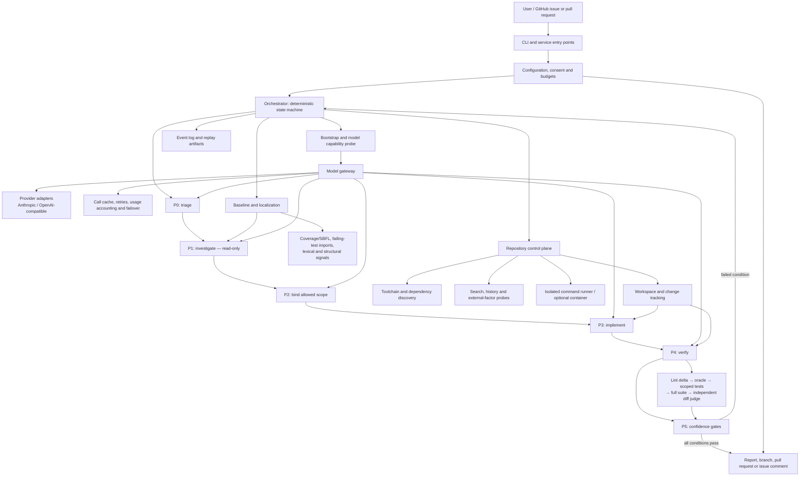

# AI Coding Harness

An autonomous coding harness: it takes a GitHub issue as text, investigates
the repository, produces the smallest change that resolves the root cause,
verifies it against the repository's own tests, and reports what it did with
evidence.

Built for the LCC × DevClub AI Coding Harness Hackathon 2026.
See `PRD.md` for requirements, `SPEC.md` for the design, `IMPLEMENTATION.md`
for the build plan.

---

## System architecture

The harness is a deterministic control plane around probabilistic coding
models. Models propose hypotheses, plans and edits; the harness owns repository
access, executes every check, measures every result and decides whether a
change is safe to submit.



### Component responsibilities

| Layer | Responsibility |
|---|---|
| Entry and acquisition | Accepts issue text, a local checkout, or a GitHub issue/PR; clones and prepares external repositories when needed. |
| Orchestration | Runs P0–P5 through one explicit state machine, enforces time/token/cycle budgets and chooses the recovery phase for each failed gate. |
| Model gateway | Detects and ranks models, normalizes provider APIs, probes capabilities, caches calls, retries transient failures and fails over from the primary to the cheap model. |
| Repository intelligence | Discovers language and test tooling, captures the pre-edit baseline, localizes failures with coverage/SBFL plus lexical, structural, test-import and history signals, and probes external factors. |
| Controlled editing | Gives investigation no write tools; after a binding scope is approved, validates every create, update, delete and move against the allowed paths and change-size budget. |
| Verification | Compares lint and tests with the baseline, runs the issue's oracle and scoped tests before the full suite, detects flaky and pre-existing failures, and asks a cheaper independent model to judge diff intent. |
| Confidence and recovery | Computes six evidence-backed conditions. Failed scope, size, test, root-cause or external-factor conditions route back to the appropriate phase; no failed hard gate can reach submission. |
| Publication and audit | Produces replayable JSONL events, structured evidence records, a patch and a human report; push, PR and issue-comment actions remain behind explicit consent. |

### End-to-end data flow

1. **Acquire and classify.** Normalize the task, discover the repository and
   toolchain, probe model capabilities, and set budgets.
2. **Measure before changing.** Install dependencies with consent, capture the
   test/lint baseline and gather localization signals. This separates new
   regressions from existing repository debt.
3. **Investigate without write access.** The model proposes competing
   hypotheses and executable checks; the harness runs those checks and records
   the evidence used for the root cause.
4. **Bind the change.** P2 names allowed and forbidden files, symbols and an
   estimated line budget. P3 cannot silently expand that scope.
5. **Edit and verify.** Apply validated edits, then run gates from cheapest to
   most expensive. Repositories without tests get a temporary red-green
   reproduction that must fail before the fix and pass afterward.
6. **Recover or publish.** Confidence failures deterministically re-enter P1,
   P2 or P3. Only a fully evidenced run can produce an outward-facing action,
   and that action still passes through the consent policy.

### Why this AI harness is unique

Most coding agents optimize for generating a plausible patch. This harness
optimizes for producing **evidence that the patch should be trusted**:

- **Models do not decide reality.** They suggest what to inspect and how to
  edit; deterministic tools execute checks, classify test transitions and
  enforce submission policy.
- **Root cause is a capability boundary.** Investigation is structurally
  read-only, so the agent cannot code first and rationalize the change later.
- **Verification has a before-state.** Baseline-aware lint and test
  classification distinguish fixed, new, flaky and pre-existing failures
  instead of treating a single green command as proof.
- **Scope is executable, not prose.** Allowed paths, forbidden paths and a
  proportional diff budget are hard gates checked against the actual Git
  change set.
- **No-test repositories still produce falsifiable evidence.** A generated
  reproduction must be red on the original code and green after the fix, then
  is removed so scaffolding cannot leak into the submitted patch.
- **Recovery is designed, not improvised.** Each failed confidence condition
  maps to a specific earlier phase, while stuck detection, alternative
  hypotheses and bounded cycles prevent endless self-repair loops.
- **It adapts without surrendering control.** Provider/model discovery,
  capability probing, tier-specific action spaces, caching and primary-to-cheap
  failover change how work is attempted—not what evidence is required.
- **Submission is both evidence-gated and permission-gated.** Even a verified
  fix cannot push, open a PR or post a comment unless the configured consent
  policy allows that exact external action.
- **Every claim is auditable.** Structured phase records, the baseline,
  verification results, confidence conditions, patch and event trajectory make
  a run replayable instead of leaving only a chat transcript.

In short, the differentiator is not another model wrapper. It is an
evidence-first software-engineering loop in which AI supplies reasoning and
deterministic infrastructure supplies authority.

---

## Quick start

```bash
export AI_API_KEY="<your key>"
make setup
make run ISSUE="https://github.com/owner/repo/pull/456" (required for smooth evaluation) PR=True/False (optional)
```

### The console

Run `make run` at a terminal with no issue and it asks:

```
  ╭──────────────────────────────────────────────────────────────╮
  │ ◈ HARNESS                                               v2.1 │
  ╰──────────────────────────────────────────────────────────────╯
    provider     anthropic · claude-opus-…  T2
    repository   /work/acme-api

    What should I work on?

  ▸ paste an issue                  write it in place, tab when done
    github issue or pull request    owner/repo#123
    a local repository              @ to search, or pick below
    recent                          3 previous run(s)

    ↑↓ move   tab run   q quit
```

Typing `@` anywhere you would start typing opens the repository finder: it
scans for git checkouts once, caches them, and filters as you type. `@hh`
finds `harness-hackathon`, `@wsb` finds `ws-backend-sep` -- initials, prefix,
substring and subsequence all match, best first. 133 repositories in 0.4s
cold and 28ms warm, so it never makes you wait.

After a run it offers the diff, the full report, opening a pull request,
posting the report back to the issue, or another run.

Arrow keys move, `tab` runs, `esc` goes back, `q` quits. The mouse wheel does
nothing on purpose: the frame turns off every mouse reporting mode and
alternate scroll while it is up, so a scroll cannot move the selection or
close the console. Text selection still works, which is why mouse reporting
is left off rather than captured. To see what your terminal really sends:

```bash
python -m harness.keys     # press keys and scroll; a scroll should print nothing
```

This is not a mode and it is not labelled as one: it is what the CLI does
when it has a terminal and no issue, the same way `git` pages and `ls`
colourises. **The run is identical either way** -- same phases, same budgets,
same verification, same confidence report. Only the way you say what to work
on differs.

It can never be reached by an automated run: it needs a TTY on both stdin and
stdout, and no issue supplied. `HARNESS_NONINTERACTIVE=1` disables it
outright. `tests/unit/test_nonblocking.py` runs the real entry points under a
hard timeout to keep that true.

### From a GitHub issue or pull request

Hand it a reference and nothing else. The harness fetches the issue with its
comments, clones the repository, creates a branch, and works there:

```bash
make run ISSUE="owner/repo#123"
make run ISSUE="https://github.com/owner/repo/pull/456"
```

An issue gets a `harness/issue-123` branch; a pull request is checked out
through `pull/456/head`, so a fork works the same as a branch.

No `gh` needed -- the GitHub REST API is reached with the standard library,
the same way the model providers are. `gh` is used when it is already
installed, because it already holds your auth. For private repositories or
to lift the 60-request hourly rate limit, set `GITHUB_TOKEN`.

Reporting back is off by default, because it writes to someone else's issue
tracker:

```bash
HARNESS_POST=comment make run ISSUE="owner/repo#123"
```

That posts the run report as a comment, and only when the run produced a
verified fix.

### Permission

Four things reach outside this machine: cloning a repository, pushing a
branch, opening a pull request, posting a comment. Each one asks first:

```
  ! Permission needed
    open a pull request

    repository    acme/dateparse
    branch        harness/issue-77
    commit        fix(parser): handle dates with no separator
    changes       src/dateparse/parser.py  (+2 -0)

    tab allow   esc decline
```

Everything else -- reading, editing, running tests -- is local and
reversible, so it runs freely. Gating it would make the harness useless
without making it safer.

`HARNESS_AUTO` configures this, and the default is to ask:

| `HARNESS_AUTO` | effect |
|---|---|
| unset / `ask` | ask before each outward-facing action *(default)* |
| `auto` | allow all four unattended |
| `pr,push` | allow exactly those, ask for the rest |
| `never` | refuse all four, even when asked for directly |

An unrecognised value is treated as `ask`, never as permission. Naming a
repository on the command line is itself consent to clone that one, so
scripted runs work without `HARNESS_AUTO`; push and PR still need it.

`git push` stays on the deny list for model-issued commands throughout. The
harness issues it itself, once, after the gate passes.

### The pull request

With permission, a verified fix becomes a pull request: a conventional-commit
subject, and a body carrying the root cause, the diff summary, the
verification results and the confidence report, closing the issue it fixes.

```bash
make run ISSUE="owner/repo#123" PR=True
```

`PR=True` pushes the branch and opens the pull request, but only when the fix
verifies. `PR=False` forbids it outright. Leave `PR` unset and the default
applies: ask at a terminal, decline when there is nobody to ask. Cloning and
installing happen either way -- they are how the repository gets read and run
at all.

`HARNESS_AUTO` is the same switch with finer grain, if you want (say) comments
but not pushes.

It never fires on a run without a verified fix.

That is the whole interface. `make setup` creates a virtualenv and prints a
readiness report; `make run` executes the pipeline and prints the fix, the
verification results and a confidence report.

```bash
make test     # replays the last run offline, with no API key
make clean    # remove the venv and all harness artifacts
```

---

## What it does

```
issue text
   │
   ├─ P0  triage        anchors, task type, vagueness score
   ├─ ──  baseline      run the suite BEFORE editing, instrumented with coverage
   ├─ ──  localize      coverage (SBFL) + grep + structure + git history
   ├─ P1  investigate   hypotheses with checks the HARNESS executes
   ├─ P2  scope         a binding plan: files to change, files not to change
   ├─ P3  implement     smallest change, style matched to the file
   ├─ P4  verify        lint → scoped tests → full suite → cheap-model judges
   └─ P5  confidence    six conditions; any failure loops back, never submits
```

### Reading the output

Every line carries a glyph saying where the claim came from:

```
  ◆ baseline      3 passed, 1 failed        ← a program measured this
  ◇ p1_synthesis  opus  8.2k→640  4.1s      ← a model said this
  ✓ oracle        test_parse_date_…  PASS
  ! degraded      no_coverage
```

That is the point of the whole design: most of what the harness concludes is
measured rather than asked, and the gutter is where you can see that at a
glance. Count the diamonds.

Colour, glyphs and the live status line appear on a terminal. Piped output is
plain text with the same facts, so a captured log stays readable and
diffable. `HARNESS_UI=plain` forces it; `NO_COLOR` is honoured.

Key properties:

- **No code before the root cause.** Phase 1 is handed no write tool at all.
- **The harness decides what is true.** Every hypothesis carries a check the
  harness runs itself; the model proposes and interprets.
- **Pre-existing failures are documented, never fixed.** The suite is run
  before the first edit so a regression can be told from existing debt.
- **The lint gate is scoped to changed files** and diffed against the
  baseline, so a repository with lint debt does not deadlock every cycle.
- **It adapts to the model it is given.** The action space, edit format,
  sampling and context budget all change with the detected model tier.

---

## Which model it picks

With a single-vendor key the choice is obvious. With an aggregator it is not:
an OpenRouter key lists several hundred models from every vendor, and the
harness has to choose two -- one to do the work, one to judge it.

| | how it is chosen |
|---|---|
| primary | provider's own ranking, else known coding families, then the **newest version** within that family |
| cheap | the **published input price**, when the provider states one |

Two things follow that are worth knowing:

- **Prices decide the cheap model, not a list of names.** Any hardcoded
  "small models" list is a guess about a catalogue that changes weekly. Where
  a provider publishes no pricing, the fallback matches the naming convention
  (`mini`, `nano`, `flash`, `micro`, `haiku`) rather than specific versions,
  because the convention outlives them.
- **Batch, preview and modality variants are skipped.** A `:batch` endpoint
  accepts work and answers later, which a fix-and-verify loop cannot use; a
  vision or audio variant spends capacity on a modality this harness never
  touches.

The cheap model still has to hold a diff, so it needs a 64k window whatever
it costs. Both choices are printed at startup, and `HARNESS_MODEL` /
`HARNESS_CHEAP_MODEL` override them outright -- those are not validated
against the listing, because a proxy may serve ids it does not advertise.

---

## When the repository has no tests

Most repositories don't have a suite, and a harness that can only verify a fix
when somebody else already wrote the test isn't autonomous. So the harness
writes the test itself.

The catch is obvious: a model asked to check its own work writes a test that
passes. The answer is red-green, and the red half is the whole point:

```
  ▸ P2  writing a test: this repository has none
  ◆ reproduction    fails on the unfixed code  (node --test harness_repro.test.js)
  ...
  ✓ reproduction    passes after the fix
```

1. It writes a test from the issue, **before any fix exists**.
2. It runs it against the unfixed code. **The test must fail.**
3. If it passes, it's thrown away — it doesn't describe the bug, however
   plausible it looks — and rewritten once with that feedback.
4. Only then does the fix go in, and the same test must go green.

A test that was green before the fix proves nothing about the fix. Rejecting
it is what makes this evidence rather than the model's opinion of itself. A
file that doesn't parse is rejected too: a syntax error also exits non-zero,
and would otherwise look like a reproduction of nothing.

Nothing needs installing. `node --test` ships with Node 18 and `unittest` is
in the Python standard library, so a repository with no test tooling at all is
still verifiable.

The reproduction is scaffolding, not output: it's excluded from the change set
and deleted before the diff is taken, so a model-written test never lands in
your patch or your pull request.

| `HARNESS_REPRO` | |
|---|---|
| `auto` *(default)* | write one only when no suite was found |
| `always` | write one as a second opinion alongside the suite |
| `off` | never |

Where a suite exists it wins — a written test can't override it. But a
reproduction that was red before the fix and is **still red after it** fails
the run outright, whatever the suite says, because that's direct evidence the
fix didn't work.

---

## Working on a repository it has never seen

Cloning someone's repository is the normal case, so the things that only
happen there are handled rather than assumed away.

**It installs the dependencies.** A fresh clone has no `node_modules` and no
virtualenv, so the suite can't start — `jest: command not found`. That used to
read as a failing suite. Installing asks first, because it fetches from a
public registry and `npm install` runs a `postinstall` script from every
transitive dependency:

```
  ! Permission needed
    install this repository's dependencies

    repository    acme-api
    command       npm ci --ignore-scripts
    scripts       disabled (--ignore-scripts)

    tab allow   esc decline
```

Scripts are off unless you ask for them (`HARNESS_INSTALL_SCRIPTS=1`); the
lockfile picks the package manager. Decline and the run continues, saying the
suite may not run. `npm install` stays on the deny list for anything the model
asks for — the harness runs it itself, after you say yes.

**It can add, remove and move files.** Not every fix lives in a file that
already exists. New paths have to be named in the plan, have to look like
source in that repository, and a rename's destination is scope-checked like
any other write — so a file can't be moved somewhere the plan never mentioned.

**It asks, once, when it has to.** An issue that names no file, no symbol and
no error can't be localized, and guessing is how you get a confident wrong
patch. At a terminal it asks one question and carries on with your answer.
Unattended it still declines — making up an answer to its own question is
worse than stopping.

---

## Configuration

Only `AI_API_KEY` is required. Everything else has a sensible default.

| Variable | Default | Purpose |
|---|---|---|
| `AI_API_KEY` | **required** | the only credential; read from the environment only |
| `AI_BASE_URL` | per provider | any OpenAI-compatible endpoint |
| `HARNESS_MODEL` / `HARNESS_CHEAP_MODEL` | auto | override model selection |
| `HARNESS_PROVIDER` / `HARNESS_TIER` | auto | force the adapter or the tier profile |
| `ISSUE` / `ISSUE_FILE` | stdin | the issue text; also accepted as `argv[1]` |
| `REPO_PATH` | `$PWD` | the repository to fix (ignored when `ISSUE` is a GitHub reference) |
| `GITHUB_TOKEN` / `GH_TOKEN` | — | private repositories, and 5000 instead of 60 API requests an hour |
| `HARNESS_INSTALL_SCRIPTS` | `0` | let dependency install scripts run |
| `HARNESS_EXPLORE_ROUNDS` | `1` | extra investigation rounds on a weak root cause |
| `HARNESS_REPRO` | `auto` | write a reproduction test when the repo has no suite; `always` or `off` |
| `HARNESS_AUTO` | `ask` | `auto`, `never`, or a comma list like `pr,push`: which outward-facing actions may proceed unattended |
| `HARNESS_POST` | `off` | `comment` posts the run report back to the issue or PR |
| `HARNESS_WORKSPACE` | `./.harness/workspace` | where cloned repositories land |
| `HARNESS_CLONE_DEPTH` | 0 (full) | shallow clone depth; full history is needed for FR-16 |
| `HARNESS_MAX_CYCLES` | 5 | fix-and-verify cycle cap |
| `HARNESS_TOKEN_BUDGET` | 900000 | global token cap |
| `HARNESS_TIME_BUDGET` | 1500 | seconds |
| `HARNESS_TEST_CMD` / `HARNESS_LINT_CMD` | discovered | override discovery |
| `HARNESS_DRY_RUN` | 0 | run P0–P2 and print the plan, writing nothing |
| `HARNESS_NO_CACHE` | 0 | disable the model-call cache |
| `HARNESS_LOG_LEVEL` | info | `info` or `debug` |
| `HARNESS_UI` | auto | `rich` or `plain`; auto-detects a TTY. `NO_COLOR` is honoured |

The provider is detected from the key prefix with no API call. Anthropic,
OpenAI, OpenRouter, Groq, xAI, Cerebras, Google, Together, Fireworks,
DeepSeek and Mistral are recognised; anything else works through
`AI_BASE_URL`.

---

## Output

Written to `.harness/run/` in the target repository, which is added to
`.git/info/exclude` so it can never appear in the diff:

| File | Contents |
|---|---|
| `run_report.md` | the evidence package: task, investigation, root cause, diff, what was **not** changed, verification, confidence, cost |
| `diff.patch` | the change as a patch |
| `rootcause.json`, `scope.json` | the structured records each phase produced |
| `baseline.json`, `verification.json`, `confidence.json` | test results before and after, and the six conditions |
| `trajectory.jsonl` | every event, replayable by `make test` |

Exit codes: `0` success, `2` partial (a fix is present but a condition
failed), `3` no fix, `4` configuration error, `5` internal error. Codes 4 and
5 restore the working tree.

---

## Modality

**Text only.** No image, audio or video code path exists anywhere in the
harness — not dormant, not behind a flag. The tool surface has no media type,
so the constraint is structural rather than a promise. `tests/unit/` asserts
this.

## Credentials

`AI_API_KEY` is read from the environment, injected only at the HTTP
boundary, and never placed in a prompt or in the environment of any command
run against the repository. Anything token-shaped is redacted before it is
written to disk. No credential appears anywhere in this repository; a
`.env.example` with an empty value is provided for local use.

---

## Development

```bash
python3 scripts/make_fixtures.py     # build the 11 fixture repositories
.venv/bin/python -m pytest tests -q  # the unit and integration suites
.venv/bin/python bench/runner.py     # the fixture matrix, offline
```

`bench/runner.py` runs every fixture against a scripted stand-in model and
records metrics to `bench/reports/`. An ENH feature ships only if the matrix
shows a gain in the **T0** column: a feature that helps only a frontier model
is helping the model, not the harness.
